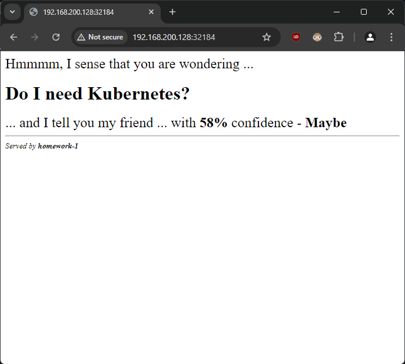
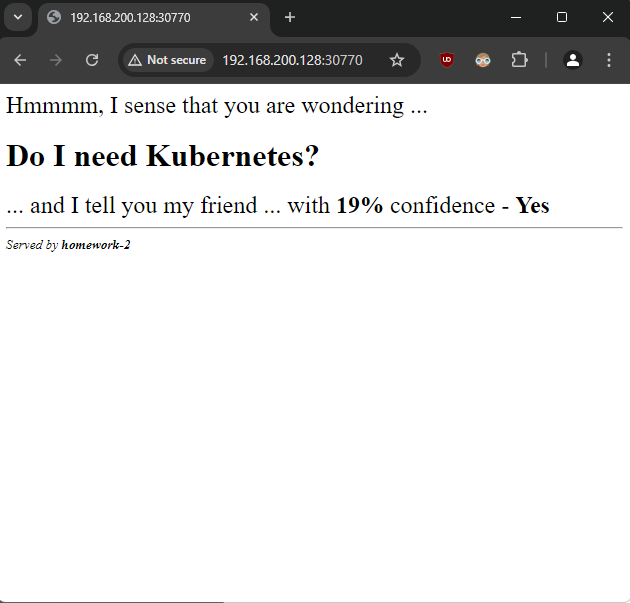
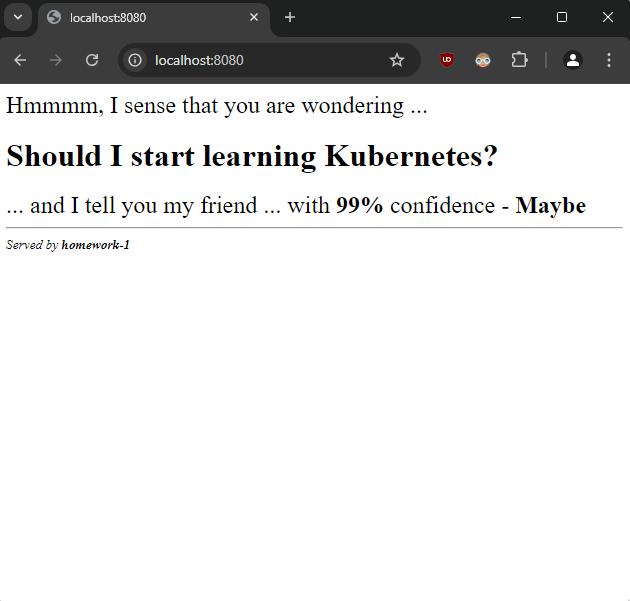
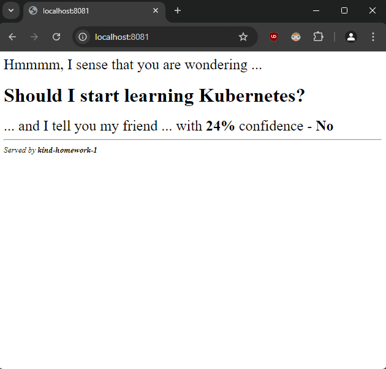

### 1. Execute a series of commands to

#### - Create a namespace named homework
```sh
$ kubectl create namespace homework
namespace/homework created

$ kubectl get namespaces
NAME              STATUS   AGE
default           Active   49s
homework          Active   11s
kube-node-lease   Active   49s
kube-public       Active   49s
kube-system       Active   49s
```
#### - Create a homework-1 pod in that namespace that uses this (shekeriev/k8s-oracle) image and set two labels on it (all at once) – app=hw and tier=gold
```sh
$ kubectl run homework-1 --image shekeriev/k8s-oracle -n homework --labels=app=hw,tier=gold
pod/homework-1 created

$ kubectl get pods -n homework
NAME         READY   STATUS    RESTARTS   AGE
homework-1   1/1     Running   0          3m29s
```
#### - Remove the tier=gold label with a separate command
```sh
# Check pod before remove the label
$ kubectl get pods -L app,tier -n homework
NAME         READY   STATUS    RESTARTS   AGE     APP   TIER
homework-1   1/1     Running   0          8m42s   hw    gold

# Remove label `tier`
$ kubectl label pod homework-1 tier- -n homework
pod/homework-1 unlabeled

# Check pod after remove the label
$ kubectl get pods -L app,tier -n homework
NAME         READY   STATUS    RESTARTS   AGE   APP   TIER
homework-1   1/1     Running   0          10m   hw
```
#### - Create a homework-2 pod in that namespace that uses this (shekeriev/k8s-oracle) image
```sh
$ kubectl run homework-2 --image shekeriev/k8s-oracle -n homework
pod/homework-2 created

$ kubectl get pods -n homework
NAME         READY   STATUS    RESTARTS   AGE
homework-1   1/1     Running   0          13m
homework-2   1/1     Running   0          28s
```
#### - Add a label to the second pod app=hw with a separate command
```sh
# Before add label to pod `homework-2`
$ kubectl get pods -L app -n homework
NAME         READY   STATUS    RESTARTS   AGE   APP
homework-1   1/1     Running   0          14m   hw
homework-2   1/1     Running   0          88s

# Add label `app=hw` to pod `homework-2`
$ kubectl label pod homework-2 app=hw -n homework
pod/homework-2 labeled

# After add label to pod
$ kubectl get pods -n homework --show-labels
NAME         READY   STATUS    RESTARTS   AGE     APP
homework-1   1/1     Running   0          20m     hw
homework-2   1/1     Running   0          7m25s   hw
```
#### - Set annotation on both pods with the following content purpose=homework
```sh
$ kubectl annotate pods --all purpose=homework -n homework
pod/homework-1 annotated
pod/homework-2 annotated
```
#### - Create a homerwork-svc service to expose both pods on port 32000 of every node in the cluster
```sh
$ kubectl expose pod homework-1 homework-2 -n homework --name=homework-svc --port=32000 --target-port=5000 --type=NodePort
service/homework-svc exposed

$ kubectl describe svc homework-svc -n homework
Name:                     homework-svc
Namespace:                homework
Labels:                   app=hw
Annotations:              <none>
Selector:                 app=hw
Type:                     NodePort
IP Family Policy:         SingleStack
IP Families:              IPv4
IP:                       10.100.183.149
IPs:                      10.100.183.149
Port:                     <unset>  32000/TCP
TargetPort:               5000/TCP
NodePort:                 <unset>  32184/TCP
Endpoints:                10.244.0.7:5000,10.244.0.8:5000
Session Affinity:         None
External Traffic Policy:  Cluster
Events:                   <none>

$ minikube service list
|-------------|--------------|--------------|------------------------------|
|  NAMESPACE  |     NAME     | TARGET PORT  |             URL              |
|-------------|--------------|--------------|------------------------------|
| default     | kubernetes   | No node port |                              |
| homework    | homework-svc |        32000 | http://192.168.200.128:32184 |
| kube-system | kube-dns     | No node port |                              |
|-------------|--------------|--------------|------------------------------|
```
Picture:


### 2. Create manifests for every object (the namespace, the two pods, and the service) from task 1 and apply them one by one
#### - Namespace `homework`
```sh
$ cat .\01-homework-ns.yaml
apiVersion: v1
kind: Namespace
metadata:
  name: homework
spec: {}
status: {}

$ kubectl apply -f .\01-homework-ns.yaml
namespace/homework created
```
#### - Pod `homework-1`
```sh
$ cat .\02-homework-1-pod.yaml
apiVersion: v1
kind: Pod
metadata:
  name: homework-1
  namespace: homework
  labels:
    app: hw
  annotations:
    purpose: homework
spec:
  containers:
  - image: shekeriev/k8s-oracle
    name: homework-1
    ports:
    - containerPort: 5000

$ kubectl apply -f .\02-homework-1-pod.yaml
pod/homework-1 created
```
#### - Pod `homework-2`
```sh
$ cat .\03-homework-2-pod.yaml
apiVersion: v1
kind: Pod
metadata:
  name: homework-2
  namespace: homework
  labels:
    app: hw
  annotations:
    purpose: homework
spec:
  containers:
  - image: shekeriev/k8s-oracle
    name: homework-2
    ports:
    - containerPort: 5000

$ kubectl apply -f .\03-homework-2-pod.yaml
pod/homework-2 created
```
#### - Service `homework-svc`
```sh
$ cat .\04-homework-svc-svc.yaml
apiVersion: v1
kind: Service
metadata:
  name: homework-svc
  namespace: homework
spec:
  selector:
    app: hw
  ports:
    - protocol: TCP
      port: 32000
      targetPort: 5000
  type: NodePort

$ kubectl apply -f .\04-homework-svc-svc.yaml
service/homework-svc created
```

Check if service is working as expected:
```sh
$ kubectl describe svc homework-svc -n homework
Name:                     homework-svc
Namespace:                homework
Labels:                   <none>
Annotations:              <none>
Selector:                 app=hw
Type:                     NodePort
IP Family Policy:         SingleStack
IP Families:              IPv4
IP:                       10.107.225.206
IPs:                      10.107.225.206
Port:                     <unset>  32000/TCP
TargetPort:               5000/TCP
NodePort:                 <unset>  30770/TCP
Endpoints:                10.244.0.10:5000,10.244.0.9:5000
Session Affinity:         None
External Traffic Policy:  Cluster
Events:                   <none>

$ minikube service list
|-------------|--------------|--------------|------------------------------|
|  NAMESPACE  |     NAME     | TARGET PORT  |             URL              |
|-------------|--------------|--------------|------------------------------|
| default     | kubernetes   | No node port |                              |
| homework    | homework-svc |        32000 | http://192.168.200.128:30770 |
| kube-system | kube-dns     | No node port |                              |
|-------------|--------------|--------------|------------------------------|
```
Picture:


Remove all created resources
```sh
$ kubectl delete -f .\01-homework-ns.yaml
namespace "homework" deleted

$ kubectl get all
NAME                 TYPE        CLUSTER-IP   EXTERNAL-IP   PORT(S)   AGE
service/kubernetes   ClusterIP   10.96.0.1    <none>        443/TCP   17h
```
### 3.	Is there a way to submit those manifests at once? Find and demonstrate two ways of doing it
#### - Using `kubectl apply` with a directory
```sh
$ tree homework/
homework/
├── 01-homework-ns.yaml
├── 02-homework-1-pod.yaml
├── 03-homework-2-pod.yaml
└── 04-homework-svc-svc.yaml

0 directories, 4 files

$ kubectl apply -f homework/
```
#### - Using `kubectl apply` with multiple files
```sh
kubectl apply -f 01-homework-ns.yaml -f 02-homework-1-pod.yaml -f 03-homework-2-pod.yaml -f 04-homework-svc.yaml
```
#### - Combined YAML File as `combined-homework.yaml`
```sh
$ cat .\combined-homework.yaml
# 01-homework-ns.yaml
apiVersion: v1
kind: Namespace
metadata:
  name: homework
---
# 02-homework-1-pod.yaml
apiVersion: v1
kind: Pod
metadata:
  name: homework-1
  namespace: homework
  labels:
    app: hw
spec:
  containers:
    - name: app
      image: shekeriev/k8s-oracle
      ports:
        - containerPort: 5000
---
# 03-homework-2-pod.yaml
apiVersion: v1
kind: Pod
metadata:
  name: homework-2
  namespace: homework
  labels:
    app: hw
spec:
  containers:
    - name: app
      image: shekeriev/k8s-oracle
      ports:
        - containerPort: 5000
---
# 04-homework-svc.yaml
apiVersion: v1
kind: Service
metadata:
  name: homework-svc
  namespace: homework
spec:
  selector:
    app: hw
  ports:
    - protocol: TCP
      port: 32000
      targetPort: 5000
  type: NodePort

$ kubectl apply -f combined-homework.yaml
```
#### - Using Deployment object ( Pods will have automatically generated names ) - `combined-deployment-homework.yaml`
```sh
$ cat .\combined-deployment-homework.yaml
# 01-homework-ns.yaml
apiVersion: v1
kind: Namespace
metadata:
  name: homework
---
# Combined deployment for homework-1 and homework-2
apiVersion: apps/v1
kind: Deployment
metadata:
  name: homework-deployment
  namespace: homework
spec:
  replicas: 2
  selector:
    matchLabels:
      app: hw
  template:
    metadata:
      labels:
        app: hw
    spec:
      containers:
      - name: app
        image: shekeriev/k8s-oracle
        ports:
        - containerPort: 5000
---
# 04-homework-svc.yaml
apiVersion: v1
kind: Service
metadata:
  name: homework-svc
  namespace: homework
spec:
  selector:
    app: hw
  ports:
    - protocol: TCP
      port: 32000
      targetPort: 5000
  type: NodePort

$ kubectl apply -f combined-deployment-homework.yaml
```
### 4. _Optional:_ Try to translate the attached docker-compose.yml file to a set of Kubernetes objects and the corresponding manifest(s)
#### - Namespace `translate`
```sh
$ cat .\01-ns.yaml
apiVersion: v1
kind: Namespace
metadata:
  name: translate
```
#### - Pod `listener`
```sh
$ cat .\02-listener-pod.yaml
apiVersion: v1
kind: Pod
metadata:
  name: listener
  namespace: translate
  labels:
    app: hw
spec:
  containers:
  - image: shekeriev/k8s-listener
    name: listener
    ports:
    - containerPort: 5000
```
#### - Pod `speaker`
```sh
$ cat .\03-speaker-pod.yaml
apiVersion: v1
kind: Pod
metadata:
  name: speaker
  namespace: translate
  labels:
    app: hw
spec:
  containers:
  - image: shekeriev/k8s-speaker
    name: speaker
    ports:
    - containerPort: 5000
```
#### - Service `translate-svc`
```sh
$ cat .\04-svc.yaml
apiVersion: v1
kind: Service
metadata:
  name: translate-svc
  namespace: translate
spec:
  selector:
    app: hw
  ports:
    - protocol: TCP
      port: 32000
      targetPort: 5000
  type: NodePort
```

Apply with folder
```sh
$ kubectl apply -f .\m1-hw\
namespace/translate created
pod/listener created
pod/speaker created
service/translate-svc created

$ kubectl describe svc translate-svc -n translate
Name:                     translate-svc
Namespace:                translate
Labels:                   <none>
Annotations:              <none>
Selector:                 app=hw
Type:                     NodePort
IP Family Policy:         SingleStack
IP Families:              IPv4
IP:                       10.103.214.197
IPs:                      10.103.214.197
Port:                     <unset>  32000/TCP
TargetPort:               5000/TCP
NodePort:                 <unset>  31334/TCP
Endpoints:                10.244.0.13:5000,10.244.0.14:5000
Session Affinity:         None
External Traffic Policy:  Cluster
Events:                   <none>

$ minikube service list
|-------------|---------------|--------------|------------------------------|
|  NAMESPACE  |     NAME      | TARGET PORT  |             URL              |
|-------------|---------------|--------------|------------------------------|
| default     | kubernetes    | No node port |                              |
| kube-system | kube-dns      | No node port |                              |
| translate   | translate-svc |        32000 | http://192.168.200.128:31334 |
|-------------|---------------|--------------|------------------------------|
```
Picture:


Remove all created resources
```sh
$ kubectl delete -f .\01-ns.yaml
namespace "translate" deleted
```
### 5. _Optional:_ Give the KIND tool a try and spin up a Kubernetes cluster in a Docker instance. Once done, start the pod (task 1.b) and the service (task 1.g) either imperatively or with manifests (for example, the ones from task 2)
#### - Create KIND cluster
```sh
$ kind create cluster
Creating cluster "kind" ...
 ✓ Ensuring node image (kindest/node:v1.31.0) 🖼
 ✓ Preparing nodes 📦
 ✓ Writing configuration 📜
 ✓ Starting control-plane 🕹️
 ✓ Installing CNI 🔌
 ✓ Installing StorageClass 💾
Set kubectl context to "kind-kind"
You can now use your cluster with:

kubectl cluster-info --context kind-kind

Not sure what to do next? 😅  Check out https://kind.sigs.k8s.io/docs/user/quick-start/
```
#### - Imperative approach
```sh
$ kubectl create namespace homework
namespace/homework created

$ kubectl run homework-1 --image=shekeriev/k8s-oracle -n homework --labels=app=hw,tier=gold --restart=Never --port=5000
pod/homework-1 created

$ kubectl expose pod homework-1 -n homework --name=homework-svc --port=32000 --target-port=5000 --type=NodePort

$ kubectl get services -n homework
NAME           TYPE       CLUSTER-IP     EXTERNAL-IP   PORT(S)           AGE
homework-svc   NodePort   10.96.88.163   <none>        32000:30449/TCP   7m6s

$ kubectl port-forward svc/homework-svc 8080:32000 -n homework
Forwarding from 127.0.0.1:8080 -> 5000
Forwarding from [::1]:8080 -> 5000
Handling connection for 8080
Handling connection for 8080
```
Picture:

#### - Declarative approach
- Namespace `kind-homework`
```sh
$ cat .\ns.yaml
apiVersion: v1
kind: Namespace
metadata:
  name: kind-homework
```
- Pod `kind-homework-1`
```sh
$ cat .\pod.yaml
apiVersion: v1
kind: Pod
metadata:
  name: kind-homework-1
  namespace: kind-homework
  labels:
    app: hw
    tier: gold
spec:
  containers:
    - name: oracle-container
      image: shekeriev/k8s-oracle
      ports:
        - containerPort: 5000
```
- Service `kind-homework-svc`
```sh
$ cat .\svc.yaml
apiVersion: v1
kind: Service
metadata:
  name: kind-homework-svc
  namespace: kind-homework
spec:
  selector:
    app: hw
  ports:
    - protocol: TCP
      port: 32000
      targetPort: 5000
  type: NodePort
```
Apply with folder
```sh
$ kubectl apply -f .\kind\
namespace/kind-homework created
pod/kind-homework-1 created
service/kind-homework-svc created
```
Check the service in browser
```sh
$ kubectl port-forward svc/kind-homework-svc 8081:32000 -n kind-homework
Forwarding from 127.0.0.1:8081 -> 5000
Forwarding from [::1]:8081 -> 5000
Handling connection for 8081
Handling connection for 8081
```
Picture:


Delete kind cluster
```sh
$ kind delete cluster
Deleting cluster "kind" ...
Deleted nodes: ["kind-control-plane"]
```