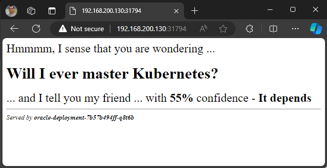
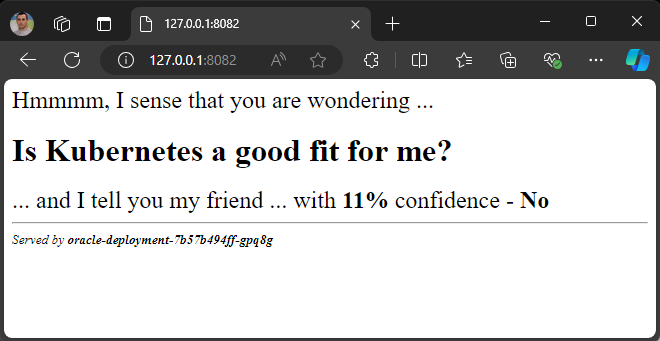

# Tasks

### 1. Create a two node Minikube-based Kubernetes cluster and deploy a simple app on it. For example, shekeriev/k8s-oracle from the previous HW

- Start Mikikube-based cluster with two node.
```sh
$ minikube start --nodes 2 -p twonode-demo
😄  [twonode-demo] minikube v1.34.0 on Microsoft Windows 11 Enterprise 10.0.22621.4317 Build 22621.4317
✨  Using the vmware driver based on user configuration
👍  Starting "twonode-demo" primary control-plane node in "twonode-demo" cluster
🔥  Creating vmware VM (CPUs=2, Memory=6000MB, Disk=20000MB) ...
❗  Failing to connect to https://registry.k8s.io/ from inside the minikube VM
💡  To pull new external images, you may need to configure a proxy: https://minikube.sigs.k8s.io/docs/reference/networking/proxy/
🐳  Preparing Kubernetes v1.31.0 on Docker 27.2.0 ...
    ▪ Generating certificates and keys ...
    ▪ Booting up control plane ...
    ▪ Configuring RBAC rules ...
🔗  Configuring CNI (Container Networking Interface) ...
🔎  Verifying Kubernetes components...
    ▪ Using image gcr.io/k8s-minikube/storage-provisioner:v5
🌟  Enabled addons: storage-provisioner, default-storageclass

👍  Starting "twonode-demo-m02" worker node in "twonode-demo" cluster
🔥  Creating vmware VM (CPUs=2, Memory=6000MB, Disk=20000MB) ...
🌐  Found network options:
    ▪ NO_PROXY=192.168.200.130
    ▪ NO_PROXY=192.168.200.130
❗  Failing to connect to https://registry.k8s.io/ from inside the minikube VM
💡  To pull new external images, you may need to configure a proxy: https://minikube.sigs.k8s.io/docs/reference/networking/proxy/
🐳  Preparing Kubernetes v1.31.0 on Docker 27.2.0 ...
    ▪ env NO_PROXY=192.168.200.130
    > kubeadm.sha256:  64 B / 64 B [-------------------------] 100.00% ? p/s 0s
    > kubelet.sha256:  64 B / 64 B [-------------------------] 100.00% ? p/s 0s
    > kubectl.sha256:  64 B / 64 B [-------------------------] 100.00% ? p/s 0s
    > kubectl:  53.77 MiB / 53.77 MiB [-------------] 100.00% 9.75 MiB p/s 5.7s
    > kubeadm:  55.59 MiB / 55.59 MiB [------------] 100.00% 10.05 MiB p/s 5.7s
    > kubelet:  73.30 MiB / 73.30 MiB [------------] 100.00% 10.61 MiB p/s 7.1s
🔎  Verifying Kubernetes components...
🏄  Done! kubectl is now configured to use "twonode-demo" cluster and "default" namespace by default

$ kubectl get nodes
NAME               STATUS     ROLES           AGE   VERSION
twonode-demo       Ready      control-plane   96s   v1.31.0
twonode-demo-m02   NotReady   <none>          16s   v1.31.0
```
- Create namespace named `task-1`
```sh
$ cat .\task1-ns.yaml
apiVersion: v1
kind: Namespace
metadata:
  name: task-1

$ kubectl apply -f .\task1-ns.yaml
namespace/task-1 created
```
- Create Oracle pod
```sh
$ cat .\task1-oracle-deployment.yaml
apiVersion: apps/v1
kind: Deployment
metadata:
  name: oracle-deployment
  namespace: task-1
  labels:
    app: oracle
spec:
  replicas: 1
  selector:
    matchLabels:
      app: oracle
  template:
    metadata:
      labels:
        app: oracle
    spec:
      containers:
        - name: oracle
          image: shekeriev/k8s-oracle
          ports:
            - containerPort: 5000

$ kubectl apply -f .\task1-oracle-deployment.yaml
deployment.apps/oracle-deployment created

$ kubectl get pods -n task-1
NAME                                 READY   STATUS    RESTARTS   AGE     IP           NODE               NOMINATED NODE   READINESS GATES
oracle-deployment-7b57b494ff-q8t6b   1/1     Running   0          6m24s   10.244.1.2   twonode-demo-m02   <none>           <none>
```
- Create service named 'task1-svc`
```sh
$ cat .\task1-svc.yaml
apiVersion: v1
kind: Service
metadata:
  name: task1-svc
  namespace: task-1
spec:
  selector:
    app: oracle
  ports:
    - protocol: TCP
      port: 32111
      targetPort: 5000
  type: NodePort

$ kubectl apply -f .\task1-svc.yaml
service/task1-svc created
```
- Check if service is working as expected
```sh
$ kubectl describe svc task1-svc -n task-1
Name:                     task1-svc
Namespace:                task-1
Labels:                   <none>
Annotations:              <none>
Selector:                 app=oracle
Type:                     NodePort
IP Family Policy:         SingleStack
IP Families:              IPv4
IP:                       10.100.150.255
IPs:                      10.100.150.255
Port:                     <unset>  32111/TCP
TargetPort:               5000/TCP
NodePort:                 <unset>  31794/TCP
Endpoints:                10.244.1.2:5000
Session Affinity:         None
External Traffic Policy:  Cluster
Events:                   <none>

$ minikube service list -p twonode-demo
|-------------|------------|--------------|------------------------------|
|  NAMESPACE  |    NAME    | TARGET PORT  |             URL              |
|-------------|------------|--------------|------------------------------|
| default     | kubernetes | No node port |                              |
| kube-system | kube-dns   | No node port |                              |
| task-1      | task1-svc  |        32111 | http://192.168.200.130:31794 |
|-------------|------------|--------------|------------------------------|
```
- Picture


### 2. Create a three node KIND-based Kubernetes cluster and deploy a simple app on it. For example, shekeriev/k8s-oracle from the previous HW
- Create KinD cluster of one control-plane and two workers
```sh
$ cat .\kind-config.yaml
kind: Cluster
apiVersion: kind.x-k8s.io/v1alpha4
nodes:
- role: control-plane
- role: worker
- role: worker

$ kind create cluster --config .\kind-config.yaml
Creating cluster "kind" ...
 ✓ Ensuring node image (kindest/node:v1.31.0) 🖼
 ✓ Preparing nodes 📦 📦 📦
 ✓ Writing configuration 📜
 ✓ Starting control-plane 🕹️
 ✓ Installing CNI 🔌
 ✓ Installing StorageClass 💾
 ✓ Joining worker nodes 🚜
Set kubectl context to "kind-kind"
You can now use your cluster with:

kubectl cluster-info --context kind-kind

Have a nice day! 👋

$ kubectl get nodes
NAME                 STATUS   ROLES           AGE     VERSION
kind-control-plane   Ready    control-plane   8m47s   v1.31.0
kind-worker          Ready    <none>          8m35s   v1.31.0
kind-worker2         Ready    <none>          8m35s   v1.31.0

$ docker ps -a
CONTAINER ID   IMAGE                  COMMAND                  CREATED         STATUS         PORTS                       NAMES
c5b74edd9c79   kindest/node:v1.31.0   "/usr/local/bin/entr…"   2 minutes ago   Up 2 minutes                               kind-worker2
f8376f3abdfb   kindest/node:v1.31.0   "/usr/local/bin/entr…"   2 minutes ago   Up 2 minutes   127.0.0.1:62199->6443/tcp   kind-control-plane
19085d472434   kindest/node:v1.31.0   "/usr/local/bin/entr…"   2 minutes ago   Up 2 minutes                               kind-worker
```
- Create namespace named `task-2`
```sh
$ cat .\task-2-ns.yaml
apiVersion: v1
kind: Namespace
metadata:
  name: task-2

$ kubectl apply -f .\task-2-ns.yaml
namespace/task-2 created
```
- Deploy three pods of Oracle application
```sh
$ cat .\task-2-oracle-deployment.yaml
apiVersion: apps/v1
kind: Deployment
metadata:
  name: oracle-deployment
  namespace: task-2
  labels:
    app: oracle
spec:
  replicas: 3
  selector:
    matchLabels:
      app: oracle
  template:
    metadata:
      labels:
        app: oracle
    spec:
      containers:
        - name: oracle
          image: shekeriev/k8s-oracle
          ports:
            - containerPort: 5000

$ kubectl apply -f .\task-2-oracle-deployment.yaml
deployment.apps/oracle-deployment created

$ kubectl get pods -n task-2 -o wide
NAME                                 READY   STATUS    RESTARTS   AGE     IP           NODE           NOMINATED NODE   READINESS GATES
oracle-deployment-7b57b494ff-gpq8g   1/1     Running   0          2m39s   10.244.1.2   kind-worker2   <none>           <none>
oracle-deployment-7b57b494ff-pq7sx   1/1     Running   0          2m39s   10.244.2.2   kind-worker    <none>           <none>
oracle-deployment-7b57b494ff-vl7cf   1/1     Running   0          2m39s   10.244.2.3   kind-worker    <none>           <none>
```
- Create service named `task-2-svc`
```sh
$ cat .\task-2-svc.yaml
apiVersion: v1
kind: Service
metadata:
  name: task-2-svc
  namespace: task-2
spec:
  selector:
    app: oracle
  ports:
    - protocol: TCP
      port: 32111
      targetPort: 5000
  type: NodePort

$ kubectl apply -f .\task-2-svc.yaml
service/task-2-svc created
```
- Expose the service
```sh
kubectl port-forward svc/task-2-svc 8082:32111 -n task-2
Forwarding from 127.0.0.1:8082 -> 5000
Forwarding from [::1]:8082 -> 5000
Handling connection for 8082
Handling connection for 8082
```
- Picture


- Delete KinD cluster
```sh
$ kind delete cluster
Deleting cluster "kind" ...
Deleted nodes: ["kind-worker2" "kind-control-plane" "kind-worker"]
```
### 3. Create a three-node vanilla Kubernetes cluster in a virtualization solution of your choice. You are free to use Debian (as demonstrated during the practice) or any other (from the same or another family) Linux distribution. Use Vagrant or a similar tool to do it in as much automated fashion as possible (If you are new to Vagrant, don’t worry. Do the other two tasks and wait until the solution is published)
-  Initializes Vagrant environment
```sh
$ vagrant init
A `Vagrantfile` has been placed in this directory. You are now
ready to `vagrant up` your first virtual environment! Please read
the comments in the Vagrantfile as well as documentation on
`vagrantup.com` for more information on using Vagrant.
```
- Start the Vagrant Environment ( one control-plane and two workers )
```sh
$ cat .\Vagrantfile
# -*- mode: ruby -*-
# vi: set ft=ruby :

Vagrant.configure("2") do |config|
  # Base configuration
  config.ssh.insert_key = false
  config.vm.synced_folder ".", "/vagrant", disabled: true

  # Define control-plane node
  config.vm.define "cp" do |srv|
    srv.vm.box = "generic/debian12"
    srv.vm.hostname = "cp.k8s"
    srv.vm.network "public_network", bridge: true
    srv.vm.provider "vmware_desktop" do |v|
      v.memory = 2048
      v.cpus = 2
      v.linked_clone = true
    end
  end

  # Define worker 1 node
  config.vm.define "worker1" do |srv|
    srv.vm.box = "generic/debian12"
    srv.vm.hostname = "worker1.k8s"
    srv.vm.network "public_network", bridge: true
    srv.vm.provider "vmware_desktop" do |v|
      v.memory = 2048
      v.cpus = 2
      v.linked_clone = true
    end
  end

  # Define worker 2 node
  config.vm.define "worker2" do |srv|
    srv.vm.box = "generic/debian12"
    srv.vm.hostname = "worker2.k8s"
    srv.vm.network "public_network", bridge: true
    srv.vm.provider "vmware_desktop" do |v|
      v.memory = 2048
      v.cpus = 2
      v.linked_clone = true
    end
  end
end

$ vagrant up
Bringing machine 'cp' up with 'vmware_desktop' provider...
Bringing machine 'worker1' up with 'vmware_desktop' provider...
Bringing machine 'worker2' up with 'vmware_desktop' provider...
==> cp: Cloning VMware VM: 'generic/debian12'. This can take some time...
==> cp: Checking if box 'generic/debian12' version '4.3.12' is up to date...
==> cp: Verifying vmnet devices are healthy...
==> cp: Preparing network adapters...
==> cp: Starting the VMware VM...
==> cp: Waiting for the VM to receive an address...
==> cp: Forwarding ports...
    cp: -- 22 => 2222
==> cp: Waiting for machine to boot. This may take a few minutes...
    cp: SSH address: 127.0.0.1:2222
    cp: SSH username: vagrant
    cp: SSH auth method: private key
==> cp: Machine booted and ready!
==> cp: Setting hostname...
==> cp: Configuring network adapters within the VM...
==> worker1: Cloning VMware VM: 'generic/debian12'. This can take some time...
==> worker1: Checking if box 'generic/debian12' version '4.3.12' is up to date...
==> worker1: Verifying vmnet devices are healthy...
==> worker1: Preparing network adapters...
==> worker1: Fixed port collision for 22 => 2222. Now on port 2200.
==> worker1: Starting the VMware VM...
==> worker1: Waiting for the VM to receive an address...
==> worker1: Forwarding ports...
    worker1: -- 22 => 2200
==> worker1: Waiting for machine to boot. This may take a few minutes...
    worker1: SSH address: 127.0.0.1:2200
    worker1: SSH username: vagrant
    worker1: SSH auth method: private key
==> worker1: Machine booted and ready!
==> worker1: Setting hostname...
==> worker1: Configuring network adapters within the VM...
==> worker2: Cloning VMware VM: 'generic/debian12'. This can take some time...
==> worker2: Checking if box 'generic/debian12' version '4.3.12' is up to date...
==> worker2: Verifying vmnet devices are healthy...
==> worker2: Preparing network adapters...
==> worker2: Fixed port collision for 22 => 2222. Now on port 2201.
==> worker2: Starting the VMware VM...
==> worker2: Waiting for the VM to receive an address...
==> worker2: Forwarding ports...
    worker2: -- 22 => 2201
==> worker2: Waiting for machine to boot. This may take a few minutes...
    worker2: SSH address: 127.0.0.1:2201
    worker2: SSH username: vagrant
    worker2: SSH auth method: private key
==> worker2: Machine booted and ready!
==> worker2: Setting hostname...
==> worker2: Configuring network adapters within the VM...
```
- Login ssh to each machine to check the ip address
```sh
$ vagrant ssh cp # worker1 and worker2 
```
- Create Ansible inventory file
```sh
$ cat .\inventory
[k8s_cluster:children]
control_plane
workers

[control_plane]
cp.k8s ansible_host=192.168.88.152

[workers]
worker1.k8s ansible_host=192.168.88.153
worker2.k8s ansible_host=192.168.88.154

[k8s_cluster:vars]
ansible_user=vagrant
ansible_private_key_file=~/.vagrant.d/insecure_private_key
```
- Create Ansible playbook for initial setup
```sh
$ cat .\playbook.yaml
---
- name: Prepare Kubernetes Cluster Nodes
  hosts: all
  become: true
  tasks:
    # Check if the br_netfilter module is loaded
    - name: Install kmod package (for modprobe)
      apt:
        name: kmod
        state: present

    - name: Check if br_netfilter module is loaded
      shell: lsmod | grep br_netfilter
      register: br_netfilter_loaded
      ignore_errors: true

    - name: Load br_netfilter module if not loaded
      command: modprobe br_netfilter
      when: br_netfilter_loaded.stdout == ""

    - name: Ensure br_netfilter is loaded on boot
      copy:
        dest: /etc/modules-load.d/k8s.conf
        content: |
          br_netfilter

    - name: Configure sysctl for network settings
      copy:
        dest: /etc/sysctl.d/k8s.conf
        content: |
          net.bridge.bridge-nf-call-ip6tables = 1
          net.bridge.bridge-nf-call-iptables = 1
          net.ipv4.ip_forward = 1

    - name: Apply sysctl settings
      command: sysctl --system

    # Switch iptables to iptables-legacy
    - name: Check if iptables is installed
      command: dpkg -l | grep iptables
      register: iptables_installed
      ignore_errors: true

    - name: Install iptables if not installed
      apt:
        name: iptables
        state: present
      when: iptables_installed.rc != 0

    - name: Check which variant of iptables is in use
      command: update-alternatives --query iptables
      register: iptables_variant
      when: iptables_installed.rc == 0

    - name: Switch to iptables-legacy
      command: update-alternatives --set iptables /usr/sbin/iptables-legacy
      when: 
        - iptables_installed.rc == 0
        - "'iptables-legacy' not in iptables_variant.stdout"

    # Disable swap file
    - name: Disable swap for the current session
      command: swapoff -a

    - name: Ensure swap is disabled on boot
      lineinfile:
        path: /etc/fstab
        regexp: '^\s*[^#]*\sswap\s'
        line: '# swap disabled by Ansible'

    # Container runtime
    - name: Install Docker prerequisites
      apt:
        name: "{{ item }}"
        state: present
      with_items:
        - ca-certificates
        - curl
        - gnupg
        - lsb-release

    - name: Ensure /etc/apt/keyrings directory exists
      file:
        path: /etc/apt/keyrings
        state: directory
        mode: '0755'

    - name: Download and install Docker GPG key
      get_url:
        url: https://download.docker.com/linux/debian/gpg
        dest: /etc/apt/keyrings/docker.asc
        mode: '0644'

    - name: Add Docker repository
      shell: |
        echo "deb [arch=$(dpkg --print-architecture) signed-by=/etc/apt/keyrings/docker.asc] https://download.docker.com/linux/debian $(. /etc/os-release && echo "$VERSION_CODENAME") stable" | tee /etc/apt/sources.list.d/docker.list > /dev/null
      notify:
        - update apt cache

    - name: Install Docker and containerd packages
      apt:
        name:
          - docker-ce
          - docker-ce-cli
          - containerd.io
          - docker-buildx-plugin
          - docker-compose-plugin
        state: present
        update_cache: yes

    # Kubernetes components
    # Ensure Kubernetes prerequisites are installed
    - name: Install Kubernetes prerequisites
      apt:
        name: "{{ item }}"
        state: present
      with_items:
        - apt-transport-https
        - ca-certificates
        - curl
        - gnupg

    # Ensure /etc/apt/keyrings directory exists
    - name: Ensure /etc/apt/keyrings directory exists
      file:
        path: /etc/apt/keyrings
        state: directory
        mode: '0755'

    # Download and install the Kubernetes GPG key correctly
    - name: Download and install Kubernetes GPG key
      shell: |
        curl -fsSL https://pkgs.k8s.io/core:/stable:/v1.31/deb/Release.key | gpg --dearmor -o /usr/share/keyrings/kubernetes-archive-keyring.gpg
      args:
        creates: /usr/share/keyrings/kubernetes-archive-keyring.gpg

    # Add the Kubernetes repository with the correct GPG key path
    - name: Add Kubernetes repository
      shell: |
        echo 'deb [signed-by=/usr/share/keyrings/kubernetes-archive-keyring.gpg] https://pkgs.k8s.io/core:/stable:/v1.31/deb/ /' | tee /etc/apt/sources.list.d/kubernetes.list
      notify:
        - update apt cache

    # Update the apt cache after adding the repositories
    - name: Update apt cache after adding repositories
      apt:
        update_cache: yes

    # Install Kubernetes components
    - name: Install Kubernetes components
      apt:
        name: "{{ item }}"
        state: present
      with_items: 
        - kubelet
        - kubeadm
        - kubectl

    - name: Backup containerd config
      command: cp /etc/containerd/config.toml /etc/containerd/config.toml.bak
      ignore_errors: true

    - name: Generate containerd config
      command: containerd config default | tee /etc/containerd/config.toml > /dev/null

    - name: Update SystemdCgroup setting in containerd config
      replace:
        path: /etc/containerd/config.toml
        regexp: 'SystemdCgroup = false'
        replace: 'SystemdCgroup = true'

    - name: Update pause container image version to 3.9
      replace:
        path: /etc/containerd/config.toml
        regexp: 'pause:3.8'
        replace: 'pause:3.9'

    - name: Restart containerd
      service:
        name: containerd
        state: restarted

    # /etc/hosts update
    - name: Remove '127.0.1.1 debian' entry from /etc/hosts
      lineinfile:
        path: /etc/hosts
        state: absent
        regexp: '^127\.0\.1\.1\s+debian'
      become: true
    
    - name: Ensure Kubernetes host entries are present in /etc/hosts
      lineinfile:
        path: /etc/hosts
        state: present
        line: "{{ item }}"
        create: yes
      with_items:
        - "192.168.88.152 cp.k8s"
        - "192.168.88.153 worker1.k8s"
        - "192.168.88.154 worker2.k8s"
      become: true

  handlers:
    - name: update apt cache
      apt:
        update_cache: yes
```
- After many many tries and fixing playbook.yaml :)
```sh
$ ansible-playbook -i inventory playbook.yaml

PLAY [Prepare Kubernetes Cluster Nodes] ************************************************************************************************************************

TASK [Gathering Facts] *****************************************************************************************************************************************
ok: [worker2.k8s]
ok: [worker1.k8s]
ok: [cp.k8s]

TASK [Install kmod package (for modprobe)] *********************************************************************************************************************
ok: [cp.k8s]
ok: [worker1.k8s]
ok: [worker2.k8s]

TASK [Check if br_netfilter module is loaded] ******************************************************************************************************************
changed: [worker1.k8s]
changed: [worker2.k8s]
changed: [cp.k8s]

TASK [Load br_netfilter module if not loaded] ******************************************************************************************************************
skipping: [cp.k8s]
skipping: [worker1.k8s]
skipping: [worker2.k8s]

TASK [Ensure br_netfilter is loaded on boot] *******************************************************************************************************************
ok: [worker1.k8s]
ok: [worker2.k8s]
ok: [cp.k8s]

TASK [Configure sysctl for network settings] *******************************************************************************************************************
ok: [cp.k8s]
ok: [worker1.k8s]
ok: [worker2.k8s]

TASK [Apply sysctl settings] ***********************************************************************************************************************************
changed: [cp.k8s]
changed: [worker1.k8s]
changed: [worker2.k8s]

TASK [Check if iptables is installed] **************************************************************************************************************************
fatal: [cp.k8s]: FAILED! => {"changed": true, "cmd": ["dpkg", "-l", "|", "grep", "iptables"], "delta": "0:00:00.011788", "end": "2024-10-20 12:30:51.393887", "msg": "non-zero return code", "rc": 1, "start": "2024-10-20 12:30:51.382099", "stderr": "dpkg-query: no packages found matching |", "stderr_lines": ["dpkg-query: no packages found matching |"], "stdout": "Desired=Unknown/Install/Remove/Purge/Hold\n| Status=Not/Inst/Conf-files/Unpacked/halF-conf/Half-inst/trig-aWait/Trig-pend\n|/ Err?=(none)/Reinst-required (Status,Err: uppercase=bad)\n||/ Name           Version      Architecture Description\n+++-==============-============-============-=================================================\nii  grep           3.8-5        amd64        GNU grep, egrep and fgrep\nii  iptables       1.8.9-2      amd64        administration tools for packet filtering and NAT", "stdout_lines": ["Desired=Unknown/Install/Remove/Purge/Hold", "| Status=Not/Inst/Conf-files/Unpacked/halF-conf/Half-inst/trig-aWait/Trig-pend", "|/ Err?=(none)/Reinst-required (Status,Err: uppercase=bad)", "||/ Name           Version      Architecture Description", "+++-==============-============-============-=================================================", "ii  grep           3.8-5        amd64        GNU grep, egrep and fgrep", "ii  iptables       1.8.9-2      amd64        administration tools for packet filtering and NAT"]}
...ignoring
fatal: [worker1.k8s]: FAILED! => {"changed": true, "cmd": ["dpkg", "-l", "|", "grep", "iptables"], "delta": "0:00:00.013364", "end": "2024-10-20 12:30:51.429722", "msg": "non-zero return code", "rc": 1, "start": "2024-10-20 12:30:51.416358", "stderr": "dpkg-query: no packages found matching |", "stderr_lines": ["dpkg-query: no packages found matching |"], "stdout": "Desired=Unknown/Install/Remove/Purge/Hold\n| Status=Not/Inst/Conf-files/Unpacked/halF-conf/Half-inst/trig-aWait/Trig-pend\n|/ Err?=(none)/Reinst-required (Status,Err: uppercase=bad)\n||/ Name           Version      Architecture Description\n+++-==============-============-============-=================================================\nii  grep           3.8-5        amd64        GNU grep, egrep and fgrep\nii  iptables       1.8.9-2      amd64        administration tools for packet filtering and NAT", "stdout_lines": ["Desired=Unknown/Install/Remove/Purge/Hold", "| Status=Not/Inst/Conf-files/Unpacked/halF-conf/Half-inst/trig-aWait/Trig-pend", "|/ Err?=(none)/Reinst-required (Status,Err: uppercase=bad)", "||/ Name           Version      Architecture Description", "+++-==============-============-============-=================================================", "ii  grep           3.8-5        amd64        GNU grep, egrep and fgrep", "ii  iptables       1.8.9-2      amd64        administration tools for packet filtering and NAT"]}
...ignoring
fatal: [worker2.k8s]: FAILED! => {"changed": true, "cmd": ["dpkg", "-l", "|", "grep", "iptables"], "delta": "0:00:00.011832", "end": "2024-10-20 12:30:51.450531", "msg": "non-zero return code", "rc": 1, "start": "2024-10-20 12:30:51.438699", "stderr": "dpkg-query: no packages found matching |", "stderr_lines": ["dpkg-query: no packages found matching |"], "stdout": "Desired=Unknown/Install/Remove/Purge/Hold\n| Status=Not/Inst/Conf-files/Unpacked/halF-conf/Half-inst/trig-aWait/Trig-pend\n|/ Err?=(none)/Reinst-required (Status,Err: uppercase=bad)\n||/ Name           Version      Architecture Description\n+++-==============-============-============-=================================================\nii  grep           3.8-5        amd64        GNU grep, egrep and fgrep\nii  iptables       1.8.9-2      amd64        administration tools for packet filtering and NAT", "stdout_lines": ["Desired=Unknown/Install/Remove/Purge/Hold", "| Status=Not/Inst/Conf-files/Unpacked/halF-conf/Half-inst/trig-aWait/Trig-pend", "|/ Err?=(none)/Reinst-required (Status,Err: uppercase=bad)", "||/ Name           Version      Architecture Description", "+++-==============-============-============-=================================================", "ii  grep           3.8-5        amd64        GNU grep, egrep and fgrep", "ii  iptables       1.8.9-2      amd64        administration tools for packet filtering and NAT"]}
...ignoring

TASK [Install iptables if not installed] ***********************************************************************************************************************
ok: [cp.k8s]
ok: [worker1.k8s]
ok: [worker2.k8s]

TASK [Check which variant of iptables is in use] ***************************************************************************************************************
skipping: [cp.k8s]
skipping: [worker1.k8s]
skipping: [worker2.k8s]

TASK [Switch to iptables-legacy] *******************************************************************************************************************************
skipping: [cp.k8s]
skipping: [worker1.k8s]
skipping: [worker2.k8s]

TASK [Disable swap for the current session] ********************************************************************************************************************
changed: [cp.k8s]
changed: [worker1.k8s]
changed: [worker2.k8s]

TASK [Ensure swap is disabled on boot] *************************************************************************************************************************
ok: [worker2.k8s]
ok: [cp.k8s]
ok: [worker1.k8s]

TASK [Install Docker prerequisites] ****************************************************************************************************************************
ok: [cp.k8s] => (item=ca-certificates)
ok: [worker1.k8s] => (item=ca-certificates)
ok: [worker2.k8s] => (item=ca-certificates)
ok: [cp.k8s] => (item=curl)
ok: [worker1.k8s] => (item=curl)
ok: [worker2.k8s] => (item=curl)
ok: [cp.k8s] => (item=gnupg)
ok: [worker1.k8s] => (item=gnupg)
ok: [worker2.k8s] => (item=gnupg)
ok: [cp.k8s] => (item=lsb-release)
ok: [worker1.k8s] => (item=lsb-release)
ok: [worker2.k8s] => (item=lsb-release)

TASK [Ensure /etc/apt/keyrings directory exists] ***************************************************************************************************************
ok: [cp.k8s]
ok: [worker1.k8s]
ok: [worker2.k8s]

TASK [Download and install Docker GPG key] *********************************************************************************************************************
ok: [worker1.k8s]
ok: [cp.k8s]
ok: [worker2.k8s]

TASK [Add Docker repository] ***********************************************************************************************************************************
changed: [cp.k8s]
changed: [worker1.k8s]
changed: [worker2.k8s]

TASK [Install Docker and containerd packages] ******************************************************************************************************************
changed: [worker2.k8s]
changed: [worker1.k8s]
changed: [cp.k8s]

TASK [Install Kubernetes prerequisites] ************************************************************************************************************************
ok: [cp.k8s] => (item=apt-transport-https)
ok: [worker1.k8s] => (item=apt-transport-https)
ok: [worker2.k8s] => (item=apt-transport-https)
ok: [cp.k8s] => (item=ca-certificates)
ok: [worker1.k8s] => (item=ca-certificates)
ok: [worker2.k8s] => (item=ca-certificates)
ok: [cp.k8s] => (item=curl)
ok: [worker1.k8s] => (item=curl)
ok: [worker2.k8s] => (item=curl)
ok: [cp.k8s] => (item=gnupg)
ok: [worker1.k8s] => (item=gnupg)
ok: [worker2.k8s] => (item=gnupg)

TASK [Ensure /etc/apt/keyrings directory exists] ***************************************************************************************************************
ok: [cp.k8s]
ok: [worker1.k8s]
ok: [worker2.k8s]

TASK [Download and install Kubernetes GPG key] *****************************************************************************************************************
ok: [cp.k8s]
ok: [worker1.k8s]
ok: [worker2.k8s]

TASK [Add Kubernetes repository] *******************************************************************************************************************************
changed: [cp.k8s]
changed: [worker1.k8s]
changed: [worker2.k8s]

TASK [Update apt cache after adding repositories] **************************************************************************************************************
ok: [cp.k8s]
ok: [worker1.k8s]
ok: [worker2.k8s]

TASK [Install Kubernetes components] ***************************************************************************************************************************
ok: [cp.k8s] => (item=kubelet)
ok: [worker1.k8s] => (item=kubelet)
ok: [worker2.k8s] => (item=kubelet)
ok: [cp.k8s] => (item=kubeadm)
ok: [worker1.k8s] => (item=kubeadm)
ok: [worker2.k8s] => (item=kubeadm)
ok: [worker1.k8s] => (item=kubectl)
ok: [cp.k8s] => (item=kubectl)
ok: [worker2.k8s] => (item=kubectl)

TASK [Backup containerd config] ********************************************************************************************************************************
changed: [cp.k8s]
changed: [worker1.k8s]
changed: [worker2.k8s]

TASK [Generate containerd config] ******************************************************************************************************************************
changed: [cp.k8s]
changed: [worker1.k8s]
changed: [worker2.k8s]

TASK [Update SystemdCgroup setting in containerd config] *******************************************************************************************************
ok: [worker2.k8s]
ok: [cp.k8s]
ok: [worker1.k8s]

TASK [Update pause container image version to 3.9] *************************************************************************************************************
ok: [cp.k8s]
ok: [worker1.k8s]
ok: [worker2.k8s]

TASK [Restart containerd] **************************************************************************************************************************************
changed: [worker1.k8s]
changed: [cp.k8s]
changed: [worker2.k8s]

TASK [Remove '127.0.1.1 debian' entry from /etc/hosts] *********************************************************************************************************
changed: [cp.k8s]
changed: [worker1.k8s]
changed: [worker2.k8s]

TASK [Ensure Kubernetes host entries are present in /etc/hosts] ************************************************************************************************
changed: [cp.k8s] => (item=192.168.88.152 cp.k8s)
changed: [worker1.k8s] => (item=192.168.88.152 cp.k8s)
changed: [worker2.k8s] => (item=192.168.88.152 cp.k8s)
changed: [cp.k8s] => (item=192.168.88.153 worker1.k8s)
changed: [worker1.k8s] => (item=192.168.88.153 worker1.k8s)
changed: [worker2.k8s] => (item=192.168.88.153 worker1.k8s)
changed: [cp.k8s] => (item=192.168.88.154 worker2.k8s)
changed: [worker1.k8s] => (item=192.168.88.154 worker2.k8s)
changed: [worker2.k8s] => (item=192.168.88.154 worker2.k8s)

RUNNING HANDLER [update apt cache] *****************************************************************************************************************************
ok: [cp.k8s]
ok: [worker1.k8s]
ok: [worker2.k8s]

PLAY RECAP *****************************************************************************************************************************************************
cp.k8s                     : ok=29   changed=12   unreachable=0    failed=0    skipped=3    rescued=0    ignored=1
worker1.k8s                : ok=29   changed=12   unreachable=0    failed=0    skipped=3    rescued=0    ignored=1
worker2.k8s                : ok=29   changed=12   unreachable=0    failed=0    skipped=3    rescued=0    ignored=1
```
- Create Ansible playbook named `control-plane-init.yaml`
```sh
$ cat .\control-plane-init.yaml
---
- name: Kubernetes Control Plane Initialization
  hosts: cp.k8s
  become: true
  tasks:

    - name: Initialize Kubernetes cluster
      command: kubeadm init --apiserver-advertise-address=192.168.88.152 --pod-network-cidr=10.244.0.0/16
      register: kubeadm_init_output

    - name: Display full join command for workers
      debug:
        msg: "{{ kubeadm_init_output.stdout | regex_replace('\\\\', '') | regex_replace('\\n', ' ') | regex_replace('\\t', ' ') | regex_search('kubeadm join.*') }}"

    - name: Create Kubernetes config directory
      file:
        path: $HOME/.kube
        state: directory
        mode: '0755'

    - name: Copy Kubernetes admin.conf to user .kube directory
      shell: cp -i /etc/kubernetes/admin.conf $HOME/.kube/config

    - name: Set ownership of Kubernetes config
      shell: chown $(id -u):$(id -g) $HOME/.kube/config

    - name: Install Flannel network plugin
      command: kubectl apply -f https://github.com/flannel-io/flannel/releases/latest/download/kube-flannel.yml

    - name: Wait for 30 seconds
      pause:
        seconds: 30

    - name: Check node readiness after Flannel installation
      command: kubectl get nodes
      register: final_node_status
      ignore_errors: true

    - name: Display final node readiness
      debug:
        msg: "{{ final_node_status.stdout_lines }}"
```
- Again may tries with `control-plane-init.yaml`
```sh
$ ansible-playbook -i inventory control-plane-init.yaml

PLAY [Kubernetes Control Plane Initialization] *****************************************************************************************************************

TASK [Gathering Facts] *****************************************************************************************************************************************
ok: [cp.k8s]

TASK [Initialize Kubernetes cluster] ***************************************************************************************************************************
changed: [cp.k8s]

TASK [Display full join command for workers] *******************************************************************************************************************
ok: [cp.k8s] => {
    "msg": "kubeadm join 192.168.88.152:6443 --token v9rqqj.nvf7swqjcyvq3xgw   --discovery-token-ca-cert-hash sha256:f2b19f7189ac0f0cd45bc19d576409d8f03d8e2930f0a0ed6ed53aeb35600a50 "
}

TASK [Create Kubernetes config directory] **********************************************************************************************************************
changed: [cp.k8s]

TASK [Copy Kubernetes admin.conf to user .kube directory] ******************************************************************************************************
changed: [cp.k8s]

TASK [Set ownership of Kubernetes config] **********************************************************************************************************************
changed: [cp.k8s]

TASK [Install Flannel network plugin] **************************************************************************************************************************
changed: [cp.k8s]

TASK [Wait for 30 seconds] *************************************************************************************************************************************
Pausing for 30 seconds
(ctrl+C then 'C' = continue early, ctrl+C then 'A' = abort)
ok: [cp.k8s]

TASK [Check node readiness after Flannel installation] *********************************************************************************************************
changed: [cp.k8s]

TASK [Display final node readiness] ****************************************************************************************************************************
ok: [cp.k8s] => {
    "msg": [
        "NAME   STATUS   ROLES           AGE   VERSION",
        "cp     Ready    control-plane   37s   v1.31.1"
    ]
}

PLAY RECAP *****************************************************************************************************************************************************
cp.k8s                     : ok=10   changed=6    unreachable=0    failed=0    skipped=0    rescued=0    ignored=0
```
- Create Ansible playbook named `workers-init.yaml`
```sh
$ cat .\workers-init.yaml
---
- name: Join Kubernetes worker nodes to the cluster
  hosts: workers
  become: true
  tasks:
    - name: Join the worker node to the Kubernetes cluster
      command: kubeadm join 192.168.88.152:6443 --token v9rqqj.nvf7swqjcyvq3xgw --discovery-token-ca-cert-hash sha256:f2b19f7189ac0f0cd45bc19d576409d8f03d8e2930f0a0ed6ed53aeb35600a50
      register: join_output
      ignore_errors: true

    - name: Display the output of the join command
      debug:
        var: join_output.stdout

    - name: Restart kubelet service to ensure node starts properly
      service:
        name: kubelet
        state: restarted
```
- From first try with `workers-init.yaml` :)
```sh
$ ansible-playbook -i inventory workers-init.yaml

PLAY [Join Kubernetes worker nodes to the cluster] *************************************************************************************************************

TASK [Gathering Facts] *****************************************************************************************************************************************
ok: [worker1.k8s]
ok: [worker2.k8s]

TASK [Join the worker node to the Kubernetes cluster] **********************************************************************************************************
changed: [worker2.k8s]
changed: [worker1.k8s]

TASK [Display the output of the join command] ******************************************************************************************************************
ok: [worker1.k8s] => {
    "join_output.stdout": "[preflight] Running pre-flight checks\n[preflight] Reading configuration from the cluster...\n[preflight] FYI: You can look at this config file with 'kubectl -n kube-system get cm kubeadm-config -o yaml'\n[kubelet-start] Writing kubelet configuration to file \"/var/lib/kubelet/config.yaml\"\n[kubelet-start] Writing kubelet environment file with flags to file \"/var/lib/kubelet/kubeadm-flags.env\"\n[kubelet-start] Starting the kubelet\n[kubelet-check] Waiting for a healthy kubelet at http://127.0.0.1:10248/healthz. This can take up to 4m0s\n[kubelet-check] The kubelet is healthy after 501.612968ms\n[kubelet-start] Waiting for the kubelet to perform the TLS Bootstrap\n\nThis node has joined the cluster:\n* Certificate signing request was sent to apiserver and a response was received.\n* The Kubelet was informed of the new secure connection details.\n\nRun 'kubectl get nodes' on the control-plane to see this node join the cluster."
}
ok: [worker2.k8s] => {
    "join_output.stdout": "[preflight] Running pre-flight checks\n[preflight] Reading configuration from the cluster...\n[preflight] FYI: You can look at this config file with 'kubectl -n kube-system get cm kubeadm-config -o yaml'\n[kubelet-start] Writing kubelet configuration to file \"/var/lib/kubelet/config.yaml\"\n[kubelet-start] Writing kubelet environment file with flags to file \"/var/lib/kubelet/kubeadm-flags.env\"\n[kubelet-start] Starting the kubelet\n[kubelet-check] Waiting for a healthy kubelet at http://127.0.0.1:10248/healthz. This can take up to 4m0s\n[kubelet-check] The kubelet is healthy after 1.001206674s\n[kubelet-start] Waiting for the kubelet to perform the TLS Bootstrap\n\nThis node has joined the cluster:\n* Certificate signing request was sent to apiserver and a response was received.\n* The Kubelet was informed of the new secure connection details.\n\nRun 'kubectl get nodes' on the control-plane to see this node join the cluster."
}

TASK [Restart kubelet service to ensure node starts properly] **************************************************************************************************
changed: [worker1.k8s]
changed: [worker2.k8s]

PLAY RECAP *****************************************************************************************************************************************************
worker1.k8s                : ok=4    changed=2    unreachable=0    failed=0    skipped=0    rescued=0    ignored=0
worker2.k8s                : ok=4    changed=2    unreachable=0    failed=0    skipped=0    rescued=0    ignored=0
```
- Check the cluster from control-plane node
```sh
$ kubectl get nodes
NAME      STATUS   ROLES           AGE    VERSION
cp        Ready    control-plane   7m1s   v1.31.1
worker1   Ready    <none>          2m3s   v1.31.1
worker2   Ready    <none>          2m2s   v1.31.1
```

# Note: 
In order to further automate the task of setting up the cluster, a main.yaml file can be created, which will call the initial setup relevant for all nodes in the cluster. Then, the setup for the control-plane node will be called, with the join command stored in a variable. As the final step, the worker nodes will be set up using the stored variable from the previous step.

I can give it a try, but for now, I only have time for what I’ve presented.