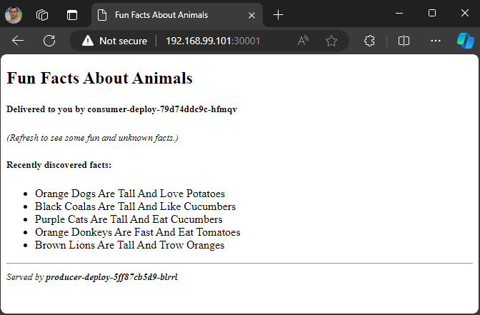
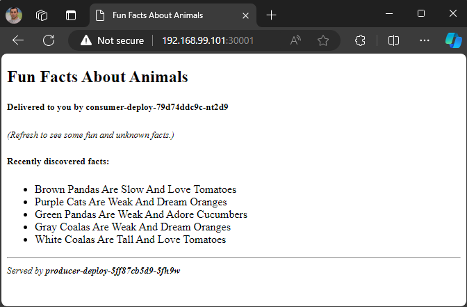

# Tasks *
You are expected to complete the following set of tasks:
### 1.	Create and register two Kubernetes uses – **Ivan** (**ivan**) and **Mariana** (**mariana**) who are part of the **Gurus** (**gurus**) group
- Setting up a Vanilla Kubernetes cluster
- Create users with `create_k8s_user.sh` bash script
```sh
#!/bin/bash

# Function to create OS Linux local users
create_os_users() {
  local username=$1

  sudo useradd -m -s /bin/bash ${username}
  sudo passwd ${username}

  printf "OS Linux local user %s was created successfully\n" "$username"
}

# Function to create a private key for user
create_private_key() {
  local username=$1

  cd /home/${username}
  sudo mkdir -p .certs && cd .certs

  printf "Generating private key for %s...\n" "$username"
  sudo openssl genrsa -out ${username}.key 2048

  printf "Private key generated for user %s\n" "$username"
}

# Function to create certificates for a Kubernetes user
create_certificates() {
  local username=$1
  local groupname=$2

  printf "Creating Certificate Signing Request (CSR) for %s...\n" "$username"
  sudo openssl req -new -key ${username}.key -out ${username}.csr -subj "/CN=${username}/O=${groupname}"

  printf "Signing the CSR with Kubernetes CA...\n"
  sudo openssl x509 -req -in ${username}.csr -CA /etc/kubernetes/pki/ca.crt -CAkey /etc/kubernetes/pki/ca.key -CAcreateserial -out ${username}.crt -days 365

  printf "Certificates generated for user %s.\n" "$username"
}

# Function to create kubeconfig for a Kubernetes user
create_kubeconfig() {
  local username=$1

  printf "Creating kubeconfig for %s...\n" "$username"
  kubectl config set-credentials ${username} --client-certificate=/home/${username}/.certs/${username}.crt --client-key=/home/${username}/.certs/${username}.key
  kubectl config set-context ${username}-context --cluster=kubernetes --user=${username}

  printf "Kubeconfig created for user %s.\n" "$username"
}

# Function to create user config file
create_user_config() {
  local username=$1

  sudo mkdir -p /home/${username}/.kube
  cd /home/${username}/.kube

  cat > config << EOF
apiVersion: v1
clusters:
- cluster:
    certificate-authority-data: LS0tLS1CRUdJTiBDRVJUSUZJQ0FURS0tLS0tCk1JSURCVENDQWUyZ0F3SUJBZ0lJVXc4WE1hWUpZT0V3RFFZSktvWklodmNOQVFFTEJRQXdGVEVUTUJFR0ExVUUKQXhNS2EzVmlaWEp1WlhSbGN6QWVGdzB5TkRFd01qY3dOakE0TURkYUZ3MHpOREV3TWpVd05qRXpNRGRhTUJVeApFekFSQmdOVkJBTVRDbXQxWW1WeWJtVjBaWE13Z2dFaU1BMEdDU3FHU0liM0RRRUJBUVVBQTRJQkR3QXdnZ0VLCkFvSUJBUURDTDcvSmtValJCSUVRbHVBaFBhKzFpZWlyQ3lFdHpLaXowRkZpelZnKzRvbi9HUU1kbWFlVmUzTzgKemN4VGx4RmNxdnJkdzdGR3JpeVM4OGxwK1RuRmN5QXpNdUxEam5lNjZsUWVkWTd1MzR3cVh1YWdPQ05DUXJSWgo4VnE0a0g3TnVhWGVvUlFvN2lJU2tjbmU3eVFTQ0ZEWU9uc09mTTBHcmF0RGt4SGNmdEVENnY1M3BObEhTeWRIClZmSXAwbklCeUpOZTUxbWZvcktZRVJTOFN0MkdLc05XUlRCNk0zYTFoMFcyK0p5L1dSa1RpNlc1dkFnWGJTTzgKYm1MQzBiYnZUZzAyRkZnbDBPWWQ4L01JOGducUZCS1JWaDU4OXArV1d2YVpaYlFucHZCYWdaeG93TXlKbTFWZAovYzFvS0JrbGN2RWwzeEhTalFsNlRVa1N3OURsQWdNQkFBR2pXVEJYTUE0R0ExVWREd0VCL3dRRUF3SUNwREFQCkJnTlZIUk1CQWY4RUJUQURBUUgvTUIwR0ExVWREZ1FXQkJTZ29PRmVrdDNvckhoTVA4bStsbi9Ib216elRqQVYKQmdOVkhSRUVEakFNZ2dwcmRXSmxjbTVsZEdWek1BMEdDU3FHU0liM0RRRUJDd1VBQTRJQkFRQXNvSk1Rc2tYYwp5b2RBbjkxZ0xyVzFvMENxQUQyQlluU3ZTTmt3cVRXbStUU2wwU0FaWWNGaytFZUN1b3Q4S1hGUzB5UDZGL2MwCi9oeWlleHpFUW02VFUzS1VMMkVQeWxhVHlRRlp4TnJMK1BSa0pnTURGWE9PSEF4TmJNWlgrTXFYNDBBeXFjWjUKOEtKSDcwSnovMm01QWpaMU1uN2JwY2xkSzJLekZuL24xREVUTk4vaTUwelowR1B3Y2p1OEptbHNHUVQxMlpvNQp1WWNadm05dDNtdGNHQWFDWm8rcWRNb0ozdHlYR2tUeHpkVnozM284YmVzWjNEbC9KbjFzYWdvMlVQa0ljc08zCmRwdXU1ai9wN29KUHczSGFEaWQ3blpEVWlzYmhJZzdSNnJxdWsvYzgyRGlOYm1sYS9GZVFzT04xWkxpRTNiWmcKY1MyajFjSTNnZjkvCi0tLS0tRU5EIENFUlRJRklDQVRFLS0tLS0K
    server: https://192.168.99.101:6443
  name: kubernetes
contexts:
- context:
    cluster: kubernetes
    user: ${username}
  name: ${username}-context
current-context: ${username}-context
kind: Config
preferences: {}
users:
- name: ${username}
  user:
    client-certificate: /home/${username}/.certs/${username}.crt
    client-key: /home/${username}/.certs/${username}.key
EOF

  sudo chown -R ${username}: /home/${username}/
}

# Read user input
read -p "Enter the username: " username
read -p "Enter the group name: " groupname

# Create certificates and config for the user
create_os_users $username
create_private_key $username
create_certificates $username $groupname
create_kubeconfig $username
create_user_config $username

printf "User %s from group %s has been registered in Kubernetes.\n" "$username" "$groupname"
```
- Create user `ivan`
```sh
$ sudo ./create_k8s_user.sh
Enter the username: ivan
Enter the group name: gurus
New password:
Retype new password:
passwd: password updated successfully
OS Linux local user ivan was created successfully
Generating private key for ivan...
Private key generated for user ivan
Creating Certificate Signing Request (CSR) for ivan...
Signing the CSR with Kubernetes CA...
Certificate request self-signature ok
subject=CN = ivan, O = gurus
Certificates generated for user ivan.
Creating kubeconfig for ivan...
User "ivan" set.
Context "ivan-context" modified.
Kubeconfig created for user ivan.
User ivan from group gurus has been registered in Kubernetes.

$ su - ivan

$ kubectl config get-users
NAME
ivan

$ kubectl config get-contexts
CURRENT   NAME           CLUSTER      AUTHINFO   NAMESPACE
*         ivan-context   kubernetes   ivan

$ kubectl config view
apiVersion: v1
clusters: null
contexts:
- context:
    cluster: kubernetes
    user: ivan
  name: ivan-context
current-context: ivan-context
kind: Config
preferences: {}
users:
- name: ivan
  user:
    client-certificate: /home/ivan/.certs/ivan.crt
    client-key: /home/ivan/.certs/ivan.key
```
- Create user `mariana`
```sh
$ sudo ./create_k8s_user.sh
Enter the username: mariana
Enter the group name: gurus
New password:
Retype new password:
passwd: password updated successfully
OS Linux local user mariana was created successfully
Generating private key for mariana...
Private key generated for user mariana
Creating Certificate Signing Request (CSR) for mariana...
Signing the CSR with Kubernetes CA...
Certificate request self-signature ok
subject=CN = mariana, O = gurus
Certificates generated for user mariana.
Creating kubeconfig for mariana...
User "mariana" set.
Context "mariana-context" created.
Kubeconfig created for user mariana.
User mariana from group gurus has been registered in Kubernetes.

$ kubectl config get-users
NAME
mariana

$ kubectl config get-contexts
CURRENT   NAME              CLUSTER      AUTHINFO   NAMESPACE
*         mariana-context   kubernetes   mariana

$ kubectl config view
apiVersion: v1
clusters: null
contexts:
- context:
    cluster: kubernetes
    user: mariana
  name: mariana-context
current-context: mariana-context
kind: Config
preferences: {}
users:
- name: mariana
  user:
    client-certificate: /home/mariana/.certs/mariana.crt
    client-key: /home/mariana/.certs/mariana.key
```
### 2.	Create a **namespace** named **projectx**
```sh
$ cat create-ns.yaml
apiVersion: v1
kind: Namespace
metadata:
  name: projectx

$ kubectl apply -f create-ns.yaml
namespace/projectx created
```
### 3.	Create a **LimitRange** for the namespace to set **defaults**, **minimum** and **maximum** both for **CPU** and **memory** (use values that you consider suitable)
- LimitRange manifest `create-limits.yaml`
```sh
$ cat create-limits.yaml
apiVersion: v1
kind: LimitRange
metadata:
  name: projectx-limits
  namespace: projectx
spec:
  limits:
  - type: Pod
    max:
      cpu: "2000m"
      memory: "1.5Gi"
    min:
      cpu: "100m"
      memory: "100Mi"
  - type: Container
    default:
      cpu: "200m"
      memory: "128Mi"
    max:
      cpu: "1000m"
      memory: "750Mi"
    min:
      cpu: "50m"
      memory: "64Mi"

$ kubectl apply -f create-limits.yaml
limitrange/projectx-limits created

$ kubectl describe limitrange projectx-limits -n projectx
Name:       projectx-limits
Namespace:  projectx
Type        Resource  Min    Max     Default Request  Default Limit  Max Limit/Request Ratio
----        --------  ---    ---     ---------------  -------------  -----------------------
Pod         cpu       100m   2       -                -              -
Pod         memory    100Mi  1536Mi  -                -              -
Container   cpu       50m    1       200m             200m           -
Container   memory    64Mi   750Mi   128Mi            128Mi          -
```
### 4.	Create a **ResourceQuota** for the namespace to set **requests** and **limits** both for **CPU** and **memory** (use values that you consider suitable). In addition, add limits for **pods**, **services**, **deployments**, and **replicasets** (again, use values that you find appropriate)
- ResourceQuota manifest `create-quota.yaml`
```sh
$ cat create-quota.yaml
apiVersion: v1
kind: ResourceQuota
metadata:
  name: projectx-quota
  namespace: projectx
spec:
  hard:
    requests.cpu: "2000m"
    requests.memory: "1.8Gi" 
    limits.cpu: "4000m"       
    limits.memory: "4Gi"
    pods: "8"
    count/services: "5"
    count/deployments.apps: "5"
    count/replicasets.apps: "5"

$ kubectl apply -f create-quota.yaml
resourcequota/projectx-quota configured

$ kubectl describe quota projectx-quota -n projectx
Name:                   projectx-quota
Namespace:              projectx
Resource                Used  Hard
--------                ----  ----
count/deployments.apps  0     5
count/replicasets.apps  0     5
count/services          0     5
limits.cpu              0     4
limits.memory           0     4Gi
pods                    0     8
requests.cpu            0     2
requests.memory         0     1932735283200m
```
### 5.	Create a custom role (**devguru**) which will allow the one that has it to do anything with any of the following resources **pods**, **services**, **deployments**, and **replicasets**. Grant the role to **ivan** and **mariana** (or to the group they belong to) for the namespace created earlier
- Role and RoleBinding manifest `create-group-role-binding.yaml`
```sh
$ cat create-group-role-binding.yaml
apiVersion: rbac.authorization.k8s.io/v1
kind: Role
metadata:
  name: devguru
  namespace: projectx
rules:
- apiGroups: ["", "apps"]
  resources: ["pods", "services", "deployments", "replicasets"]
  verbs: ["*"]
---
apiVersion: rbac.authorization.k8s.io/v1
kind: RoleBinding
metadata:
  name: devguru-binding
  namespace: projectx
subjects:
- kind: Group
  name: gurus
  apiGroup: rbac.authorization.k8s.io
roleRef:
  kind: Role
  name: devguru
  apiGroup: rbac.authorization.k8s.io

$ kubectl apply -f create-group-role-binding.yaml
role.rbac.authorization.k8s.io/devguru unchanged
rolebinding.rbac.authorization.k8s.io/devguru-binding created

$ kubectl get role,rolebinding -n projectx
NAME                                     CREATED AT
role.rbac.authorization.k8s.io/devguru   2024-10-27T07:49:44Z

NAME                                                    ROLE           AGE
rolebinding.rbac.authorization.k8s.io/devguru-binding   Role/devguru   61s
```
### 6.	Using one of the two users, deploy the **producer-consumer** application (use the attached files – you may need to modify them a bit). Deploy one additional pod that will act as a (curl) **client**
- Login as `mariana`
```sh
su - mariana
```
- Deploy manifest `producer-deployment.yml`. Add `namespace: projectx` under `metadata`
```sh
$ kubectl config current-context
mariana-context

$ cat producer-deployment.yml
apiVersion: apps/v1
kind: Deployment
metadata:
  name: producer-deploy
  namespace: projectx
spec:
  replicas: 3
  selector:
    matchLabels:
      app: fun-facts
      role: producer
  minReadySeconds: 15
  strategy:
    type: RollingUpdate
    rollingUpdate:
      maxUnavailable: 1
      maxSurge: 1
  template:
    metadata:
      labels:
        app: fun-facts
        role: producer
    spec:
      containers:
      - name: prod-container
        image: shekeriev/k8s-producer:latest
        ports:
        - containerPort: 5000

$ kubectl apply -f producer-deployment.yml
deployment.apps/producer-deploy created

$ kubectl get pods -n projectx
NAME                               READY   STATUS    RESTARTS   AGE
producer-deploy-5ff87cb5d9-2b8kt   1/1     Running   0          21s
producer-deploy-5ff87cb5d9-887ns   1/1     Running   0          21s
producer-deploy-5ff87cb5d9-cg97f   1/1     Running   0          21s
```
- Deploy manifest `producer-svc.yml`. Add `namespace: projectx` under `metadata`
```sh
$ cat producer-svc.yml
apiVersion: v1
kind: Service
metadata:
  name: producer
  namespace: projectx
  labels:
    app: fun-facts
    role: producer
spec:
  type: ClusterIP
  ports:
  - port: 5000
    protocol: TCP
  selector:
    app: fun-facts
    role: producer

$ kubectl apply -f producer-svc.yml
service/producer created
```
- Run client pod
```sh
$ kubectl run client --image=alpine --namespace projectx -- sleep 1d
pod/client created

$ kubectl get pod,svc -n projectx -o wide
NAME                                   READY   STATUS    RESTARTS   AGE     IP              NODE    NOMINATED NODE   READINESS GATES
pod/client                             1/1     Running   0          11s     10.244.104.19   node2   <none>           <none>
pod/producer-deploy-5ff87cb5d9-5fh9w   1/1     Running   0          5m43s   10.244.135.16   node3   <none>           <none>
pod/producer-deploy-5ff87cb5d9-blrrl   1/1     Running   0          5m43s   10.244.104.17   node2   <none>           <none>
pod/producer-deploy-5ff87cb5d9-jz8pz   1/1     Running   0          5m43s   10.244.104.18   node2   <none>           <none>

NAME               TYPE        CLUSTER-IP      EXTERNAL-IP   PORT(S)    AGE     SELECTOR
service/producer   ClusterIP   10.101.16.177   <none>        5000/TCP   5m38s   app=fun-facts,role=producer
```
- Login to clinet pod
```sh
$ kubectl exec -it client -n projectx -- sh
```
- Execute on `client` pod
```sh
$ apk add curl
fetch https://dl-cdn.alpinelinux.org/alpine/v3.20/main/x86_64/APKINDEX.tar.gz
fetch https://dl-cdn.alpinelinux.org/alpine/v3.20/community/x86_64/APKINDEX.tar.gz
(1/10) Installing ca-certificates (20240705-r0)
(2/10) Installing brotli-libs (1.1.0-r2)
(3/10) Installing c-ares (1.33.1-r0)
(4/10) Installing libunistring (1.2-r0)
(5/10) Installing libidn2 (2.3.7-r0)
(6/10) Installing nghttp2-libs (1.62.1-r0)
(7/10) Installing libpsl (0.21.5-r1)
(8/10) Installing zstd-libs (1.5.6-r0)
(9/10) Installing libcurl (8.10.1-r0)
(10/10) Installing curl (8.10.1-r0)
Executing busybox-1.36.1-r29.trigger
Executing ca-certificates-20240705-r0.trigger
OK: 13 MiB in 24 packages

$ curl --connect-timeout 5 http://producer:5000
<h5>Recently discovered facts:</h5>
<ul>
<li>White Donkeys Are Weak And Dream Potatoes</li>
<li>Orange Cats Are Slow And Dream Bananas</li>
<li>Yellow Horses Are Slow And Adore Cucumbers</li>
<li>Orange Dogs Are Tall And Eat Cucumbers</li>
<li>Yellow Chameleons Are Short And Eat Onions</li>
</ul>
<hr>
<small><i>Served by <b>producer-deploy-5ff87cb5d9-5fh9w</b></i></small>
```
### 7.	Create one or more **NetworkPolicy** resources in order to
#### a.	Allow communication to the **producer** only from the **consumer**
- Deploy manifest `consumer-deployment.yml`. Add `namespace: projectx` under `metadata`
```sh
$ cat consumer-deployment.yml
apiVersion: apps/v1
kind: Deployment
metadata:
  name: consumer-deploy
  namespace: projectx
spec:
  replicas: 3
  selector:
    matchLabels:
      app: fun-facts
      role: consumer
  minReadySeconds: 15
  strategy:
    type: RollingUpdate
    rollingUpdate:
      maxUnavailable: 1
      maxSurge: 1
  template:
    metadata:
      labels:
        app: fun-facts
        role: consumer
    spec:
      containers:
      - name: cons-container
        image: shekeriev/k8s-consumer:latest
        ports:
        - containerPort: 5000

$ kubectl apply -f consumer-deployment.yml
deployment.apps/consumer-deploy created
```
- Deploy manifest `consumer-svc.yml`. Add `namespace: projectx` under `metadata`
```sh
$ cat consumer-svc.yml
apiVersion: v1
kind: Service
metadata:
  name: consumer
  namespace: projectx
  labels:
    app: fun-facts
    role: consumer
spec:
  type: NodePort
  ports:
  - port: 5000
    nodePort: 30001
    protocol: TCP
  selector:
    app: fun-facts
    role: consumer

$ kubectl apply -f consumer-svc.yml
service/consumer created
```
- Check all pods and services in namespace `projectx`
```sh
$ kubectl get pod,svc -n projectx -o wide
NAME                                   READY   STATUS    RESTARTS   AGE     IP              NODE    NOMINATED NODE   READINESS GATES
pod/client                             1/1     Running   0          11m     10.244.104.19   node2   <none>           <none>
pod/consumer-deploy-79d74ddc9c-hfmqv   1/1     Running   0          2m18s   10.244.135.19   node3   <none>           <none>
pod/consumer-deploy-79d74ddc9c-nt2d9   1/1     Running   0          113s    10.244.104.21   node2   <none>           <none>
pod/consumer-deploy-79d74ddc9c-vpms7   1/1     Running   0          113s    10.244.135.20   node3   <none>           <none>
pod/producer-deploy-5ff87cb5d9-5fh9w   1/1     Running   0          17m     10.244.135.16   node3   <none>           <none>
pod/producer-deploy-5ff87cb5d9-blrrl   1/1     Running   0          17m     10.244.104.17   node2   <none>           <none>
pod/producer-deploy-5ff87cb5d9-jz8pz   1/1     Running   0          17m     10.244.104.18   node2   <none>           <none>

NAME               TYPE        CLUSTER-IP      EXTERNAL-IP   PORT(S)          AGE   SELECTOR
service/consumer   NodePort    10.106.180.9    <none>        5000:30001/TCP   22s   app=fun-facts,role=consumer
service/producer   ClusterIP   10.101.16.177   <none>        5000/TCP         17m   app=fun-facts,role=producer
```
- Check Quota after deploying all pods
```sh
$ kubectl describe quota projectx-quota -n projectx
Name:                   projectx-quota
Namespace:              projectx
Resource                Used       Hard
--------                ----       ----
count/deployments.apps  2          5
count/replicasets.apps  2          5
count/services          2          5
limits.cpu              1800m      4
limits.memory           896Mi      4Gi
pods                    7          8
requests.cpu            1800m      2
requests.memory         939524096  1932735283200m
```
- Picture



- Apply NetworkPolicy `create-policy-a.yaml`
```sh
$ cat create-policy-a.yaml
apiVersion: networking.k8s.io/v1
kind: NetworkPolicy
metadata:
  name: access-producer-form-consumer
  namespace: projectx
spec:
  podSelector:
    matchLabels:
      role: producer
  policyTypes:
  - Ingress
  ingress:
  - from:
    - podSelector:
        matchLabels:
          role: consumer
    ports:
    - protocol: TCP
      port: 5000

$ kubectl apply -f create-policy-a.yaml
networkpolicy.networking.k8s.io/access-producer-form-consumer created

$ kubectl describe netpol access-producer-form-consumer -n projectx
Name:         access-producer-form-consumer
Namespace:    projectx
Created on:   2024-10-27 13:50:15 +0200 EET
Labels:       <none>
Annotations:  <none>
Spec:
  PodSelector:     role=producer
  Allowing ingress traffic:
    To Port: 5000/TCP
    From:
      PodSelector: role=consumer
  Not affecting egress traffic
  Policy Types: Ingress
```
- Login to clinet pod
```sh
$ kubectl exec -it client -n projectx -- sh
```
- Execute on `client` pod
```sh
$ curl --connect-timeout 5 http://producer:5000
curl: (28) Failed to connect to producer port 5000 after 5003 ms: Timeout was reached
```
- Check from one of the consumer pods
```sh
$ kubectl get pods -n projectx
NAME                               READY   STATUS    RESTARTS   AGE
client                             1/1     Running   0          93m
consumer-deploy-79d74ddc9c-hfmqv   1/1     Running   0          83m
consumer-deploy-79d74ddc9c-nt2d9   1/1     Running   0          83m
consumer-deploy-79d74ddc9c-vpms7   1/1     Running   0          83m
producer-deploy-5ff87cb5d9-5fh9w   1/1     Running   0          98m
producer-deploy-5ff87cb5d9-blrrl   1/1     Running   0          98m
producer-deploy-5ff87cb5d9-jz8pz   1/1     Running   0          98m

$ kubectl exec -it consumer-deploy-79d74ddc9c-hfmqv -n projectx -- sh
```
- Execute on `consumer-deploy-79d74ddc9c-hfmqv` pod
```sh
$ apt update && apt install curl -y

$ curl --connect-timeout 5 http://producer:5000
<h5>Recently discovered facts:</h5>
<ul>
<li>Black Lions Are Weak And Like Cucumbers</li>
<li>Pink Pandas Are Fat And Love Oranges</li>
<li>Black Pandas Are Short And Adore Oranges</li>
<li>Gray Horses Are Fast And Love Tomatoes</li>
<li>Brown Bears Are Short And Eat Bananas</li>
</ul>
<hr>
<small><i>Served by <b>producer-deploy-5ff87cb5d9-blrrl</b></i></small>
```
- Picture


#### b.	Allow communication to the **consumer** only from the **client**
- Add label to `client` pod 
```sh
$ kubectl label pods client --namespace projectx role=client
pod/client labeled
```
- Apply NetworkPolicy `create-policy-b.yaml`
```sh
$ cat create-policy-b.yaml
apiVersion: networking.k8s.io/v1
kind: NetworkPolicy
metadata:
  name: access-consumer-from-client
  namespace: projectx
spec:
  podSelector:
    matchLabels:
      role: consumer
  policyTypes:
  - Ingress
  ingress:
  - from:
    - podSelector:
        matchLabels:
          role: client
    ports:
    - protocol: TCP
      port: 5000

$ kubectl apply -f create-policy-b.yaml
networkpolicy.networking.k8s.io/access-consumer-from-client created

$ kubectl describe netpol access-consumer-from-client -n projectx
Name:         access-consumer-from-client
Namespace:    projectx
Created on:   2024-10-27 14:03:43 +0200 EET
Labels:       <none>
Annotations:  <none>
Spec:
  PodSelector:     role=consumer
  Allowing ingress traffic:
    To Port: 5000/TCP
    From:
      PodSelector: role=client
  Not affecting egress traffic
  Policy Types: Ingress
```
- Login to `clinet` pod
```sh
$ kubectl exec -it client -n projectx -- sh
```
- Execute on `client` pod
```sh
$ curl --connect-timeout 5 http://consumer:5000
<!doctype html>

<html lang="en">
<head>
  <meta charset="utf-8">
  <meta name="viewport" content="width=device-width, initial-scale=1">
  <title>Fun Facts About Animals</title>
  <meta name="description" content="Overview of the recently discovered fun facts about animals">
  <meta name="author" content="Crazy Scientist">
</head>

<body>
  <h2>Fun Facts About Animals</h2>
  <h5>Delivered to you by consumer-deploy-79d74ddc9c-nt2d9</h5>
  <i><small>(Refresh to see some fun and unknown facts.)</small></i>
  <br />
  <div>
<h5>Recently discovered facts:</h5>
<ul>
<li>Pink Lions Are Tall And Dream Tomatoes</li>
<li>Gray Chameleons Are Short And Adore Bananas</li>
<li>Green Coalas Are Strong And Adore Bananas</li>
<li>Blue Crocodiles Are Weak And Adore Tomatoes</li>
<li>Green Coalas Are Weak And Love Cucumbers</li>
</ul>
<hr>
<small><i>Served by <b>producer-deploy-5ff87cb5d9-blrrl</b></i></small>

  </div>

</body>

</html>/
```