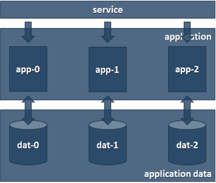


# **Practice M4: Storage and Persistence**
For the purpose of this practice, we will assume that we are working on a machine with either a Windows 10/11 or any recent Linux distribution and there is a local virtualization solution (like VirtualBox, Hyper-V, VMware Workstation, etc.) installed with Kubernetes cluster created on top of it

***Please note that long commands may be hard to read here. To handle this, you can copy them to a plain text editor first. This will allow you to see them correctly. Then you can use them as intended***
## **Part 1: (Persistent) Volumes and Claims**
### **The Docker Way**
*This section is for refreshing our knowledge, and it is not mandatory. You are free to skip it, especially if you do not have a Docker instance available to experiment with*

Let's first remember how we did this when we used to work with plain **Docker** instances

We will need access to one such instance. Let's log on to it
#### **Bind Mounts**
First, we will test the **bind mounts**

For the usual example, we must create a **~/html** folder
```sh
mkdir ~/html
```

There, we can create an **index.html** file
```sh
echo 'A simple <b>bind mount</b> test' | tee ~/html/index.html
```

Finally, we can run a **NGINX** based container and mount the folder there
```sh
docker container run -d --name web -p 80:80 -v $(pwd)/html:/usr/share/nginx/html:ro nginx
```

Then, of course, if we ask for the web page
```sh
curl http://localhost
```

We will see our sample page

Should we want, we can ask for detailed information about the container
```sh
docker container inspect web
```

We should pay attention to the **Mounts** section and especially on the **Type** which should be set to **bind**

Remove the container
```sh
docker container rm web --force
```
#### **Volumes**
Now, we can test the **volumes**

First, create a volume
```sh
docker volume create demo
```

Then list the available volumes
```sh
docker volume ls
```

And then, inspect the volume we just created
```sh
docker volume inspect demo
```

Now, that we know where its data reside, we can work directly with it

Let's create a custom **index.html** page again
```sh
echo 'A simple <b>volume</b> test' | sudo tee /var/lib/docker/volumes/demo/\_data/index.html
```

Now, start a container that will mount the volume
```sh
docker container run -d --name web -p 80:80 -v demo:/usr/share/nginx/html:ro nginx
```

Alternatively, we can use the **--mount** option. Then the command will look like
```sh
docker container run -d --name web -p 80:80 --mount source=demo,destination=/usr/share/nginx/html nginx
```

No matter which one we used, after the container is started, if we ask for the web page
```sh
curl http://localhost
```
We will see our sample page

Let's ask for detailed information about the container
```sh
docker container inspect web
```
Again, pay attention to the **Mounts** section and especially on the **Type** which should this time be set to **volume**

Remove the container
```sh
docker container rm web --force
```
And then remove the volume as well
```sh
docker volume rm demo
```
### **Ephemeral Volumes**
Let's switch to **Kubernetes** and explore some of the storage-related options there

For this exercise we will need a generic **Kubernetes** cluster

Even though most of the steps could be successfully executed in **Minikube**, we will assume that we are working in a custom-built cluster with two or three nodes
#### **EmptyDir**
One of simplest options is to use the **EmptyDir** volume

We should keep in mind that it is ephemeral and will disappear together with the **Pod** once terminated

Let's create a **part1/emptydir-pod.yaml** manifest with the following content
```yaml
apiVersion: v1
kind: Pod
metadata:
name: pod-ed
labels:
  app: notes
spec:
  containers:
  - image: shekeriev/k8s-notes
    name: container-ed
    volumeMounts:
    - mountPath: /data
      name: data-volume
  volumes:
  - name: data-volume
    emptyDir: {}
```
Save and close the file and then apply it
```sh
kubectl apply -f part1/emptydir-pod.yaml
```
Then create the service manifest **part1/service.yaml** manifest as well
```yaml
apiVersion: v1
kind: Service
metadata:
  name: svc-vol
spec:
  type: NodePort
  ports:
  - port: 80
    nodePort: 30001
    protocol: TCP
  selector:
    app: notes
```
Save and close the file and then apply it as well
```sh
kubectl apply -f part1/service.yaml
```
Check what we have created
```sh
kubectl get pods,svc
```
Open a browser tab and navigate to the service URL (**http://<cluster-node-ip>:30001**) 

Enter a few notes

Then, check details about the pod
```sh
kubectl describe pod pod-ed
```
Pay attention to the **Volumes** section and especially to the **data-volume** block

Open a session to the only container in the pod
```sh
kubectl exec -it pod-ed -- bash
```
Check the content of the folder and the file
```sh
ls -al /data

cat /data/notes.txt
```
Close the session
```sh
exit
```
Restart the container (not the pod) by terminating its main process
```sh
kubectl exec -it pod-ed -- /bin/bash -c "kill 1"
```
Confirm that it was indeed terminated
```sh
kubectl describe pod pod-ed
```
Pay attention to the **Last State** section

Now, reopen the browser tab and check if the notes that we entered are there

Yes, they should be still there

Try to add a few more

Now, terminate the whole pod
```sh
kubectl delete pod pod-ed
```
And create a new one
```sh
kubectl apply -f part1/emptydir-pod.yaml
```
Check the detailed information
```sh
kubectl describe pod pod-ed
```
Now, reopen the browser tab and check if the notes that we entered are there

No, they should not be there

Remove just the pod
```sh
kubectl delete pod pod-ed
```
#### **GitRepo**
Let's test something else

Prepare a new **part1/git-pod.yaml** manifest with the following content
```yaml
apiVersion: v1
kind: Pod
metadata:
  name: pod-git
  labels:
    app: notes
spec:
  containers:
  - image: php:apache
    name: container-git
    volumeMounts:
    - mountPath: /var/www/html
      name: git-volume
    - mountPath: /data
      name: data-volume
  volumes:
  - name: git-volume    `gitRepo:
      repository: "https://github.com/shekeriev/k8s-notes.git"
      revision: "main"
      directory: .
  - name: data-volume
    emptyDir: {}
```
Save and close the file and send it to the cluster
```sh
kubectl apply -f part1/git-pod.yaml
```
*You will see a warning that this was deprecated. Ignore it for now*

Open a session to the container inside the pod
```sh
kubectl exec -it pod-git -- bash
```
And check what is the situation there. Then close the session

Now, open a browser tab, but adjust the address to **http://<cluster-node-ip>:30001/code/index.php[]()**

It looks great but it is marked as deprecated and perhaps will be removed in the next versions, so we must avoid using it

But what if we want or need similar functionality?

Then we must mount an **EmptyDir** into an **InitContainer** that clones the repo using git, then mount the **EmptyDir** into the Pod's container (*we will elaborate on this in another module*)

Clean up by deleting the pod 
```sh
kubectl delete pod pod-git
```
### **Persistent Volumes**
Should we want persistence, we must use something else to store our Pod's data
#### **HostPath**
This is the simplest option

While working, it binds us (or our Pod) to the host's filesystem, so we should use it with care

In addition, it may expose security vulnerabilities, so we should use it in read only mode until we know what we are doing

Let's give it a try

Create a **part1/hostpath-deployment.yaml** manifest with the following content
```yaml
apiVersion: apps/v1
kind: Deployment
metadata:
  name: notes-deploy
spec:
  replicas: 3
  selector:
    matchLabels: 
      app: notes
  template:
    metadata:
      labels:
        app: notes
    spec:
      containers:
      - name: container-hp
        image: shekeriev/k8s-notes
        volumeMounts:
        - mountPath: /data
          name: hp-data
      volumes:
      - name: hp-data
        hostPath:
          path: /tmp/data
          type: Directory
```
Save and close the file 

Before we send the file to the cluster, we must create the **/tmp/data** folder on every node

We must set the permissions to **777** 

Then we can send the manifest to the cluster
```sh
kubectl apply -f part1/hostpath-deployment.yaml
```
After a few seconds check the pods and where they ended up
```sh
kubectl get pods -o wide
```
Now, open a browser tab, and navigate to **http://<cluster-node-ip>:30001/index.php**

Enter a few notes

At some time, past notes will vanish. Why?

Enter again a few notes

Then refresh until the name of the pod changes. Are there any notes? Which ones and why?

So, while a good option, we should make sure that all nodes have the same set of files, and they are synchronized

This is not always possible, so we should be careful where and how we use this option

Clean up by removing the deployment
```sh
kubectl delete -f part1/hostpath-deployment.yaml
```
#### **NFS**
This one is a way better than using the previous option

We assume that there is a **NFS** server available and accessible by name (**nfs-server**)

Make sure the following things:

- That the **NFS** server is reachable by that name from all nodes
```sh
echo 'nfs-server-ip   nfs-server' | sudo tee -a /etc/hosts
```
- That on every node there is **NFS** client installed
```sh
sudo apt-get update && apt-get install -y nfs-common
```
- That the exported path on the NFS server is writable (in our case by everyone)
```sh
chmod -R 777 /data/nfs/k8sdata
```
Prepare the **part1/nfs-deployment.yaml** manifest with the following content
```yaml
apiVersion: apps/v1
kind: Deployment
metadata:
  name: notes-deploy
spec:
  replicas: 3
  selector:
    matchLabels: 
      app: notes
  template:
    metadata:
      labels:
        app: notes
    spec:
      containers:
      - name: container-nfs
        image: shekeriev/k8s-notes
        volumeMounts:
        - mountPath: /data
          name: nfs-data
      volumes:
      - name: nfs-data
        nfs:
          server: nfs-server
          path: /data/nfs/k8sdata
```
Save and close the file
```sh
kubectl apply -f part1/nfs-deployment.yaml
```
Check the pods and where they went
```sh
kubectl get pods -o wide
```
Now, open a browser tab, and navigate to **http://<cluster-node-ip>:30001/index.php**

Enter a few notes

Refresh a few times. Notes are there and seen by all pods. Why?

Describe one of the pods 
```sh
kubectl describe pod notes-deploy-<specific-id>
```

And pay attention to the **Volumes** section

Clean a bit by deleting the deployment
```sh
kubectl delete -f part1/nfs-deployment.yaml
```
### **Persistent Volumes and Claims**
Now, let's bring the game on another level

We can define **Persistent Volumes** and then let them to be claimed via **Persistent Volume Claims**

Let's create one **part1/pvnfs10gb.yaml** manifest with the following content
```yaml
apiVersion: v1
kind: PersistentVolume
metadata:
  name: pvnfs10gb
  labels:
    purpose: demo
spec:
  capacity:
    storage: 10Gi
  volumeMode: Filesystem
  accessModes:
    - ReadWriteMany
  persistentVolumeReclaimPolicy: Recycle
  mountOptions:
    - nfsvers=4.1
  nfs:
    path: /data/nfs/k8sdata
    server: nfs-server
```
Save and close the file

Send it to the cluster
```sh
kubectl apply -f part1/pvnfs10gb.yaml
```
*You may see a warning that the Recycle reclaim policy is deprecated. Instead, the recommended approach is to use dynamic provisioning.*

Check the list of persistent volumes
```sh
kubectl get pv
```
Pay attention to the **STATUS** and **CLAIM** fields

Describe the one that we created
```sh
kubectl describe pv pvnfs10gb
```
In order to use this persistent volume, we must claim it first

Now, we can create a **part1/pvc10gb.yaml** manifest with the following content
```yaml
apiVersion: v1
kind: PersistentVolumeClaim
metadata:
  name: pvc10gb
spec:
  accessModes:
    - ReadWriteMany
  volumeMode: Filesystem
  resources:
    requests:
      storage: 10Gi
  selector:
    matchLabels:
      purpose: demo
```
Save and close the file

Send it to the cluster
```sh
kubectl apply -f part1/pvc10gb.yaml
```
Get again the list of persistent volumes
```sh
kubectl get pv
```
Pay attention again to the **STATUS** and **CLAIM** fields

Ask for the list of persistent volume claims
```sh
kubectl get pvc
```
And then describe it
```sh
kubectl describe pvc pvc10gb
```
We can see that the **Used By** field is empty

Let's correct this by preparing and launching a deployment **part1/pv-deployment.yaml** with the following content
```yaml
apiVersion: apps/v1
kind: Deployment
metadata:
  name: notes-deploy
spec:
  replicas: 3
  selector:
    matchLabels: 
      app: notes
  template:
    metadata:
      labels:
        app: notes
    spec:
      containers:
      - name: container-nfs
        image: shekeriev/k8s-notes
        volumeMounts:
        - mountPath: /data
          name: volume-by-claim
      volumes:
      - name: volume-by-claim
        persistentVolumeClaim:
          claimName: pvc10gb
```
Save and close the file

Send it to the cluster
```sh
kubectl apply -f part1/pv-deployment.yaml
```
Monitor the pods with
```sh
kubectl get pods -o wide -w
```
Once all up and running, press **Ctrl+C** to stop

Then, check if the claim will be marked as used now
```sh
kubectl describe pvc pvc10gb
```
It should state that it is being used by all three pods that were created by the deployment

Describe one of them to see how it appears
```sh
kubectl describe pod notes-deploy-<specific-id>
```
Explore both the **Volumes** and **Mounts** sections

Now, open a browser tab, and navigate to **http://<cluster-node-ip>:30001/index.php**

Wow, our notes from before are there. Why?

*Perhaps, because we reused the storage infrastructure*

Enter a few notes

Refresh a few times. Notes are there and seen by all pods. Why?

*Perhaps, because this is the normal behavior, having a common and persistent storage shared by all the pods that are part of the same application/service*

Let's see what will happen when we delete both the deployment and the claim and then recreate them again

What do you think?

Let's first delete the deployment 
```sh
kubectl delete -f part1/pv-deployment.yaml
```
And then the claim
```sh
kubectl delete -f part1/pvc10gb.yaml
```
Now, create them again. First the claim
```sh
kubectl apply -f part1/pvc10gb.yaml
```
And then the deployment
```sh
kubectl apply -f part1/pv-deployment.yaml
```
Once all pods are running, open a browser tab, and navigate to **http://<cluster-node-ip>:30001/index.php**

Hm, no notes here. Why?

*Perhaps, because we created the **Persistent Volume** (**pvnfs10gb**) with **persistentVolumeReclaimPolicy** set to **Recycle**. Thus, when we deleted the persistent volume claim, the persistent volume was recycled (wiped)*

Enter a few notes

Scale down the deployment to two replicas
```sh
kubectl scale --replicas=2 deployment notes-deploy
```
Check if the notes will disappear

They are still there. Why?

*We did not release the persistent volume claim, so there wasn't any reason for recycling the persistent volume*
### **Clean Up**
Delete both the deployment and service
```sh
kubectl delete -f part1/pv-deployment.yaml

kubectl delete -f part1/service.yaml
```
Then delete the persistent volume claim
```sh
kubectl delete -f part1/pvc10gb.yaml
```
And finally, the persistent volume
```sh
kubectl delete -f part1/pvnfs10gb.yaml
```
## **Part 2: <a name="_hlk147379355"></a>Configuration Maps and Secrets**
Now, we will explore a few other ways of exchanging information with the pods
### **The Docker Way**
*This section is for refreshing our knowledge, and it is not mandatory. You are free to skip it, especially if you do not have a Docker instance available to experiment with*

Let's first remember how we did this when we used to work with plain **Docker** instances

We will need access to one such instance. Let's log on to it
#### **Environment Variables**
Let's try the ways to pass environment variables to a container

We can pass a variable and its value using the following command
```sh
docker container run -d -p 80:80 --name var --env DEMO\_VAR="Hello Envrironment" shekeriev/k8s-environ
```

Open a browser and navigate to the following address **http://<docker-ip>**

You should notice our **DEMO\_VAR** variable and its value amongst other environment variables

Stop and remove the container
```sh
docker container rm var --force
```
Now, let's send two variables
```sh
docker container run -d -p 80:80 --name var --env XYZ1=VALUE1 --env XYZ2=42 shekeriev/k8s-environ
```
Open a browser and navigate to the following address **http://<docker-ip>**

You should notice our **XYZ1** and **XYZ2** variables and their values amongst other environment variables

Stop and remove the container
```sh
docker container rm var --force
```
We could also pass exported variables. For example, execute the following
```sh
export XYZ1=VALUE1

export XYZ2=42
```
And then start the container with
```sh
docker container run -d -p 80:80 --name var --env XYZ1 --env XYZ2 shekeriev/k8s-environ
```
Open a browser and navigate to the following address **http://<docker-ip>**

You should notice our **XYZ1** and **XYZ2** variables and their values amongst other environment variables

Stop and remove the container
```sh
docker container rm var --force
```
Of course, in the above examples, we can shorten the **--env** option to just **-e**

There is also another way to submit environment variables – by using a file

Variables listed in the file in the form ***VAR=VALUE*** will be initialized with the value stated in the file

Those that are included just as name will be taken from the environment if exist

Create the following file
```sh
cat > env.list << EOF
XYZ1=NEWVALUE
XYZ2
XYZ3
XYZ4="Another variable and its value"
EOF
```
Now, start the container with
```sh
docker container run -d -p 80:80 --name var --env-file env.list shekeriev/k8s-environ
```
Open a browser and navigate to the following address **http://<docker-ip>**

You should notice our **XYZx** variables and their values amongst other environment variables

But wait, **XYZ2** is there and **XYZ3** not. Why?

*Maybe because **XYZ2** was **exported** earlier and present in the current session and **XYZ3** is not defined anywhere. You may notice also that the definition in the file **overwrites** the value of an exported variable (check **XYZ1**)*

Stop and remove the container
```sh
docker container rm var --force
```
Of course, we can mix the above approaches should we want or need to. Try this
```sh
docker container run -d -p 80:80 --name var --env-file env.list --env FOCUSON=XYZ shekeriev/k8s-environ
```
Open a browser and navigate to the following address **http://<docker-ip>**

Stop and remove the container
```sh
docker container rm var --force
```
### **Environment Variables**
Let's switch to **Kubernetes** and explore some of the storage-related options there

For this exercise we will need a generic **Kubernetes** cluster

Even though most of the steps could be successfully executed in **Minikube**, we will assume that we are working in a custom-built cluster with two or three nodes
#### **Environment Variables**
Let's start with a simple manifest like this one (**part2/pod-no-env.yaml**)
```yaml
apiVersion: v1
kind: Pod
metadata:
  name: pod-no-env
  labels:
    app: environ
spec:
  containers:
  - image: shekeriev/k8s-environ
    name: cont-no-env
```
Save and close the file

Send it to the cluster
```sh
kubectl apply -f part2/pod-no-env.yaml
```
Create another manifest (**part2/svc-environ.yaml**) with the following content
```yaml
apiVersion: v1
kind: Service
metadata:
  name: svc-environ
spec:
  type: NodePort
  ports:
  - port: 80
    nodePort: 30001
    protocol: TCP
  selector:
    app: environ
```
Save and close it

Send it to the cluster
```sh
kubectl apply -f part2/svc-environ.yaml
```
Check that both resources are created and ready
```sh
kubectl get pods,svc
```
Now, open a browser tab, and navigate to [**http://<cluster-node-ip>:30001/index.php**]()

Wow, way more variables than we saw on the container we ran on the **Docker** host

We may notice the two sets of variables – **KUBERNETES** and **SVC\_ENVIRON** *(this one may exist or may not exist depending on the creation order)*

They are autogenerated for every service in the same namespace

Let's check if when describing the pod, we can see all or any of those
```sh
kubectl describe pod pod-no-env
```
No, we don't see any of them

Now, let's delete the pod
```sh
kubectl delete -f part2/pod-no-env.yaml
```
How can we send our custom variables to a container in a pod?

Let's prepare another manifest (**part2/pod-w-env.yaml**) with the following content
```yaml
apiVersion: v1
kind: Pod
metadata:
  name: pod-w-env
  labels:
    app: environ
spec:
  containers:
  - image: shekeriev/k8s-environ
    name: cont-w-env
    env:
    - name: XYZ1
      value: "VALUE1"
    - name: XYZ2
      value: "42"
```
Save and close the file

Send it to the cluster
```sh
kubectl apply -f part2/pod-w-env.yaml
```
Now, open a browser tab, and navigate to **http://<cluster-node-ip>:30001/index.php**

Our two variables should be the last two in the long list

Before we delete it, let's describe it to see if the variables will appear there
```sh
kubectl describe pod pod-w-env
```
Pay attention to the **Environment** section. Our variables are there 

Now, we can delete the pod with
```sh
kubectl delete -f part2/pod-w-env.yaml
```
### **Configuration Maps**
Using this way of passing variables to the containers inside a pod is not the most agile one as we are making them part of the manifest

This would require different manifests for the different target environments. We should find a way to separate them – configuration data from the actual manifest data

For this, we can use configuration maps instead of environment variables nested into the manifests

There are multiple ways to prepare a configuration map and then to pass the information to a pod
#### **From Literals**
We can use the create command to prepare and store a configuration map. For example
```sh
kubectl create configmap environ-map-a --from-literal=XYZ1=VALUE1
```
We can then get the list of configuration maps
```sh
kubectl get cm
```
Or describe the one we just created 
```sh
kubectl describe cm environ-map-a
```
Or show its detailed configuration
```sh
kubectl get cm environ-map-a -o yaml
```
How can we change the value? *Perhaps with the **edit** command*

Should we have to, we can create a configuration map with more than one pair at once
```sh
kubectl create configmap environ-map-b --from-literal=XYZ2=42 --from-literal=XYZ3=3.14
```
And check the list of configuration maps
```sh
kubectl get cm
```
Pay attention to the **DATA** column

Delete the two configuration maps
```sh
kubectl delete cm environ-map-a environ-map-b
```
The above can be achieved with manifest (**part2/cm.yaml**) with the following content
```yaml
apiVersion: v1
kind: ConfigMap
metadata:
  name: environ-map-1
data:
  XYZ1: "VALUE1"
  XYZ2: "42"
  XYZ3: "3.14"
```
Save and close the file

Send it to the cluster
```sh
kubectl apply -f part2/cm.yaml
```
And check the list of configuration maps
```sh
kubectl get cm
```
Pay attention to the **DATA** column

Or check it via describe:
```sh
kubectl describe cm environ-map-1
```
#### **From a File**
```sh
Let's prepare a file with a few variables
cat > variables.conf << EOF
XYZ\_FF1=VALUE1
XYZ\_FF2=42
EOF
```
Now, create the configuration map from this file
```sh
kubectl create configmap environ-map-a --from-file=variables.conf
```
And check the list of configuration maps
```sh
kubectl get cm
```
Pay attention to the **DATA** column. I bet that is not quite what you expected 😉

Let's see what is inside the configuration map
```sh
kubectl get cm environ-map-a -o yaml
```
This explains why in the **DATA** column there was **1** instead of **2**

Create one more file
```sh
cat > flag.conf << EOF
true
EOF
```
Now, create a configuration map out of it
```sh
kubectl create configmap environ-map-b --from-file=debug=flag.conf
```
And check the list of configuration maps
```sh
kubectl get cm
```
Let's see what is inside the configuration map
```sh
kubectl get cm environ-map-b -o yaml
```
Okay, let's clean up
```sh
kubectl delete cm environ-map-a environ-map-b
rm variables.conf flag.conf
```
#### **From a Folder**
What if we have to import a set of files?

Of course, we can process them one by one but there is another way

We can read the whole folder

Prepare a folder
```sh
mkdir variables
```
And create two files there
```sh
echo 'production' > variables/mode

echo 'false' > variables/debug
```
Now, let's create the configuration map
```sh
kubectl create configmap environ-map-a --from-file=variables/
```
And check the list of configuration maps
```sh
kubectl get cm
```
Let's see what is inside the configuration map
```sh
kubectl get cm environ-map-a -o yaml
```
Okay, let's clean up
```sh
kubectl delete cm environ-map-a

rm -rf variables/
```
#### **Use Configuration Maps**
Please note, that we can mix the above methods as we like

Now, let's check how we can use those configuration maps
##### **Environment Variable**
We can load an environment variable with data coming from a configuration map

Let's assume that we have the following (**part2/pod-cm-env-var.yaml**) manifest
```yaml
apiVersion: v1
kind: Pod
metadata:
  name: pod-cm-env-var
  labels:
    app: environ
spec:
  containers:
  - image: shekeriev/k8s-environ
    name: cont-w-env
    env:
    - name: XYZ\_FROM\_CM
      valueFrom:
        configMapKeyRef:
          name: environ-map-1
          key: XYZ2
```
Save and close the file

Send it to the cluster
```sh
kubectl apply -f part2/pod-cm-env-var.yaml
```
It uses the configuration map created earlier and maps one of its keys to a variable in the container of the pod

Now, open a browser tab, and navigate to **http://<cluster-node-ip>:30001/index.php**

Our variable should be the last one in the long list

Delete the pod
```sh
kubectl delete pod pod-cm-env-var
```
##### **Environment Variables**
Doing this one variable at a time is not the way we would like to go

We can get all keys from the config map and send them as variables

Check this (**part2/pod-cm-env-vars.yaml**) manifest
```yaml
apiVersion: v1
kind: Pod
metadata:
  name: pod-cm-env-vars
  labels:
    app: environ
spec:
  containers:
  - image: shekeriev/k8s-environ
    name: cont-w-env
    envFrom:
    - configMapRef:
      name: environ-map-1
      #prefix: CM\_ # Use this to prefix variables created from the ConfigMap
```
Save and close the file

Send it to the cluster
```sh
kubectl apply -f part2/pod-cm-env-vars.yaml
```
It uses the configuration map created earlier and maps one of its keys to a variable in the container of the pod

Now, open a browser tab, and navigate to **http://<cluster-node-ip>:30001/index.php**

Our variables should be the last ones in the long list

Delete the pod and the configuration map
```sh
kubectl delete pod pod-cm-env-v```s
```
kubectl delete cm environ-map-1
```
### **Secrets**
Okay, and what about sensitive information? How can we pass it to the containers?

For this we should use secrets
#### **Explore**
*Note that since version 1.24 this is not the case anymore. No secret is automatically created. Skip this section and continue with Create Secrets*

Let's check if there are any secrets defined in the **default** namespace
```sh
kubectl get secret
```
We can see that there is one with three data entries (the **DATA** column)

Let's describe it
```sh
kubectl describe secret
```
First, we do not need to specify a name as there (in the **default** namespace) is just one secret

Second, we did not manage to see all three data entries

Let's try another way
```sh
kubectl get secret -o yaml
```
We can finally see all three entries – **ca.crt**, **namespace** and **token**

This information is automatically attached to the pods that run in this namespace

It allows them to communicate with the cluster (*we used this in the previous module*)

We can also notice that the information is (**base64**) encoded
#### **Create Secrets**
Let's create our own secret

As we will see the process is quite similar to the one used for configuration maps

Start with this form
```sh
kubectl create secret generic secret-a -from-literal=password='Parolka1'
```
Then prepare a file
```sh
echo 'DrugaParolka1' > password.conf
```
And execute this one
```sh
kubectl create secret generic secret-b --from-file=password=password.conf
```
Ask for the available secrets
```sh
kubectl get secret
```
Let's describe them
```sh
kubectl get secret secret-a -o yaml

kubectl get secret secret-b -o yaml
```
Copy one of the encoded secrets and see if you can see the original content
```sh
echo <encoded-text> | base64 --decode
```
Clean the two secrets
```sh
kubectl delete secret secret-a secret-b
```
#### **Create From Manifest**
Now, let's create a few more but from manifest (**part2/secrets.yaml**)
```yaml
apiVersion: v1
kind: Secret
metadata:
  name: mysecrets
  namespace: default
data:
  password1: S3ViZXJuZXRlc1JvY2tzIQo=
  password2: U3VwZXJTZWNyZXRQQHNzdzByZAo=
  message: S3ViZXJuZXRlcyBpcyBib3RoIGZ1biBhbmQgZWFzeSB0byBsZWFybiA7KQo=
```
Save and close the file

Send it to the cluster
```sh
kubectl apply -f part2/secrets.yaml
```
Check that the secret is there
```sh
kubectl get secrets
```
#### **Use Secrets**
Okay, but how do we use them?

We can attach them to environment variables and mount them as volumes

Here we will see the first approach, and the second will be part of the homework 😉

Let's prepare a manifest (**part2/pod-secret.yaml**) with the following content
```yaml
apiVersion: v1
kind: Pod
metadata:
  name: pod-secret
  labels:
    app: environ
spec:
  containers:
  - image: shekeriev/k8s-environ
    name: cont-w-env
    envFrom:
    - secretRef:
        name: mysecrets
      prefix: XYZ\_
```
Save and close the file

Send it to the cluster
```sh
kubectl apply -f part2/pod-secret.yaml
```
Now, open a browser tab, and navigate to **http://<cluster-node-ip>:30001/index.php**

Our three secrets should be exposed as variables with prefix **XYZ\_** and should be the last ones in the long list
### **Clean Up**
Delete all resources that we created during this part and are still there
```sh
kubectl delete pod/pod-secret service/svc-environ secret/mysecrets

rm password.conf
```
## **Part 3: Stateful Sets**
So far, we saw and worked with techniques that allowed scaling of stateless applications

They worked pretty well

How we can address stateful applications, like databases? Can we scale them? How?

Let's imagine that we have an application that has special requirements when scaled. Refer to this image:



Some of the requirements may be:

- Each instance should operate with its set of data
- Each instance should have a predictable name and should be reachable by it
- Instances should come and go (scale) in order
- If an instance goes its data should stay

The solution to all this is the **StatefulSet** resource. In the next few paragraphs, we will explore it
### **Storage Layer**
One of the components that we must handle first is the storage layer

We already know enough about persistent volumes and claims, so let's employ them

Prepare a manifest (**part3/pvssa.yaml**) for a **NFS** backed **PersistentVolume** with the following content
```yaml
apiVersion: v1
kind: PersistentVolume
metadata:
  name: pvssa
  labels:
    purpose: ssdemo
spec:
  capacity:
    storage: 1Gi
  volumeMode: Filesystem
  accessModes:
    - ReadWriteOnce
  persistentVolumeReclaimPolicy: Recycle
  mountOptions:
    - nfsvers=4.1
  nfs:
    path: /data/nfs/k8spva
    server: nfs-server
```
Save and close the file

*Note that you should have the following folders **/data/nfs/k8spva**, **/data/nfs/k8spvb**, and **/data/nfs/k8spvc** created and exported at the target NFS server*

In the same manner, we must prepare two more similar manifests (**pvssb.yaml** and **pvssc.yaml**)

Send all of them to the cluster
```sh
kubectl apply -f part3/pvssa.yaml

kubectl apply -f part3/pvssb.yaml

kubectl apply -f part3/pvssc.yaml
```
And check that they appear as resources
```sh
kubectl get pv
```
Okay, next step is to ensure that the pods will be reachable by name
### **Headless Service**
For this, we must create a service, but not an ordinary one

We must create a headless service

Let's use the following manifest (**part3/svcss.yaml**)
```yaml
apiVersion: v1
kind: Service
metadata:
  name: facts
spec:
  selector:
    app: facts
  clusterIP: None
  ports:
  - port: 5000
    protocol: TCP
```
Save and close the file

Send it to the cluster
```sh
kubectl apply -f part3/svcss.yaml
```
Check that the resource has been created
```sh
kubectl get svc
```
### **Pods and Storage**
Next step is to ensure that each pod will be created in order and will be linked its own storage

This is covered by the **StatefulSet** resource

It contains two templates – one for the **pod** and one for the associated storage (a **claim**)

Those pairs are scaled together

Let's prepare a manifest (**part3/ss.yaml**) for this with the following content
```yaml
apiVersion: apps/v1
kind: StatefulSet
metadata:
  name: facts
spec:
  selector:
    matchLabels:
      app: facts
  serviceName: facts
  replicas: 2
  # POD template
  template:
    metadata:
      labels:
        app: facts
    spec:
      terminationGracePeriodSeconds: 10
      containers:
      - name: main
        image: shekeriev/k8s-facts
        ports:
        - name: app
          containerPort: 5000
        volumeMounts:
        - name: facts-data
          mountPath: /data
  # VolumeClaim template
  volumeClaimTemplates:
  - metadata:
      name: facts-data
    spec:
      accessModes: [ "ReadWriteOnce" ]
      resources:
        requests:
          storage: 1Gi
```
Save and close the file

Send it to the cluster
```sh
kubectl apply -f part3/ss.yaml
```
Check what resources we have so far
```sh
kubectl get pod,svc,statefulset,pv,pvc
```
We may need to execute the above a few times while the two replicas of the stateful set are being created

We can notice that there are the pods, service, persistent volumes, persistent volume claims, and stateful set
### **Public (NodePort) Service**
So far, so good. How can we interact with these?

We may create a standard or public (in our case **NodePort**) service that will expose the pods

Use the following (**part3/svcssnp.yaml**) manifest
```yaml
apiVersion: v1
kind: Service
metadata:
  name: factsnp
spec:
  selector:
    app: facts
  type: NodePort
  ports:
  - port: 5000
    nodePort: 30001
    protocol: TCP
```
Save and close the file

Send it to the cluster
```sh
kubectl apply -f part3/svcssnp.yaml
```
Check what resources we have so far
```sh
kubectl get pod,svc,statefulset,pv,pvc
```
We should have the full set of components now

Open a browser tab, and navigate to **http://<cluster-node-ip>:30001/**

Our application is working

Besides the main information that is displayed – the fun fact and who brought it to us, it also reports information about the other nodes

We may refresh a few times and pay attention to the information that is displayed

It is working 😊
### **Stress and Scaling**
Okay, let's experiment a bit

What will happen if we delete one of the pods?

*Perhaps it will be rescheduled again, but who knows* 😉

First, check where are scheduled the pods currently and what claims are assigned to them
```sh
kubectl get pods,pvc -o wide
```
Then, to delete the first pod, execute
```sh
kubectl delete pod facts-0
```
Now, check again
```sh
kubectl get pods,pvc -o wide
```
As we can see, the node may have changed (or not) but the assigned claim is still the same

Let's return to the browser and see if everything is fine there

Yes, it should be

Now, let's scale down to just one replica
```sh
kubectl scale --replicas=1 statefulset/facts
```
Then, check again what is the situation with the different components
```sh
kubectl get pod,svc,statefulset,pv,pvc
```
We may need to execute it a few times until the scaling finishes

Notice that the **Pod** is deleted but the **PersistentVolumeClaim** is not

Let's return to the browser and see if everything is fine there

Yes, it should be

Now, let's scale up to three replicas
```sh
kubectl scale --replicas=3 statefulset/facts
```
Then, check again what is the situation with the different components
```sh
kubectl get pod,svc,statefulset,pv,pvc
```
We may need to execute it a few times until the scaling finishes

Notice that the claim to pod assignment does not change – **pod #2** (**facts-1**) is attached to the same claim

Let's return to the browser and see if everything is fine there

Yes, it should be
### **Clean Up**
Delete the stateful set first
```sh
kubectl delete statefulset.apps/facts
```
Then the services
```sh
kubectl delete service/facts service/factsnp
```
Next, the persistent claims
```sh
kubectl delete persistentvolumeclaim facts-data-facts-0 facts-data-facts-1 facts-data-facts-2
```
And then the persistent volumes
```sh
kubectl delete persistentvolume pvssa pvssb pvssc
```
