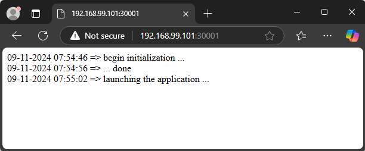
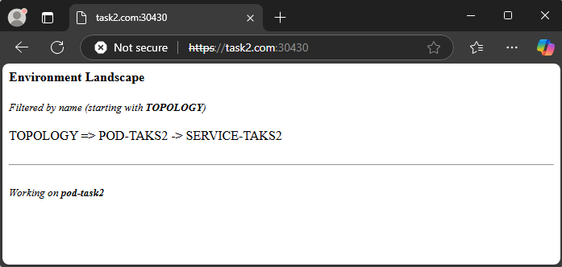
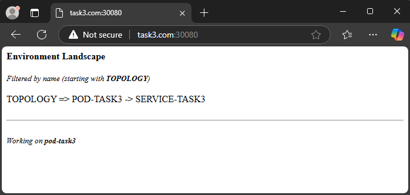

# Tasks

Tree of folders
```sh
.
├── homework-tonytech.docx
├── homework-tonytech.md
├── k8s
│   ├── hash.txt
│   └── Vagrantfile
├── pictures
│   ├── pic-1.png
│   ├── pic-2.png
│   └── pic-3.png
├── task1
│   └── init-container.yaml
├── task2
│   ├── ingress-resource.yaml
│   └── pod-task2.yaml
└── task3
    ├── ingress.yaml
    ├── pod-task3.yaml
    └── traefik-deployment.yaml

6 directories, 13 files
```

Try to solve the following set of tasks:
### 1.	Init Containers
##### a.	Create a set of two init containers and one app container (in fact modify/extend the example shown during the practice)
##### b.	The first init container should generate the following two lines with 10 seconds delay
dd-mm-yyyy hh:mi:ss => begin initialization …
dd-mm-yyyy hh:mi:ss => … done
Please note that the dd-mm-yyyy hh:mi:ss should reflect the actual time the event is taking place
##### c.	The second init container should add one more line like the following
dd-mm-yyyy hh:mi:ss => launching the application …
Please note that the dd-mm-yyyy hh:mi:ss should reflect the actual time the event is taking place
##### d.	The app container should be nginx based and should display the three lines generated by the init containers instead of the default index page

#### Solution
- Manifest file
```yaml
apiVersion: v1
kind: Pod
metadata:
  name: task1
  labels:
    app: task1
spec:
  containers:
  - name: app-container
    image: nginx
    ports:
    - containerPort: 80
    volumeMounts:
    - name: data
      mountPath: /usr/share/nginx/html
  initContainers:
  - name: init-container-a
    image: alpine
    command: ["/bin/sh", "-c"]
    args:
      - echo "$(date +'%d-%m-%Y %H:%M:%S') => begin initialization ..." '<br />' >> /data/index.html;
        sleep 10;
        echo "$(date +'%d-%m-%Y %H:%M:%S') => ... done" '<br />' >> /data/index.html;
    volumeMounts:
    - name: data
      mountPath: /data
  - name: init-container-b
    image: alpine
    command: ["/bin/sh", "-c"]
    args:
      - echo "$(date +'%d-%m-%Y %H:%M:%S') => launching the application ..." '<br />' >> /data/index.html;
    volumeMounts:
    - name: data
      mountPath: /data
  volumes:
  - name: data
    emptyDir: {}
---
apiVersion: v1
kind: Service
metadata:
  name: task1-svc
  labels:
    app: task1-svc
spec:
  type: NodePort
  ports:
  - port: 80
    nodePort: 30001
    protocol: TCP
  selector:
    app: task1
```
- Overview of pods and services
```sh
$ kubectl get pod,svc
NAME        READY   STATUS    RESTARTS   AGE
pod/task1   1/1     Running   0          2m39s

NAME                 TYPE        CLUSTER-IP      EXTERNAL-IP   PORT(S)        AGE
service/kubernetes   ClusterIP   10.96.0.1       <none>        443/TCP        86m
service/task1-svc    NodePort    10.110.235.10   <none>        80:30001/TCP   2m39s
```
- Picture



### 2.	Ingress and TLS
##### a.	Using either NGINX or HAProxy (the implementation should not differ significantly) ingress controller try to modify/extend the fan out example shown in the practice to handle TLS traffic
##### b.	Note, that you will need to create a self-signed certificate and store it in a secret which then to be used in the ingress

#### Solution
- Working with NGINX with Ingress class
```sh
$ kubectl get ingressclass
NAME    CONTROLLER                     PARAMETERS   AGE
nginx   nginx.org/ingress-controller   <none>       4m11s

$ kubectl get service -n nginx-ingress
NAME            TYPE       CLUSTER-IP      EXTERNAL-IP   PORT(S)                      AGE
nginx-ingress   NodePort   10.97.126.168   <none>        80:32633/TCP,443:30430/TCP   6s
```
- Generate a self-signed certificate
```sh
$ openssl req -x509 -nodes -days 365 -newkey rsa:2048 -keyout task2.key -out task2.crt -subj "/CN=task2.com/O=task2"
...........+.+...........+++++++++++++++++++++++++++++++++++++++++++++++++++++++++++++++++*.........+++++++++++++++++++++++++++++++++++++++++++++++++++++++++++++++++*..+....+.........+..+....+........+...+...+.+...+..+...+......+......+.............+...........+..........+...........+.+..................+.........+...+...+.....+.+.....................+............+...+........+.+.....+....+..............+.......+...+........+...+............+....+...+.......................+...+....+..+......+...+.......+...............+..+.......+.....+...+.......+......+..+......+.........+.+.....+..........+.....+.......+.....+...............+.......+..+....+......+.....+......+.......+...+.....+...+....+..+.........+.+.....+....+.....+.......+..+............+.........+......+..........+...+........+...+.+...+...+.....+++++++++++++++++++++++++++++++++++++++++++++++++++++++++++++++++
..........+.........+++++++++++++++++++++++++++++++++++++++++++++++++++++++++++++++++*.+...+............+...+....+++++++++++++++++++++++++++++++++++++++++++++++++++++++++++++++++*.......+......+.........+.........+.+..................+..+....+..+....+..............+.+...+...........+.+.....+.+..+.+......+......+........+.+........+..........+..+....+.........+.....+...+....+.........+.........+...+...+.....+.+.....+.........+......+.........+.+...+..+.+..+..................+...+.........+..................+...............+...+....+.....+......+++++++++++++++++++++++++++++++++++++++++++++++++++++++++++++++++
-----
```
- Create a secret from certificate files
```sh
$ kubectl create secret tls task2-secret --cert=task2.crt --key=task2.key
secret/task2-secret created

$ kubectl get secret
NAME           TYPE                DATA   AGE
task2-secret   kubernetes.io/tls   2      16s
```
- Add a pod and expose it via service with type ClusterIP
```sh
$ cat pod-task2.yaml
apiVersion: v1
kind: Pod
metadata:
  name: pod-task2
  labels:
    app: pod-task2
spec:
  containers:
  - image: shekeriev/k8s-environ
    name: main
    env:
    - name: TOPOLOGY
      value: "POD1 -> SERVICE1"
    - name: FOCUSON
      value: "TOPOLOGY"
---
apiVersion: v1
kind: Service
metadata:
  name: service
spec:
  ports:
  - port: 80
    protocol: TCP
  selector:
    app: pod-task2

$ kubectl get pod,svc
NAME            READY   STATUS    RESTARTS   AGE
pod/pod-task2   1/1     Running   0          9m31s

NAME                    TYPE        CLUSTER-IP     EXTERNAL-IP   PORT(S)          AGE
service/kubernetes      ClusterIP   10.96.0.1      <none>        443/TCP          5h40m
service/service-task2   ClusterIP   10.107.55.89   <none>        80/TCP,443/TCP   9m31s
```
- Create an Ingress Resource for TLS Traffic
```sh
$ cat ingress-resource.yaml
apiVersion: networking.k8s.io/v1
kind: Ingress
metadata:
  name: ingress-task2
spec:
  ingressClassName: nginx
  tls:
  - hosts:
    - task2.com
    secretName: task2-secret
  rules:
  - host: task2.com
    http:
      paths:
      - path: /
        pathType: Prefix
        backend:
          service:
            name: service-task2
            port:
              number: 80

$ kubectl apply -f ingress-resource.yaml
ingress.networking.k8s.io/ingress-task2 created

$ kubectl get ingress
NAME            CLASS   HOSTS       ADDRESS   PORTS     AGE
ingress-task2   nginx   task2.com             80, 443   10m
```
- Add line `192.168.99.101	task2.com` into `/etc/hosts/`
- Picture



### 3.	Another Ingress Controller
##### a.	Repeat the fan out example shown in the practice but with another ingress controller of your choice (not NGINX or HAProxy)

#### Solution with Traefik
- Apply `traefik-deployment.yaml` with NodePort
```sh
$ cat traefik-deployment.yaml
---
kind: ClusterRole
apiVersion: rbac.authorization.k8s.io/v1
metadata:
  name: traefik-role

rules:
  - apiGroups:
      - ""
    resources:
      - services
      - secrets
      - nodes
    verbs:
      - get
      - list
      - watch
  - apiGroups:
      - discovery.k8s.io
    resources:
      - endpointslices
    verbs:
      - list
      - watch
  - apiGroups:
      - extensions
      - networking.k8s.io
    resources:
      - ingresses
      - ingressclasses
    verbs:
      - get
      - list
      - watch
  - apiGroups:
      - extensions
      - networking.k8s.io
    resources:
      - ingresses/status
    verbs:
      - update
  - apiGroups:
      - traefik.io
    resources:
      - middlewares
      - middlewaretcps
      - ingressroutes
      - traefikservices
      - ingressroutetcps
      - ingressrouteudps
      - tlsoptions
      - tlsstores
      - serverstransports
      - serverstransporttcps
    verbs:
      - get
      - list
      - watch

---
apiVersion: v1
kind: ServiceAccount
metadata:
  name: traefik-account

---
kind: ClusterRoleBinding
apiVersion: rbac.authorization.k8s.io/v1
metadata:
  name: traefik-role-binding

roleRef:
  apiGroup: rbac.authorization.k8s.io
  kind: ClusterRole
  name: traefik-role
subjects:
  - kind: ServiceAccount
    name: traefik-account
    namespace: default

---
kind: Deployment
apiVersion: apps/v1
metadata:
  name: traefik-deployment
  labels:
    app: traefik

spec:
  replicas: 1
  selector:
    matchLabels:
      app: traefik
  template:
    metadata:
      labels:
        app: traefik
    spec:
      serviceAccountName: traefik-account
      containers:
        - name: traefik
          image: traefik:v3.2
          args:
            - --api.insecure
            - --providers.kubernetesingress
          ports:
            - name: web
              containerPort: 80
            - name: dashboard
              containerPort: 8080

---
apiVersion: v1
kind: Service
metadata:
  name: traefik-dashboard-service

spec:
  type: NodePort
  ports:
    - port: 8080
      targetPort: dashboard
      nodePort: 32080
  selector:
    app: traefik

---
apiVersion: v1
kind: Service
metadata:
  name: traefik-web-service

spec:
  type: NodePort
  ports:
    - targetPort: web
      port: 80
      nodePort: 30080
  selector:
    app: traefik

$ kubectl apply -f traefik-deployment.yaml
clusterrole.rbac.authorization.k8s.io/traefik-role created
serviceaccount/traefik-account created
clusterrolebinding.rbac.authorization.k8s.io/traefik-role-binding created
deployment.apps/traefik-deployment created
service/traefik-dashboard-service created
service/traefik-web-service created
```
- Apply pod and service
```sh
$ cat pod-task3.yaml
apiVersion: v1
kind: Pod
metadata:
  name: pod-task3
  labels:
    app: pod-task3
spec:
  containers:
  - image: shekeriev/k8s-environ
    name: main
    env:
    - name: TOPOLOGY
      value: "POD-TASK3 -> SERVICE-TASK3"
    - name: FOCUSON
      value: "TOPOLOGY"
---
apiVersion: v1
kind: Service
metadata:
  name: service-task3
spec:
  ports:
  - port: 80
    protocol: TCP
  selector:
    app: pod-task3

$ kubectl apply -f pod-task3.yaml
pod/pod-task3 created
service/service-task3 created
```
- Apply `ingress.yaml`
```sh
$ cat ingress.yaml
apiVersion: networking.k8s.io/v1
kind: Ingress
metadata:
  name: task3-ingress
spec:
  rules:
  - host: task3.com
    http:
      paths:
      - path: /
        pathType: Prefix
        backend:
          service:
            name: service-task3
            port:
              number: 80

$ kubectl apply -f ingress.yaml
ingress.networking.k8s.io/task3-ingress created
```
- Check the port is as we expected
```sh
$ kubectl get svc traefik-web-service
NAME                  TYPE       CLUSTER-IP      EXTERNAL-IP   PORT(S)        AGE
traefik-web-service   NodePort   10.104.118.62   <none>        80:30080/TCP   21m
```
- Picture


