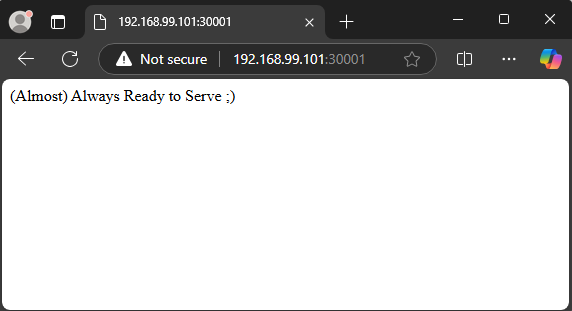

# Tasks
Try to solve the following set of tasks (files are in part3/ folder):

### 1. Try to solve scenario 2 and make the application working again
- Initial apply of manifest file
```sh
$ kubectl apply -f task1.yaml
service/readiness-cmd created
The Pod "readiness-http" is invalid:
* spec.containers[1].volumeMounts[0].name: Not found: "html"
* spec.initContainers[0].volumeMounts[0].name: Not found: "html"
```
On first look we see that service is successfully created, but we have issues with volumeMounts on initContainers and containers
- Fix the issues with volumeMounts
After check of manifest file we found that it contains only one volume with name `data` and we should change the name of volumeMounts from `html` to `data` on containers with name `init-data` and `cont-sidecar-postpone`
```sh
$ kubectl apply -f task1/task1.yaml
pod/readiness-http created
service/readiness-cmd unchanged
```
After the fix we had containers and service running.
- Check the pod status
```sh
$ kubectl get pods -o wide
NAME             READY   STATUS                  RESTARTS      AGE   IP           NODE    NOMINATED NODE   READINESS GATES
readiness-http   0/3     Init:CrashLoopBackOff   3 (27s ago)   77s   10.244.2.2   node3   <none>           <none>
```
We found that status of pod is `Init:CrashLoopBackOff` which indicates problem with pod
- Check with describe information for pod
```sh
$ kubectl describe pod readiness-http
Name:             readiness-http
Namespace:        default
Priority:         0
Service Account:  default
Node:             node3/192.168.99.103
Start Time:       Sat, 16 Nov 2024 20:06:13 +0200
Labels:           app=readiness-http
Annotations:      <none>
Status:           Pending
IP:               10.244.2.2
IPs:
  IP:  10.244.2.2
Init Containers:
  init-data:
    Container ID:  containerd://3dc258746ac1b9f144bc66159f6364a2c6afc880220bb18376ba4266425eab74
    Image:         alpine
    Image ID:      docker.io/library/alpine@sha256:1e42bbe2508154c9126d48c2b8a75420c3544343bf86fd041fb7527e017a4b4a
    Port:          <none>
    Host Port:     <none>
    Command:
      /bin/bash
      -c
    Args:
      echo '(Almost) Always Ready to Serve' ;) > /data/index.html
    State:          Waiting
      Reason:       RunContainerError
    Last State:     Terminated
      Reason:       StartError
      Message:      failed to create containerd task: failed to create shim task: OCI runtime create failed: runc create failed: unable to start container process: exec: "/bin/bash": stat /bin/bash: no such file or directory: unknown
      Exit Code:    128
      Started:      Thu, 01 Jan 1970 02:00:00 +0200
      Finished:     Sat, 16 Nov 2024 20:09:33 +0200
    Ready:          False
    Restart Count:  5
    Environment:    <none>
    Mounts:
      /usr/share/nginx/html from data (rw)
      /var/run/secrets/kubernetes.io/serviceaccount from kube-api-access-hqlv8 (ro)
Containers:
  cont-main:
    Container ID:
    Image:          nginx
    Image ID:
    Port:           <none>
    Host Port:      <none>
    State:          Waiting
      Reason:       PodInitializing
    Ready:          False
    Restart Count:  0
    Readiness:      http-get http://:80/healthy.html delay=5s timeout=1s period=5s #success=1 #failure=3
    Environment:    <none>
    Mounts:
      /usr/share/nginx/html from data (rw)
      /var/run/secrets/kubernetes.io/serviceaccount from kube-api-access-hqlv8 (ro)
  cont-sidecar-postpone:
    Container ID:
    Image:         alpine
    Image ID:
    Port:          <none>
    Host Port:     <none>
    Command:
      /bin/sh
      -c
    Args:
      while true; do sleep 20; echo 'WORKING' > /check/healthy.html; sleep 60; done
    State:          Waiting
      Reason:       PodInitializing
    Ready:          False
    Restart Count:  0
    Environment:    <none>
    Mounts:
      /check from data (rw)
      /var/run/secrets/kubernetes.io/serviceaccount from kube-api-access-hqlv8 (ro)
  cont-sidecar-break:
    Container ID:
    Image:         alpine
    Image ID:
    Port:          <none>
    Host Port:     <none>
    Command:
      /bin/sh
      -c
    Args:
      while true; do sleep 60; rm /check/healthy.html; sleep 20; done
    State:          Waiting
      Reason:       PodInitializing
    Ready:          False
    Restart Count:  0
    Environment:    <none>
    Mounts:
      /check from data (rw)
      /var/run/secrets/kubernetes.io/serviceaccount from kube-api-access-hqlv8 (ro)
Conditions:
  Type                        Status
  PodReadyToStartContainers   True
  Initialized                 False
  Ready                       False
  ContainersReady             False
  PodScheduled                True
Volumes:
  data:
    Type:       EmptyDir (a temporary directory that shares a pod's lifetime)
    Medium:
    SizeLimit:  <unset>
  kube-api-access-hqlv8:
    Type:                    Projected (a volume that contains injected data from multiple sources)
    TokenExpirationSeconds:  3607
    ConfigMapName:           kube-root-ca.crt
    ConfigMapOptional:       <nil>
    DownwardAPI:             true
QoS Class:                   BestEffort
Node-Selectors:              <none>
Tolerations:                 node.kubernetes.io/not-ready:NoExecute op=Exists for 300s
                             node.kubernetes.io/unreachable:NoExecute op=Exists for 300s
Events:
  Type     Reason     Age                    From               Message
  ----     ------     ----                   ----               -------
  Normal   Scheduled  3m24s                  default-scheduler  Successfully assigned default/readiness-http to node3
  Normal   Pulled     3m22s                  kubelet            Successfully pulled image "alpine" in 3.016s (3.016s including waiting). Image size: 3634744 bytes.
  Normal   Pulled     3m21s                  kubelet            Successfully pulled image "alpine" in 945ms (945ms including waiting). Image size: 3634744 bytes.
  Normal   Pulled     3m3s                   kubelet            Successfully pulled image "alpine" in 936ms (936ms including waiting). Image size: 3634744 bytes.
  Normal   Created    2m34s (x4 over 3m22s)  kubelet            Created container init-data
  Warning  Failed     2m34s (x4 over 3m22s)  kubelet            Error: failed to create containerd task: failed to create shim task: OCI runtime create failed: runc create failed: unable to start container process: exec: "/bin/bash": stat /bin/bash: no such file or directory: unknown
  Normal   Pulled     2m34s                  kubelet            Successfully pulled image "alpine" in 930ms (930ms including waiting). Image size: 3634744 bytes.
  Warning  BackOff    117s (x8 over 3m20s)   kubelet            Back-off restarting failed container init-data in pod readiness-http_default(20dd665b-9746-4f95-a978-affe55bfdd0c)
  Normal   Pulling    102s (x5 over 3m25s)   kubelet            Pulling image "alpine"
```
From describe output we can see that initContainer can not start because `/bin/bash` folder does not exist.
- Fix init container
Change `/bin/bash` to `/bin/sh` because Bash shell may not exist on this Linux distribution.
- Apply manifest after fix
```sh
$ kubectl apply -f task1.yaml
pod/readiness-http created
service/readiness-cmd created
```
- Check the pod
```sh
$ kubectl get pods -o wide
NAME             READY   STATUS                  RESTARTS       AGE     IP           NODE    NOMINATED NODE   READINESS GATES
readiness-http   0/3     Init:CrashLoopBackOff   5 (101s ago)   4m48s   10.244.1.2   node2   <none>           <none>
```
Again error in init container, form describe we found that the directory where `echo` trying to write is not same as volumeMounts and `:)` is outside the brackets.
- Fix the issue with directory and brackets
Change the stdout to `/usr/share/nginx/html/index.html` and issue with brackets.
```sh
$ kubectl get pods -o wide
NAME             READY   STATUS    RESTARTS   AGE   IP           NODE    NOMINATED NODE   READINESS GATES
readiness-http   3/3     Running   0          37s   10.244.2.5   node3   <none>           <none>
```
Now we have 3/3 ready containers in our pod
- Check the service on port 30001
```sh
$ curl http://localhost:30001
curl: (7) Failed to connect to localhost port 30001 after 0 ms: Couldn't connect to server
```
We found problem with service. With describe on service we found that there no any Endpoints, this may be because of selector.
Change the selector of service from `app=readiness-cmd` to `app=readiness-http`
- Fix the issue with service selector
```sh
$ kubectl describe svc  readiness-cmd
Name:                     readiness-cmd
Namespace:                default
Labels:                   app=readiness-cmd
Annotations:              <none>
Selector:                 app=readiness-http
Type:                     NodePort
IP Family Policy:         SingleStack
IP Families:              IPv4
IP:                       10.97.19.97
IPs:                      10.97.19.97
Port:                     <unset>  80/TCP
TargetPort:               80/TCP
NodePort:                 <unset>  30001/TCP
Endpoints:                10.244.1.3:80
Session Affinity:         None
External Traffic Policy:  Cluster
Events:                   <none>

$ curl http://localhost:30001
(Almost) Always Ready to Serve ;)
```
- Picture



### 2. Try to solve scenario 3 and make the application working again
### 3. Try to solve scenario 4 and make the application working again
