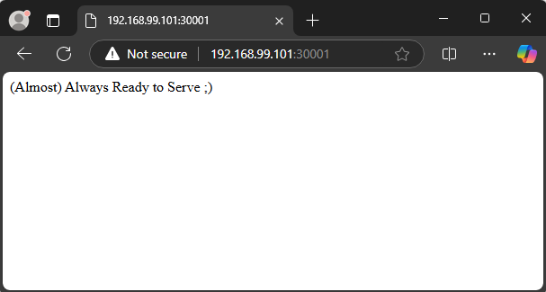
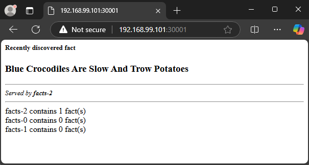

# Tasks
Try to solve the following set of tasks (files are in part3/ folder):

### 1. Try to solve scenario 2 and make the application working again
- Initial apply of manifest file
```sh
$ kubectl apply -f task1.yaml
service/readiness-cmd created
The Pod "readiness-http" is invalid:
* spec.containers[1].volumeMounts[0].name: Not found: "html"
* spec.initContainers[0].volumeMounts[0].name: Not found: "html"
```
On first look we see that service is successfully created, but we have issues with volumeMounts on initContainers and containers
- Fix the issues with volumeMounts
After check of manifest file we found that it contains only one volume with name `data` and we should change the name of volumeMounts from `html` to `data` on containers with name `init-data` and `cont-sidecar-postpone`
```sh
$ kubectl apply -f task1/task1.yaml
pod/readiness-http created
service/readiness-cmd unchanged
```
After the fix we had containers and service running.
- Check the pod status
```sh
$ kubectl get pods -o wide
NAME             READY   STATUS                  RESTARTS      AGE   IP           NODE    NOMINATED NODE   READINESS GATES
readiness-http   0/3     Init:CrashLoopBackOff   3 (27s ago)   77s   10.244.2.2   node3   <none>           <none>
```
We found that status of pod is `Init:CrashLoopBackOff` which indicates problem with pod
- Check with describe information for pod
```sh
$ kubectl describe pod readiness-http
Name:             readiness-http
Namespace:        default
Priority:         0
Service Account:  default
Node:             node3/192.168.99.103
Start Time:       Sat, 16 Nov 2024 20:06:13 +0200
Labels:           app=readiness-http
Annotations:      <none>
Status:           Pending
IP:               10.244.2.2
IPs:
  IP:  10.244.2.2
Init Containers:
  init-data:
    Container ID:  containerd://3dc258746ac1b9f144bc66159f6364a2c6afc880220bb18376ba4266425eab74
    Image:         alpine
    Image ID:      docker.io/library/alpine@sha256:1e42bbe2508154c9126d48c2b8a75420c3544343bf86fd041fb7527e017a4b4a
    Port:          <none>
    Host Port:     <none>
    Command:
      /bin/bash
      -c
    Args:
      echo '(Almost) Always Ready to Serve' ;) > /data/index.html
    State:          Waiting
      Reason:       RunContainerError
    Last State:     Terminated
      Reason:       StartError
      Message:      failed to create containerd task: failed to create shim task: OCI runtime create failed: runc create failed: unable to start container process: exec: "/bin/bash": stat /bin/bash: no such file or directory: unknown
      Exit Code:    128
      Started:      Thu, 01 Jan 1970 02:00:00 +0200
      Finished:     Sat, 16 Nov 2024 20:09:33 +0200
    Ready:          False
    Restart Count:  5
    Environment:    <none>
    Mounts:
      /usr/share/nginx/html from data (rw)
      /var/run/secrets/kubernetes.io/serviceaccount from kube-api-access-hqlv8 (ro)
Containers:
  cont-main:
    Container ID:
    Image:          nginx
    Image ID:
    Port:           <none>
    Host Port:      <none>
    State:          Waiting
      Reason:       PodInitializing
    Ready:          False
    Restart Count:  0
    Readiness:      http-get http://:80/healthy.html delay=5s timeout=1s period=5s #success=1 #failure=3
    Environment:    <none>
    Mounts:
      /usr/share/nginx/html from data (rw)
      /var/run/secrets/kubernetes.io/serviceaccount from kube-api-access-hqlv8 (ro)
  cont-sidecar-postpone:
    Container ID:
    Image:         alpine
    Image ID:
    Port:          <none>
    Host Port:     <none>
    Command:
      /bin/sh
      -c
    Args:
      while true; do sleep 20; echo 'WORKING' > /check/healthy.html; sleep 60; done
    State:          Waiting
      Reason:       PodInitializing
    Ready:          False
    Restart Count:  0
    Environment:    <none>
    Mounts:
      /check from data (rw)
      /var/run/secrets/kubernetes.io/serviceaccount from kube-api-access-hqlv8 (ro)
  cont-sidecar-break:
    Container ID:
    Image:         alpine
    Image ID:
    Port:          <none>
    Host Port:     <none>
    Command:
      /bin/sh
      -c
    Args:
      while true; do sleep 60; rm /check/healthy.html; sleep 20; done
    State:          Waiting
      Reason:       PodInitializing
    Ready:          False
    Restart Count:  0
    Environment:    <none>
    Mounts:
      /check from data (rw)
      /var/run/secrets/kubernetes.io/serviceaccount from kube-api-access-hqlv8 (ro)
Conditions:
  Type                        Status
  PodReadyToStartContainers   True
  Initialized                 False
  Ready                       False
  ContainersReady             False
  PodScheduled                True
Volumes:
  data:
    Type:       EmptyDir (a temporary directory that shares a pod's lifetime)
    Medium:
    SizeLimit:  <unset>
  kube-api-access-hqlv8:
    Type:                    Projected (a volume that contains injected data from multiple sources)
    TokenExpirationSeconds:  3607
    ConfigMapName:           kube-root-ca.crt
    ConfigMapOptional:       <nil>
    DownwardAPI:             true
QoS Class:                   BestEffort
Node-Selectors:              <none>
Tolerations:                 node.kubernetes.io/not-ready:NoExecute op=Exists for 300s
                             node.kubernetes.io/unreachable:NoExecute op=Exists for 300s
Events:
  Type     Reason     Age                    From               Message
  ----     ------     ----                   ----               -------
  Normal   Scheduled  3m24s                  default-scheduler  Successfully assigned default/readiness-http to node3
  Normal   Pulled     3m22s                  kubelet            Successfully pulled image "alpine" in 3.016s (3.016s including waiting). Image size: 3634744 bytes.
  Normal   Pulled     3m21s                  kubelet            Successfully pulled image "alpine" in 945ms (945ms including waiting). Image size: 3634744 bytes.
  Normal   Pulled     3m3s                   kubelet            Successfully pulled image "alpine" in 936ms (936ms including waiting). Image size: 3634744 bytes.
  Normal   Created    2m34s (x4 over 3m22s)  kubelet            Created container init-data
  Warning  Failed     2m34s (x4 over 3m22s)  kubelet            Error: failed to create containerd task: failed to create shim task: OCI runtime create failed: runc create failed: unable to start container process: exec: "/bin/bash": stat /bin/bash: no such file or directory: unknown
  Normal   Pulled     2m34s                  kubelet            Successfully pulled image "alpine" in 930ms (930ms including waiting). Image size: 3634744 bytes.
  Warning  BackOff    117s (x8 over 3m20s)   kubelet            Back-off restarting failed container init-data in pod readiness-http_default(20dd665b-9746-4f95-a978-affe55bfdd0c)
  Normal   Pulling    102s (x5 over 3m25s)   kubelet            Pulling image "alpine"
```
From describe output we can see that initContainer can not start because `/bin/bash` folder does not exist.
- Fix init container
Change `/bin/bash` to `/bin/sh` because Bash shell may not exist on this Linux distribution.
- Apply manifest after fix
```sh
$ kubectl apply -f task1.yaml
pod/readiness-http created
service/readiness-cmd created
```
- Check the pod
```sh
$ kubectl get pods -o wide
NAME             READY   STATUS                  RESTARTS       AGE     IP           NODE    NOMINATED NODE   READINESS GATES
readiness-http   0/3     Init:CrashLoopBackOff   5 (101s ago)   4m48s   10.244.1.2   node2   <none>           <none>
```
Again error in init container, form describe we found that the directory where `echo` trying to write is not same as volumeMounts and `:)` is outside the brackets.
- Fix the issue with directory and brackets
Change the stdout to `/usr/share/nginx/html/index.html` and issue with brackets.
```sh
$ kubectl get pods -o wide
NAME             READY   STATUS    RESTARTS   AGE   IP           NODE    NOMINATED NODE   READINESS GATES
readiness-http   3/3     Running   0          37s   10.244.2.5   node3   <none>           <none>
```
Now we have 3/3 ready containers in our pod
- Check the service on port 30001
```sh
$ curl http://localhost:30001
curl: (7) Failed to connect to localhost port 30001 after 0 ms: Couldn't connect to server
```
We found problem with service. With describe on service we found that there no any Endpoints, this may be because of selector.
Change the selector of service from `app=readiness-cmd` to `app=readiness-http`
- Fix the issue with service selector
```sh
$ kubectl describe svc  readiness-cmd
Name:                     readiness-cmd
Namespace:                default
Labels:                   app=readiness-cmd
Annotations:              <none>
Selector:                 app=readiness-http
Type:                     NodePort
IP Family Policy:         SingleStack
IP Families:              IPv4
IP:                       10.97.19.97
IPs:                      10.97.19.97
Port:                     <unset>  80/TCP
TargetPort:               80/TCP
NodePort:                 <unset>  30001/TCP
Endpoints:                10.244.1.3:80
Session Affinity:         None
External Traffic Policy:  Cluster
Events:                   <none>

$ curl http://localhost:30001
(Almost) Always Ready to Serve ;)
```
- Picture


- Fixed manifest
```yaml
apiVersion: v1
kind: Pod
metadata:
  labels:
    app: readiness-http
  name: readiness-http
spec:
  initContainers:
  - name: init-data
    image: alpine
    command: ["/bin/sh", "-c"]
    args:
      - echo '(Almost) Always Ready to Serve ;)' > /usr/share/nginx/html/index.html
    volumeMounts:
    - name: data
      mountPath: /usr/share/nginx/html

  containers:
  - name: cont-main
    image: nginx
    volumeMounts:
    - name: data
      mountPath: /usr/share/nginx/html
    readinessProbe:
      httpGet:
        path: /healthy.html
        port: 80
      initialDelaySeconds: 5
      periodSeconds: 5

  - name: cont-sidecar-postpone
    image: alpine
    command: ["/bin/sh", "-c"]
    args:
      - while true; do
          sleep 20;
          echo 'WORKING' > /check/healthy.html;
          sleep 60;
        done
    volumeMounts:
    - name: data
      mountPath: /check

  - name: cont-sidecar-break
    image: alpine
    command: ["/bin/sh", "-c"]
    args:
      - while true; do
          sleep 60;
          rm /check/healthy.html;
          sleep 20;
        done
    volumeMounts:
    - name: data
      mountPath: /check

  volumes:
  - name: data
    emptyDir: {}
---
apiVersion: v1
kind: Service
metadata:
  name: readiness-cmd
  labels:
    app: readiness-cmd
spec:
  type: NodePort
  ports:
  - port: 80
    nodePort: 30001
    protocol: TCP
  selector:
    app: readiness-http
```

### 2. Try to solve scenario 3 and make the application working again
- Initial apply of manifest file
```sh
$ kubectl apply -f task2.yaml
pod/startup-mixed created
service/startup-mixed created
```
After initial apply we didn't see any problems with creation of pod and service
- Check the pod and containers inside
```sh
$ kubectl get pod -o wide
NAME            READY   STATUS    RESTARTS      AGE    IP           NODE    NOMINATED NODE   READINESS GATES
startup-mixed   2/3     Running   4 (51s ago)   2m6s   10.244.2.7   node3   <none>           <none>
```
Only 2 of 3 are in status Running. We can check with describe the pod for more information.
We found issue in container `cont-main` where startupProbe trying to execute `cat /check/healthy.html` but this file not present when probe start.
To address the issue we add initialDelaySeconds with value 25 seconds. Fix the livenessProbe path and startupProbe command execution.
- Fix container `cont-main` startupProbe
```sh
$ kubectl get pod -o wide -w
NAME            READY   STATUS    RESTARTS   AGE   IP           NODE    NOMINATED NODE   READINESS GATES
startup-mixed   2/3     Running   0          8s    10.244.1.9   node2   <none>           <none>
startup-mixed   3/3     Running   0          31s   10.244.1.9   node2   <none>           <none>
```
- Check the service
```sh
curl 192.168.99.101:30001-w
curl: (7) Failed to connect to 192.168.99.101 port 30001 after 0 ms: Couldn't connect to server
```
Execute describe against service and found there no Endpoints, this may be a problem with selector.
- Fix the selector for service from `startup-nixed` to `startup-mixed`
```sh
$ kubectl describe service/startup-mixed
Name:                     startup-mixed
Namespace:                default
Labels:                   app=startup-mixed
Annotations:              <none>
Selector:                 app=startup-mixed
Type:                     NodePort
IP Family Policy:         SingleStack
IP Families:              IPv4
IP:                       10.100.12.155
IPs:                      10.100.12.155
Port:                     <unset>  8080/TCP
TargetPort:               8080/TCP
NodePort:                 <unset>  30001/TCP
Endpoints:                10.244.1.10:8080
Session Affinity:         None
External Traffic Policy:  Cluster
Events:                   <none>
``` 
Now we can see the endpoint, but again there is a issue.
```sh
$ curl http://192.168.99.101:30001
curl: (7) Failed to connect to 192.168.99.101 port 30001 after 0 ms: Couldn't connect to server
```
Check the service for other problems. There is a mismatch between service port `8080` and port of application container `80`. 
- Change the service port to `80`
```sh
$ curl http://192.168.99.101:30001
(Almost) Always Ready to Serve ;)
```
- Picture


- Fixed manifest
```yaml
apiVersion: v1
kind: Pod
metadata:
  labels:
    app: startup-mixed
  name: startup-mixed
spec:
  initContainers:
  - name: init-data
    image: alpine
    command: ["/bin/sh", "-c"]
    args:
      - echo '(Almost) Always Ready to Serve ;)' > /data/index.html
    volumeMounts:
    - name: data
      mountPath: /data
      
  containers:
  - name: cont-main
    image: nginx
    volumeMounts:
    - name: data
      mountPath: /usr/share/nginx/html
    livenessProbe:
      httpGet:
        path: /healthy.html
        port: 80
      initialDelaySeconds: 5
      periodSeconds: 5
    startupProbe:
      exec:
        command:
        - cat 
        - /usr/share/nginx/html/healthy.html
      initialDelaySeconds: 25
      failureThreshold: 3
      periodSeconds: 5

  - name: cont-sidecar-postpone
    image: alpine
    command: ["/bin/sh", "-c"]
    args:
      - while true; do
          sleep 20; 
          echo 'WORKING' > /check/healthy.html; 
          sleep 60;
        done
    volumeMounts:
    - name: data
      mountPath: /check

  - name: cont-sidecar-break
    image: alpine
    command: ["/bin/sh", "-c"]
    args:
      - while true; do
          sleep 60; 
          rm /check/healthy.html;
          sleep 20;
        done
    volumeMounts:
    - name: data
      mountPath: /check
  volumes:
  - name: data
    emptyDir: {}
---
apiVersion: v1
kind: Service
metadata:
  name: startup-mixed
  labels:
    app: startup-mixed
spec:
  type: NodePort
  ports:
  - port: 8080
    nodePort: 30001
    protocol: TCP
  selector:
    app: startup-mixed
```
### 3. Try to solve scenario 4 and make the application working again
- From PersistentVolume manifest we understand that we should use nfs-server as separate VM. This server should have folder structure:
```sh
$ tree data/
data/
└── nfs
    ├── k8spva
    ├── k8spvb
    └── k8spvc

5 directories, 0 files
```
- Made folders writable for everyone
```sh
$ sudo chmod -R 777 /data/nfs/

$ ls -al /data/nfs/
total 20
drwxrwxrwx 5 root root 4096 Nov 17 13:00 .
drwxr-xr-x 3 root root 4096 Nov 17 13:00 ..
drwxrwxrwx 2 root root 4096 Nov 17 13:00 k8spva
drwxrwxrwx 2 root root 4096 Nov 17 13:00 k8spvb
drwxrwxrwx 2 root root 4096 Nov 17 13:00 k8spvc
```
- Install NFS server
```sh
$ sudo apt update && sudo apt install nfs-kernel-server 

$ sudo systemctl start nfs-kernel-server

$ sudo systemctl enable nfs-kernel-server
```
- Install NFS client on all nodes
```sh
sudo apt update && sudo apt install -y nfs-common
```
- Add folders in `/etc/exports/` and restart `nfs-kernel-server`.
```sh
$ cat /etc/exports
# /etc/exports: the access control list for filesystems which may be exported
#               to NFS clients.  See exports(5).
#
# Example for NFSv2 and NFSv3:
# /srv/homes       hostname1(rw,sync,no_subtree_check) hostname2(ro,sync,no_subtree_check)
#
# Example for NFSv4:
# /srv/nfs4        gss/krb5i(rw,sync,fsid=0,crossmnt,no_subtree_check)
# /srv/nfs4/homes  gss/krb5i(rw,sync,no_subtree_check)
#
/data/nfs/k8spva        *(rw,sync,no_root_squash)
/data/nfs/k8spvb        *(rw,sync,no_root_squash)
/data/nfs/k8spvc        *(rw,sync,no_root_squash)
```
- Check the nfs shares
```sh
$ sudo exportfs
/data/nfs/k8spva
                <world>
/data/nfs/k8spvb
                <world>
/data/nfs/k8spvc
                <world>
```
- Apply manifest `pvss.yaml`
```sh
$ kubectl apply -f pvss.yaml
Warning: spec.persistentVolumeReclaimPolicy: The Recycle reclaim policy is deprecated. Instead, the recommended approach is to use dynamic provisioning.
persistentvolume/pvssa created
persistentvolume/pvssc created
The PersistentVolume "pvssb" is invalid: spec.accessModes: Unsupported value: "ReadOnly": supported values: "ReadOnlyMany", "ReadWriteMany", "ReadWriteOnce", "ReadWriteOncePod"
```
From error we found that accessModes for pvssb.
We change accessModes from `ReadOnly` to `ReadOnlyMany`.
- After fix
```sh
$ kubectl apply -f pvss.yaml
Warning: spec.persistentVolumeReclaimPolicy: The Recycle reclaim policy is deprecated. Instead, the recommended approach is to use dynamic provisioning.
persistentvolume/pvssa created
persistentvolume/pvssb created
persistentvolume/pvssc created
```
- Apply manifest `ss.yaml`
```sh
$ kubectl apply -f ss.yaml
statefulset.apps/facts created
```
Although we have successful creation of StatefulSet, there is a problem with pod.
```sh
~$ kubectl get pod -o wide
NAME      READY   STATUS              RESTARTS   AGE     IP       NODE    NOMINATED NODE   READINESS GATES
facts-0   0/1     ContainerCreating   0          4m44s   <none>   node2   <none>           <none>
```
Check describe on facts-0 pod and found issue with mount of nfs share. In `pvss.yaml` manifest we had syntactic error. On `pvssc` change from `/bata/nfs/k8spvc` to `/data/nfs/k8spvc`
- Fix syntactic error with `pvssc`.
```sh
$ kubectl get pod,pv,pvc
NAME          READY   STATUS    RESTARTS   AGE
pod/facts-0   1/1     Running   0          12m
pod/facts-1   1/1     Running   0          6m25s
pod/facts-2   0/1     Pending   0          6m16s

NAME                     CAPACITY   ACCESS MODES   RECLAIM POLICY   STATUS      CLAIM                        STORAGECLASS   VOLUMEATTRIBUTESCLASS   REASON   AGE
persistentvolume/pvssa   10Gi       RWO            Recycle          Bound       default/facts-data-facts-1                  <unset>                          12m
persistentvolume/pvssb   1Mi        ROX            Recycle          Available                                               <unset>                          12m
persistentvolume/pvssc   1Gi        RWO            Recycle          Bound       default/facts-data-facts-0                  <unset>                          12m

NAME                                       STATUS    VOLUME   CAPACITY   ACCESS MODES   STORAGECLASS   VOLUMEATTRIBUTESCLASS   AGE
persistentvolumeclaim/facts-data-facts-0   Bound     pvssc    1Gi        RWO                           <unset>                 12m
persistentvolumeclaim/facts-data-facts-1   Bound     pvssa    10Gi       RWO                           <unset>                 6m25s
persistentvolumeclaim/facts-data-facts-2   Pending
```
Now we have two running pods, but for third and fourth pods the pvc has no pv that satisfies the requirements. There are two approaches: create new pv which can satisfies the requirements; change `pvssb` parameters to satisfy the the pvc of third pod. I chose the second way and also scale out the StatefulSet form 4 to 3.
- Change the parameters of `pvssb`. Change storage from 1Mi to 1Gi and accessModes from ReadOnlyMany to ReadWriteOnce. Change StatefulSet replicas from 4 to 3.
```sh
$ kubectl get pod,pv,pvc
NAME          READY   STATUS    RESTARTS   AGE
pod/facts-0   1/1     Running   0          2m28s
pod/facts-1   1/1     Running   0          2m24s
pod/facts-2   1/1     Running   0          2m20s

NAME                     CAPACITY   ACCESS MODES   RECLAIM POLICY   STATUS   CLAIM                        STORAGECLASS   VOLUMEATTRIBUTESCLASS   REASON   AGE
persistentvolume/pvssa   10Gi       RWO            Recycle          Bound    default/facts-data-facts-2                  <unset>                          4m9s
persistentvolume/pvssb   1Gi        RWO            Recycle          Bound    default/facts-data-facts-1                  <unset>                          3m52s
persistentvolume/pvssc   1Gi        RWO            Recycle          Bound    default/facts-data-facts-0                  <unset>                          4m9s

NAME                                       STATUS   VOLUME   CAPACITY   ACCESS MODES   STORAGECLASS   VOLUMEATTRIBUTESCLASS   AGE
persistentvolumeclaim/facts-data-facts-0   Bound    pvssc    1Gi        RWO                           <unset>                 2m28s
persistentvolumeclaim/facts-data-facts-1   Bound    pvssb    1Gi        RWO                           <unset>                 2m24s
persistentvolumeclaim/facts-data-facts-2   Bound    pvssa    10Gi       RWO                           <unset>                 2m20s
```
- Before apply of `svcss.yaml` service, we can see that selector is wrong. Change the selector from `factc` to `facts`. After change apply the manifest.
```sh
$ kubectl get pod,svc,pv,pvc
NAME          READY   STATUS    RESTARTS   AGE
pod/facts-0   1/1     Running   0          6m20s
pod/facts-1   1/1     Running   0          6m16s
pod/facts-2   1/1     Running   0          6m12s

NAME                 TYPE        CLUSTER-IP   EXTERNAL-IP   PORT(S)    AGE
service/facts        ClusterIP   None         <none>        5000/TCP   6s
service/kubernetes   ClusterIP   10.96.0.1    <none>        443/TCP    109m

NAME                     CAPACITY   ACCESS MODES   RECLAIM POLICY   STATUS   CLAIM                        STORAGECLASS   VOLUMEATTRIBUTESCLASS   REASON   AGE
persistentvolume/pvssa   10Gi       RWO            Recycle          Bound    default/facts-data-facts-2                  <unset>                          8m1s
persistentvolume/pvssb   1Gi        RWO            Recycle          Bound    default/facts-data-facts-1                  <unset>                          7m44s
persistentvolume/pvssc   1Gi        RWO            Recycle          Bound    default/facts-data-facts-0                  <unset>                          8m1s

NAME                                       STATUS   VOLUME   CAPACITY   ACCESS MODES   STORAGECLASS   VOLUMEATTRIBUTESCLASS   AGE
persistentvolumeclaim/facts-data-facts-0   Bound    pvssc    1Gi        RWO                           <unset>                 6m20s
persistentvolumeclaim/facts-data-facts-1   Bound    pvssb    1Gi        RWO                           <unset>                 6m16s
persistentvolumeclaim/facts-data-facts-2   Bound    pvssa    10Gi       RWO                           <unset>                 6m12s
```
- Before apply of `svcssnp.yaml` service, we can see that selector is wrong. Change the selector from `factc` to `facts`. Also type should be changed from ClusterIP to NodePort. 
```sh
$ curl http://192.168.99.101:30001/
<h5>Recently discovered fact</h5>
<h3>Green Lions Are Short And Trow Tomatoes</h3>
<hr>
<small><i>Served by <b>facts-1</b></i></small>
<hr>
facts-2 contains 1 fact(s)<br />
facts-0 contains 0 fact(s)<br />
facts-1 contains 1 fact(s)<br />
```
- Picture



- Fixed manifest `pvss.yaml`
```yaml
apiVersion: v1
kind: PersistentVolume
metadata:
  name: pvssa
  labels:
    purpose: ssdemo
spec:
  capacity:
    storage: 10Gi
  volumeMode: Filesystem
  accessModes:
    - ReadWriteOnce
  persistentVolumeReclaimPolicy: Recycle
  mountOptions:
    - nfsvers=4.1
  nfs:
    path: /data/nfs/k8spva
    server: nfs-server
---
apiVersion: v1
kind: PersistentVolume
metadata:
  name: pvssb
  labels:
    purpose: ssdemo
spec:
  capacity:
    storage: 1Mi
  volumeMode: Filesystem
  accessModes:
    - ReadWriteOnce
  persistentVolumeReclaimPolicy: Recycle
  mountOptions:
    - nfsvers=4.1
  nfs:
    path: /data/nfs/k8spvb
    server: nfs-server
---
apiVersion: v1
kind: PersistentVolume
metadata:
  name: pvssc
  labels:
    purpose: ssdemo
spec:
  capacity:
    storage: 1Gi
  volumeMode: Filesystem
  accessModes:
    - ReadWriteOnce
  persistentVolumeReclaimPolicy: Recycle
  mountOptions:
    - nfsvers=4.1
  nfs:
    path: /data/nfs/k8spvc
    server: nfs-server
```
- Fixed manifest `ss.yaml`
```yaml
apiVersion: apps/v1
kind: StatefulSet
metadata:
  name: facts
spec:
  selector:
    matchLabels:
      app: facts
  serviceName: facts
  replicas: 3
  # POD template
  template:
    metadata:
      labels:
        app: facts
    spec:
      terminationGracePeriodSeconds: 10
      containers:
      - name: main
        image: shekeriev/k8s-facts
        ports:
        - name: app
          containerPort: 5000
        volumeMounts:
        - name: facts-data
          mountPath: /data
  # VolumeClaim template
  volumeClaimTemplates:
  - metadata:
      name: facts-data
    spec:
      accessModes: [ "ReadWriteOnce" ]
      resources:
        requests:
          storage: 1Gi
```
- Fixed manifest `svcss.yaml`
```yaml
apiVersion: v1
kind: Service
metadata:
  name: facts
spec:
  selector:
    app: facts
  clusterIP: None
  ports:
  - port: 5000
    protocol: TCP
```
- Fixed manifest `svcssnp.yaml`
```yaml
apiVersion: v1
kind: Service
metadata:
  name: factsnp
spec:
  selector:
    app: facts
  type: NodePort
  ports:
  - port: 5000
    targetPort: 5000
    nodePort: 30001
    protocol: TCP
```