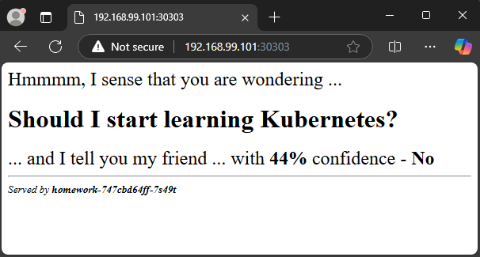
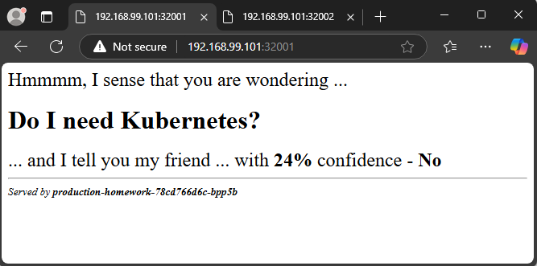
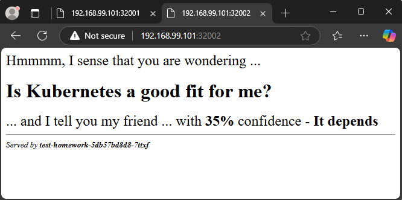
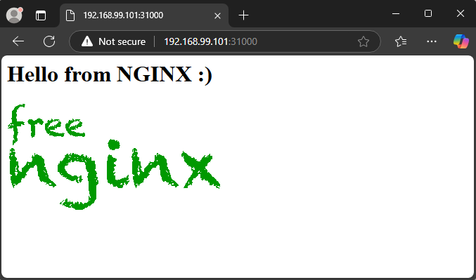
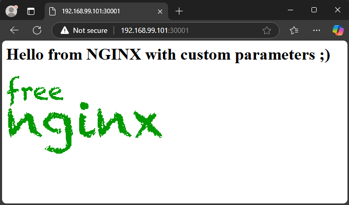

# Tasks
Try to solve the following set of tasks:
#### 1.	Using the files in task1 folder create a template using the sed-based approach. Parametrize the number of replicas and the service port
- Modify the manifest file using placeholders for number of replicas and the service port
```yaml
apiVersion: v1
kind: Namespace
metadata:
  name: homework
---
apiVersion: apps/v1
kind: Deployment
metadata:
  name: homework
  namespace: homework
spec:
  replicas: %replicas%
  selector:
    matchLabels:
      app: hw
  template:
    metadata:
      labels:
        app: hw
    spec:
      containers:
      - image: shekeriev/k8s-oracle
        name: homework
---
apiVersion: v1
kind: Service
metadata:
  labels:
    app: hw
  name: homework-svc
  namespace: homework
spec:
  ports:
  - port: 5000
    nodePort: %nodeport%
    protocol: TCP
    targetPort: 5000
  selector:
    app: hw
  type: NodePort
```
- Apply the template using sed command
```sh
$ sed 's/%replicas%/4/ ; s/%nodeport%/30303/' homework.yaml | kubectl apply -f -
namespace/homework create
deployment.apps/homework created
service/homework-svc created

$ kubectl get pod,svc -n homework
NAME                            READY   STATUS    RESTARTS   AGE
pod/homework-747cbd64ff-4bvpg   1/1     Running   0          65s
pod/homework-747cbd64ff-7s49t   1/1     Running   0          65s
pod/homework-747cbd64ff-qxp4n   1/1     Running   0          65s
pod/homework-747cbd64ff-zrxrz   1/1     Running   0          65s

NAME                   TYPE       CLUSTER-IP      EXTERNAL-IP   PORT(S)          AGE
service/homework-svc   NodePort   10.103.137.16   <none>        5000:30303/TCP   65s
```
- Picture



#### 2.	Using the files in task2 folder create a template using kustomize with two variants – test and production with difference in the service port and number of replicas
- Install Kustomize
```sh
$ curl -s "https://raw.githubusercontent.com/kubernetes-sigs/kustomize/master/hack/install_kustomize.sh" | bash
v5.5.0
kustomize installed to /home/vagrant/kustomize
```
- Check folders part executable path and move the executable in to one of the folders 
```sh
$ echo $PATH
/usr/local/bin:/usr/bin:/bin:/usr/local/games:/usr/games

$ sudo mv kustomize /usr/local/bin

$ kustomize version
v5.5.0
```
- Create set of folders and default files. Check with tree command.
```sh
$ tree
.
├── base
│   ├── homework.yaml
│   └── kustomization.yaml
└── overlays
    ├── production
    │   └── kustomization.yaml
    └── test
        └── kustomization.yaml

5 directories, 4 files
```
- Create the base customization file (base/kustomization.yaml)
```yaml
apiVersion: kustomize.config.k8s.io/v1beta1
kind: Kustomization
resources:
  - homework.yaml
```
- Check the if base customization working
```sh
$ kustomize build base/
apiVersion: v1
kind: Namespace
metadata:
  name: homework
---
apiVersion: v1
kind: Service
metadata:
  labels:
    app: hw
  name: homework-svc
  namespace: homework
spec:
  ports:
  - nodePort: 32000
    port: 5000
    protocol: TCP
    targetPort: 5000
  selector:
    app: hw
  type: NodePort
---
apiVersion: apps/v1
kind: Deployment
metadata:
  name: homework
  namespace: homework
spec:
  replicas: 1
  selector:
    matchLabels:
      app: hw
  template:
    metadata:
      labels:
        app: hw
    spec:
      containers:
      - image: shekeriev/k8s-oracle
        name: homework
```
- Create customization file for production variant (overlays/production/kustomization.yaml)
```yaml
apiVersion: kustomize.config.k8s.io/v1beta1
kind: Kustomization
namePrefix: production-
labels:
- includeSelectors: true
  pairs:
    variant: production
resources:
- ../../base
patches:
- path: custom-np.yaml
- path: custom-replicas.yaml
```
- Create patch for NodePort in production variant (overlays/production/custom-np.yaml)
```yaml
apiVersion: v1
kind: Service
metadata:
  labels:
    app: hw
  name: homework-svc
  namespace: homework
spec:
  ports:
  - port: 5000
    nodePort: 32001
    protocol: TCP
    targetPort: 5000
```
- Create patch for replicas count in production variant (overlays/production/custom-replicas.yaml)
```yaml
apiVersion: apps/v1
kind: Deployment
metadata:
  name: homework
  namespace: homework
spec:
  replicas: 2
```
- Create customization file for test variant (overlays/test/kustomization.yaml)
```yaml
apiVersion: kustomize.config.k8s.io/v1beta1
kind: Kustomization
namePrefix: test-
labels:
- includeSelectors: true
  pairs:
    variant: test
resources:
- ../../base
patches:
- path: custom-np.yaml
- path: custom-replicas.yaml
```
- Create patch for NodePort in test variant (overlays/test/custom-np.yaml)
```yaml
apiVersion: v1
kind: Service
metadata:
  labels:
    app: hw
  name: homework-svc
  namespace: homework
spec:
  ports:
  - port: 5000
    nodePort: 32002
    protocol: TCP
    targetPort: 5000
```
- Create patch for replicas count in test variant (overlays/test/custom-replicas.yaml)
```yaml
apiVersion: apps/v1
kind: Deployment
metadata:
  name: homework
  namespace: homework
spec:
  replicas: 4
```
- Check the folder structure
```sh
$ tree .
.
├── base
│   ├── homework.yaml
│   └── kustomization.yaml
└── overlays
    ├── production
    │   ├── custom-np.yaml
    │   ├── custom-replicas.yaml
    │   └── kustomization.yaml
    └── test
        ├── custom-np.yaml
        ├── custom-replicas.yaml
        └── kustomization.yaml

5 directories, 8 files
```
- Test before sent to cluster
```sh
$ kustomize build overlays/production
apiVersion: v1
kind: Namespace
metadata:
  labels:
    variant: production
  name: homework
---
apiVersion: v1
kind: Service
metadata:
  labels:
    app: hw
    variant: production
  name: production-homework-svc
  namespace: homework
spec:
  ports:
  - nodePort: 32001
    port: 5000
    protocol: TCP
    targetPort: 5000
  selector:
    app: hw
    variant: production
  type: NodePort
---
apiVersion: apps/v1
kind: Deployment
metadata:
  labels:
    variant: production
  name: production-homework
  namespace: homework
spec:
  replicas: 2
  selector:
    matchLabels:
      app: hw
      variant: production
  template:
    metadata:
      labels:
        app: hw
        variant: production
    spec:
      containers:
      - image: shekeriev/k8s-oracle
        name: homework

$ kustomize build overlays/test
apiVersion: v1
kind: Namespace
metadata:
  labels:
    variant: test
  name: homework
---
apiVersion: v1
kind: Service
metadata:
  labels:
    app: hw
    variant: test
  name: test-homework-svc
  namespace: homework
spec:
  ports:
  - nodePort: 32002
    port: 5000
    protocol: TCP
    targetPort: 5000
  selector:
    app: hw
    variant: test
  type: NodePort
---
apiVersion: apps/v1
kind: Deployment
metadata:
  labels:
    variant: test
  name: test-homework
  namespace: homework
spec:
  replicas: 4
  selector:
    matchLabels:
      app: hw
      variant: test
  template:
    metadata:
      labels:
        app: hw
        variant: test
    spec:
      containers:
      - image: shekeriev/k8s-oracle
        name: homework
```
- Apply variants to cluster
```sh
$ kustomize build overlays/production | kubectl apply -f -
namespace/homework created
service/production-homework-svc created
deployment.apps/production-homework created

$ kustomize build overlays/test | kubectl apply -f -
namespace/homework configured
service/test-homework-svc created
deployment.apps/test-homework created
```
- Check the objects in namespace homework
```sh
$ kubectl get pod,svc -n homework
NAME                                       READY   STATUS    RESTARTS   AGE
pod/production-homework-78cd766d6c-bpp5b   1/1     Running   0          60s
pod/production-homework-78cd766d6c-d8bgf   1/1     Running   0          60s
pod/test-homework-5db57bd8d8-6qrpz         1/1     Running   0          51s
pod/test-homework-5db57bd8d8-7ttxf         1/1     Running   0          51s
pod/test-homework-5db57bd8d8-cp4l5         1/1     Running   0          51s
pod/test-homework-5db57bd8d8-l8f46         1/1     Running   0          51s

NAME                              TYPE       CLUSTER-IP      EXTERNAL-IP   PORT(S)          AGE
service/production-homework-svc   NodePort   10.105.137.17   <none>        5000:32001/TCP   61s
service/test-homework-svc         NodePort   10.99.192.229   <none>        5000:32002/TCP   51s
```
- Picture (production)



- Picture (test)



- Remove all objects (When delete namespace homework all objects in it also been deleted)
```sh
$ kustomize build overlays/production/ | kubectl delete -f -
namespace "homework" deleted
service "production-homework-svc" deleted
deployment.apps "production-homework" deleted
```
#### 3.	Create a Helm chart that spins a NGINX-based deployment with 3 replicas by default. It must mount a default index.html (with a text and a picture) page from a ConfigMap. The web server should be exposed via NodePort service on port 31000 by default. At least the text of the default page, number of replicas, and service port should be parametrized
- Install Helm
```sh
$ curl https://raw.githubusercontent.com/helm/helm/main/scripts/get-helm-3 | bash

$ helm version
version.BuildInfo{Version:"v3.16.3", GitCommit:"cfd07493f46efc9debd9cc1b02a0961186df7fdf", GitTreeState:"clean", GoVersion:"go1.22.7"}
```
- Create hierarchy for our chart
```sh
$ mkdir -pv task3/templates

$ touch task3/{Chart.yaml,values.yaml} task3/templates/{cm.yaml,deployment.yaml,svc.yaml}

$ tree task3
task3
├── Chart.yaml
├── pictures
│   └── nginx.png
├── templates
│   ├── cm.yaml
│   ├── deployment.yaml
│   └── svc.yaml
└── values.yaml

3 directories, 6 files
```
- Fill in task3/Chart.yaml
```yaml
apiVersion: v2
name: task3
description: A Helm chart for Kubernetes

# Chart type
type: application

# Chart version
version: 0.1.0

# Application version
appVersion: "1.27.2"
```
- Fill in task3/templates/cm.yaml
```yaml
apiVersion: v1
kind: ConfigMap
metadata:
  name: {{ .Release.Name }}-cm
data:
  index.html: |
    <h1>{{ .Values.indexFile }}</h1>
    
```
- Fill in task3/templates/deployment.yaml
```yaml
apiVersion: apps/v1
kind: Deployment
metadata:
  name: {{ .Release.Name }}-deployment
  labels:
    app: {{ .Release.Name }}
spec:
  replicas: {{ .Values.replicasCount }}
  selector:
    matchLabels:
      app: {{ .Release.Name }}
  template:
    metadata:
      labels:
        app: {{ .Release.Name }}
    spec:
      containers:
      - name: nginx
        image: nginx:latest
        ports:
        - containerPort: 80
        volumeMounts:
        - name: html
          mountPath: /usr/share/nginx/html
      volumes:
      - name: html
        configMap:
          name: {{ .Release.Name }}-cm
```
- Fill in task3/templates/svc.yaml
```yaml
apiVersion: v1
kind: Service
metadata:
  name: {{ .Release.Name }}-service
spec:
  selector:
    app: {{ .Release.Name }}
  type: NodePort
  ports:
  - port: 80
    targetPort: 80
    nodePort: {{ .Values.nodePort }}
```
- Fill in task3/values.yaml
```yaml
replicasCount: 3
nodePort: 31000
indexFile: "Hello from NGINX :)"
```
- Package and install Helm chart
```sh
$ helm package task3
Successfully packaged chart and saved it to: /home/vagrant/task3-0.1.0.tgz

$ helm install task3 task3-0.1.0.tgz
NAME: task3
LAST DEPLOYED: Sat Nov 23 15:04:45 2024
NAMESPACE: default
STATUS: deployed
REVISION: 1
TEST SUITE: None
```
- Check Helm list
```sh
$ helm list
NAME    NAMESPACE       REVISION        UPDATED                                 STATUS          CHART           APP VERSION
task3   default         1               2024-11-23 15:04:45.470564641 +0200 EET deployed        task3-0.1.0     1.27.2
```
- Check objects from chart
```sh
$ kubectl get pods,svc,cm
NAME                                    READY   STATUS    RESTARTS   AGE
pod/task3-deployment-6dc4d75c89-b78fd   1/1     Running   0          34s
pod/task3-deployment-6dc4d75c89-h7h2l   1/1     Running   0          34s
pod/task3-deployment-6dc4d75c89-rtk2h   1/1     Running   0          34s

NAME                    TYPE        CLUSTER-IP       EXTERNAL-IP   PORT(S)        AGE
service/kubernetes      ClusterIP   10.96.0.1        <none>        443/TCP        5h16m
service/task3-service   NodePort    10.101.251.170   <none>        80:31000/TCP   34s

NAME                         DATA   AGE
configmap/kube-root-ca.crt   1      5h16m
configmap/task3-cm           1      34s
```
- Picture



- Install new revision of our package with parameters
```sh
$ helm install nginx task3-0.1.0.tgz \
--set nodePort=30001 \
--set replicaCount=4 \
--set indexFile="Hello from NGINX with custom parameters ;)"
NAME: nginx
LAST DEPLOYED: Sat Nov 23 15:12:45 2024
NAMESPACE: default
STATUS: deployed
REVISION: 1
TEST SUITE: None

$ helm list
NAME    NAMESPACE       REVISION        UPDATED                                 STATUS          CHART           APP VERSION
nginx   default         1               2024-11-23 15:12:45.629708921 +0200 EET deployed        task3-0.1.0     1.27.2
task3   default         1               2024-11-23 15:04:45.470564641 +0200 EET deployed        task3-0.1.0     1.27.2

~$ kubectl get pods,svc,cm
NAME                                    READY   STATUS    RESTARTS   AGE
pod/nginx-deployment-86bd9b498f-7bvb6   1/1     Running   0          50s
pod/nginx-deployment-86bd9b498f-9f599   1/1     Running   0          50s
pod/nginx-deployment-86bd9b498f-vf9rq   1/1     Running   0          50s
pod/task3-deployment-6dc4d75c89-b78fd   1/1     Running   0          8m50s
pod/task3-deployment-6dc4d75c89-h7h2l   1/1     Running   0          8m50s
pod/task3-deployment-6dc4d75c89-rtk2h   1/1     Running   0          8m50s

NAME                    TYPE        CLUSTER-IP       EXTERNAL-IP   PORT(S)        AGE
service/kubernetes      ClusterIP   10.96.0.1        <none>        443/TCP        5h24m
service/nginx-service   NodePort    10.100.207.253   <none>        80:30001/TCP   50s
service/task3-service   NodePort    10.101.251.170   <none>        80:31000/TCP   8m50s

NAME                         DATA   AGE
configmap/kube-root-ca.crt   1      5h24m
configmap/nginx-cm           1      50s
configmap/task3-cm           1      8m50s
```
- Picture


