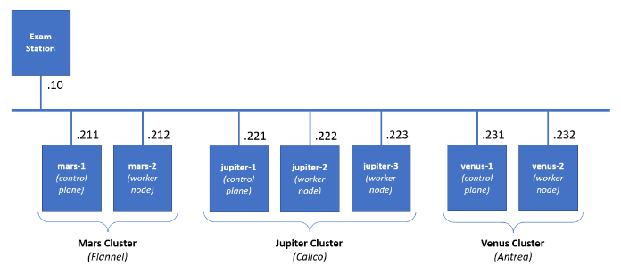

## Practice M8: Exam Preparation (Challenge)
### 1. Exam Plot
Should you want to reproduce the environment, you will have to prepare the following set of machines:

- **Exam station\*** is with **kubectl** + **helm** + **kustomize** installed
- **Mars cluster** – two machines – working cluster with **Flannel** as a pod network plugin and **HAProxy** as ingress controller
- **Jupiter cluster** – three machines – working cluster with **Calico** as a pod network plugin 
- **Venus cluster** – two machines – **broken** cluster with **Antrea** as a pod network plugin (should be installed as part of the solution)

*\* For the sake of simplifying the setup, you could skip the exam station and instead use your host as one*

All clusters are **Kubernetes 1.30.3** and all their nodes are with **2 vCPU / 2 GB RAM / 32 GB Disk / Debian 12**. The exam station is with **1 vCPU / 2 GB RAM**

There is the **exam** user which has **sudo** privileges on all machines and can authenticate to each one of them via SSH

If you are constrained by the available resources, you can spin up the clusters one by one, as the tasks are grouped by cluster. You can even omit the exam station and use your host to control and work with the clusters

Check the published archive for the setup files (folder **1-setup**). There is a separate folder (**2-files**) that contains the source or input files referenced in the tasks. Its content is expected to be copied in **/files** folder of the station
### 2. Sample Exam
#### Infrastructure
You will have to accomplish a set of tasks in the following infrastructure



#### Rules
Be sure to **follow strictly** the **naming** **conventions** specified in the checklist 

Tasks execution order should not be derived from the order in which they are listed below. Please note that there are tasks that depend on the successful completion of one or more other tasks

Usually, all steps could be achieved by following different paths and using different tools. In the end, not the means, but the **results** are being **measured**, **except stated otherwise**
#### Tasks checklist
##### **Mars Cluster** [18 pts]
Check the current context and switch if necessary.
```sh
$ kubectl config get-contexts

# Switch to context venus
$ kubectl config use-context venus-admin@venus
Switched to context "mars-admin@mars".
```
- (T101 / 3 pts) There is the **animals** namespace. There are two pairs of pod and service. You are expected to create an ingress resource (using the available ingress controller and class) that
  - Will be in the same namespace and named **pets-ingress**
  - Will serve the **pets.lab** host
  - Path **/cat** to be redirected to **cat-svc** service and **/dog** to the **dog-svc**
  - Store it in **/files/mars/t101-out.yaml** and be sure to deploy it
  1. Check the ingressclass
  ```sh
  $ kubectl get ingressclass
  NAME      CONTROLLER                       PARAMETERS   AGE
  haproxy   haproxy.org/ingress-controller   <none>       11s
  ```
  2. Prepare manifest for Ingress object
  ```yaml
  apiVersion: networking.k8s.io/v1
  kind: Ingress
  metadata:
    name: pets-ingress
    namespace: animals
    annotations:
      haproxy.org/path-rewrite: "/"
  spec:
    ingressClassName: haproxy
    rules:
    - host: pets.lab
      http:
        paths:
        - path: /cat
          pathType: Prefix
          backend:
            service:
              name: cat-svc
              port:
                number: 80
        - path: /dog
          pathType: Prefix
          backend:
            service:
              name: dog-svc
              port:
                number: 80
  ```
  3. Check the port of ingress controller
  ```sh
  $ kubectl get service -n haproxy-controller
  NAME                         TYPE       CLUSTER-IP       EXTERNAL-IP   PORT(S)                                     AGE
  haproxy-kubernetes-ingress   NodePort   10.100.181.169   <none>        80:31080/TCP,443:31471/TCP,1024:31562/TCP   11m
  ```
  4. Check the ingress
  ```sh
  $ kubectl describe -n animals ingress pets-ingress
  Name:             pets-ingress
  Labels:           <none>
  Namespace:        animals
  Address:
  Ingress Class:    haproxy
  Default backend:  <default>
  Rules:
    Host        Path  Backends
    ----        ----  --------
    pets.lab
                /cat   cat-svc:80 (10.244.1.4:80)
                /dog   dog-svc:80 (10.244.1.5:80)
  Annotations:  haproxy.org/path-rewrite: /
  Events:       <none>
  ```
  5. Check if ingress working
  ```sh
  $ curl pets.lab:31080/dog

  $ curl pets.lab:31080/cat
  ```
- (T102 / 3 pts) Explore the **tiger** namespace. There is a pod that is not in running state, but it should be. Its manifest is **/files/mars/t102-in.yaml**. Your mission, should you accept it, is to
  - Correct the issue(s) and reflect this in a new manifest **/files/mars/t102-out.yaml**
  - Make sure that the pod is in running state and doesn’t restart periodically because of a probe

RESOLUTION
- Fix the issue in manifest file (t102-out.yaml)
```yaml
apiVersion: v1
kind: Pod
metadata:
  name: tiger
  namespace: tiger
spec:
  containers:
  - image: alpine # Fix the image name
    name: main
    args:
    - /bin/sh
    - -c
    - sleep 60; touch /tmp/healthy; sleep 86400
    livenessProbe:
      exec:
        command:
        - cat
        - /tmp/healthy
      initialDelaySeconds: 65 # Fix the initial delay to fit app sleep
      periodSeconds: 5
```
- Delete the pod and apply the fixed manifest
```sh
$ kubectl delete -f t102-out.yaml
pod "tiger" deleted

$ kubectl apply -f t102-out.yaml
pod/tiger created
```
- (T103 / 4 pts) Templating is a good and necessary technique. We have a simple manifest **(/files/mars/t103-in.yaml**) which we want to be able to easily deploy in production (**blue**) and in test (**green**). Using the **kustomize** application, you must prepare a set of folders and files in the **/files/mars/t103** folder that allows 
  - Base (without any changes) deployment and deployment to both environments
  - The **blue** deployment should increase the **replicas** to **3**, use the **blue** tag, and runs on port **31103**
  - The **green** deployment should use the **green** image tag and runs on port **32103**
  - Make sure that blue and green are deployed (but not the base)

RESOLUTION
- Create folder hierarchy
```sh
$ mkdir -p /files/mars/t103/{base,overlays}

$ mkdir -p /files/mars/t103/overlays/{blue,green}
```
- Create `base/kustomization.yaml`
```yaml
apiVersion: kustomize.config.k8s.io/v1beta1
kind: Kustomization
resources:
  - t103-in.yaml
```
- Create `overlays/blue/kustomization.yaml`
```yaml
apiVersion: kustomize.config.k8s.io/v1beta1
kind: Kustomization
namePrefix: blue-
commonLabels:
  variant: blue
resources:
- ../../base
patches:
- path: cust-dpl.yaml
- path: cust-svc.yaml
```
- Create `overlays/blue/cust-dpl.yaml`
```yaml
apiVersion: apps/v1
kind: Deployment
metadata:
  name: kust
spec:
  replicas: 3
```
- Create `overlays/blue/cust-svc.yaml`
```yaml
apiVersion: v1
kind: Service
metadata:
  name: kust
spec:
  ports:
  - port: 80
    nodePort: 31103
    protocol: TCP
```
- Modify the image tag for blue
```sh
sudo kustomize edit set image shekeriev/k8s-environ:latest=shekeriev/k8s-environ:blue
```
- Create `overlays/green/kustomization.yaml`
```yaml
apiVersion: kustomize.config.k8s.io/v1beta1
kind: Kustomization
namePrefix: green-
commonLabels:
  variant: green
resources:
- ../../base
patches:
- path: cust-svc.yaml
images:
- name: shekeriev/k8s-environ:latest
  newName: shekeriev/k8s-environ
  newTag: green
```
- Create `overlays/greeb/cust-svc.yaml`
```yaml
apiVersion: v1
kind: Service
metadata:
  name: kust
spec:
  ports:
  - port: 80
    nodePort: 32103
    protocol: TCP
```
- Deploy
```sh
$ kustomize build overlays/blue/ | kubectl apply -f -
# Warning: 'commonLabels' is deprecated. Please use 'labels' instead. Run 'kustomize edit fix' to update your Kustomization automatically.
service/blue-kust created
deployment.apps/blue-kust created

$ sudo kubectl apply -k overlays/green/
service/green-kust created
deployment.apps/green-kust created
```
- Check the objects
```sh
$ kubectl get pods,svc
NAME                              READY   STATUS    RESTARTS   AGE
pod/blue-kust-5b7d595bc8-9lpf8    1/1     Running   0          106s
pod/blue-kust-5b7d595bc8-kxfl4    1/1     Running   0          106s
pod/blue-kust-5b7d595bc8-qljbc    1/1     Running   0          106s
pod/green-kust-64d6bfd456-kmgk2   1/1     Running   0          49s

NAME                 TYPE        CLUSTER-IP      EXTERNAL-IP   PORT(S)        AGE
service/blue-kust    NodePort    10.98.138.113   <none>        80:31103/TCP   106s
service/green-kust   NodePort    10.110.187.32   <none>        80:32103/TCP   49s
service/kubernetes   ClusterIP   10.96.0.1       <none>        443/TCP        123m
```
----
- (T104 / 2 pts) Explore the **cherry** namespace. There is a deployment that is failing. Your mission is to 
  - Find the reason for this and write it down *(**type of the object:name of the object**, for example **limit:banana**)* in the **/files/mars/t104-reason.txt** file
  - Correct the situation by changing the offending parameter of the deployment to comply

RESOLUTION
- Check the objects in namespace
```sh
$ kubectl get -n cherry pods,svc,deployment,rs
NAME                          READY   STATUS             RESTARTS   AGE
pod/cherry-5ff587dcd6-kfq7l   0/1     ErrImagePull       0          15h
pod/cherry-5ff587dcd6-xzdj6   0/1     ImagePullBackOff   0          15h
pod/cherry-5ff587dcd6-zkscl   0/1     ErrImagePull       0          15h

NAME                     READY   UP-TO-DATE   AVAILABLE   AGE
deployment.apps/cherry   0/5     3            0           15h

NAME                                DESIRED   CURRENT   READY   AGE
replicaset.apps/cherry-5ff587dcd6   5         3         0       15h
```
- Found problem with image pull. Create file from deployment
```sh
$ kubectl get deployment -n cherry cherry -o yaml > t104.yaml
```
- Remove unnecessary rows from t104.yaml and fix the issues
```yaml
apiVersion: apps/v1
kind: Deployment
metadata:
  name: cherry
  namespace: cherry
spec:
  progressDeadlineSeconds: 600
  replicas: 5
  revisionHistoryLimit: 10
  selector:
    matchLabels:
      app: cherry
  strategy:
    rollingUpdate:
      maxSurge: 25%
      maxUnavailable: 25%
    type: RollingUpdate
  template:
    metadata:
      creationTimestamp: null
      labels:
        app: cherry
    spec:
      containers:
      - args:
        - /bin/sh
        - -c
        - sleep 86400
        image: alpine # fix the image name
        imagePullPolicy: IfNotPresent
        name: main
        resources: {}
        terminationMessagePath: /dev/termination-log
        terminationMessagePolicy: File
      dnsPolicy: ClusterFirst
      restartPolicy: Always
      schedulerName: default-scheduler
      securityContext: {}
      terminationGracePeriodSeconds: 30
```
- Delete and Apply new deployment
```sh
$ kubectl delete -f t104.yaml
deployment.apps "cherry" deleted

$ kubectl apply -f t104.yaml
deployment.apps/cherry created
```
- Check the resources for nodes
```sh
$ kubectl describe nodes mars-1

$ kubectl describe nodes mars-2
```
- Check is there quotas
```sh
$ kubectl get quota -n cherry
NAME     AGE   REQUEST     LIMIT
cherry   15h   pods: 3/3
```
- Found that quota is the reason of the problem
```sh
$ kubectl get quota -n cherry -o yaml
apiVersion: v1
items:
- apiVersion: v1
  kind: ResourceQuota
  metadata:
    annotations:
      kubectl.kubernetes.io/last-applied-configuration: |
        {"apiVersion":"v1","kind":"ResourceQuota","metadata":{"annotations":{},"name":"cherry","namespace":"cherry"},"spec":{"hard":{"pods":3}}}
    creationTimestamp: "2024-11-28T15:01:36Z"
    name: cherry
    namespace: cherry
    resourceVersion: "12783"
    uid: e56626de-69f1-4ceb-bf21-f8e7b9170867
  spec:
    hard:
      pods: "3"
  status:
    hard:
      pods: "3"
    used:
      pods: "3"
kind: List
metadata:
  resourceVersion: ""
```
- Create `t104-reason.txt`
```sh
$ echo "ResourceQuota:cherry" > t104-reason.txt
```
- Correct  the deployment to 3 replicas.
```sh
$ kubectl edit deployment -n cherry
deployment.apps/cherry edited
```
----
- (T105 / 2 pts) Explore the pod manifest in **/files/mars/t105-in.yaml** file and
  - Create a new one (**/files/mars/t105-out.yaml**) that wraps the pod template in a **CronJob** named **five-job**
  - Set it to run **every 5 minutes** and deploy it

RESOLUTION
- Create manifest `t105-out.yaml`
```yaml
apiVersion: batch/v1
kind: CronJob
metadata:
  name: five-job
spec:
  schedule: "*/5 * * * *"
  jobTemplate:
    spec:
      template:
        spec:
          containers:
          - name: main
            image: alpine
            imagePullPolicy: IfNotPresent
            command:
            - /bin/sh
            - -c
            - sleep 60
          restartPolicy: OnFailure
```
- Apply the manifest
```sh
$ kubectl apply -f t105-out.yaml
cronjob.batch/five-job created

$ kubectl get cronjob
NAME       SCHEDULE      TIMEZONE   SUSPEND   ACTIVE   LAST SCHEDULE   AGE
five-job   */5 * * * *   <none>     False     0        75s             89s
```
----
- (T106 / 4 pts) There is the **fortress** namespace. It is empty. Your mission is to
  - Create a **ServiceAccount** named **observer**
  ```sh
  $ kubectl create serviceaccount observer -n fortress
  serviceaccount/observer created
  ```
  - Create a **Role** named **looknotouch** that allows only **get** on **pods**
  ```sh
  $ kubectl create role looknotouch -n fortress --verb=get --resource=pods
  role.rbac.authorization.k8s.io/looknotouch created
  ```
  - Create a **RoleBinding** named **looknotouch** that binds the role to the service account
  ```sh
  $ kubectl create rolebinding looknotouch -n fortress --role=looknotouch --serviceaccount=fortress:observer
  rolebinding.rbac.authorization.k8s.io/looknotouch created
  ```
  - Modify the pod manifest **/files/mars/t106-in.yaml** to run the pod with the observer service account, store the new version in **/files/mars/t106-out.yaml** and deploy it
  ```sh
  apiVersion: v1
  kind: Pod
  metadata:
    name: observer
    namespace: fortress
  spec:
    serviceAccount: observer # add the service account
    containers:
    - image: alpine
      name: main
      args:
      - /bin/sh
      - -c
      - sleep 86400
  ```
  - Apply manifest
  ```sh
  $ kubectl apply -f t106-out.yaml
  pod/observer created
  ```
  - Check the serviceAccount is in use
  ```sh
  $ kubectl get -n fortress pod/observer -o yaml | grep serviceAccount
      {"apiVersion":"v1","kind":"Pod","metadata":{"annotations":{},"name":"observer","namespace":"fortress"},"spec":{"containers":[{"args":["/bin/sh","-c","sleep 86400"],"image":"alpine","name":"main"}],"serviceAccount":"observer"}}
  serviceAccount: observer
  serviceAccountName: observer
  ```
----
##### **Jupiter Cluster** [25 pts]
Switch context
```sh
$ kubectl config use-context jupiter-admin@jupiter
```
- (T201 / 4 pts) There are three namespaces – **apple**, **orange**, and **apricot**. In all three, there is a pair of pod and service. There aren’t any restrictions. You should correct this:
  ```sh
  # Check what is the status
  $ curl http://jupiter-1:30901
  <h5>Tasty Apples :)</h5>
  <hr>
  Apples Reachable.<br />
  Oranges Reachable.<br />
  Apricots Reachable.<br />

  $ curl http://jupiter-1:30902
  <h5>Tasty Oranges :)</h5>
  <hr>
  Apples Reachable.<br />
  Oranges Reachable.<br />
  Apricots Reachable.<br />

  $ curl http://jupiter-1:30903
  <h5>Tasty Apricots :)</h5>
  <hr>
  Apples Reachable.<br />
  Oranges Reachable.<br />
  Apricots Reachable.<br />
  ```
  - Add a network policy that will limit the **ingress access** to the pods in the **apple** namespace to connections, coming only from pods in the **orange** namespace
    - Take the labels on namespace orange, from where should allow the communication
    ```sh
    $ kubectl get ns orange --show-labels
    NAME     STATUS   AGE   LABELS
    orange   Active   85m   app=orange,kubernetes.io/metadata.name=orange
    ```
    - Create network policy (t201-out.yaml)
    ```yaml
    apiVersion: networking.k8s.io/v1
    kind: NetworkPolicy
    metadata:
      name: apple-access
      namespace: apple
    spec:
      podSelector: {} # all pods in apple namespace
      policyTypes:
      - Ingress
      ingress:
      - from:
        - namespaceSelector:
            matchLabels:
              kubernetes.io/metadata.name: orange
    ```
    - Apply network policy
    ```sh
    $ kubectl apply -f t201-out.yaml
    networkpolicy.networking.k8s.io/apple-access created
    
    # Check the policy
    $ kubectl describe netpol apple-access -n apple
    Name:         apple-access
    Namespace:    apple
    Created on:   2024-11-29 11:36:05 +0200 EET
    Labels:       <none>
    Annotations:  <none>
    Spec:
      PodSelector:     <none> (Allowing the specific traffic to all pods in this namespace)
      Allowing ingress traffic:
        To Port: <any> (traffic allowed to all ports)
        From:
          NamespaceSelector: kubernetes.io/metadata.name=orange
      Not affecting egress traffic
      Policy Types: Ingress

    # Check the status after our NetworkPolicy
    $ curl --connect-timeout 5 http://jupiter-1:30901
    curl: (28) Failed to connect to jupiter-1 port 30901 after 5001 ms: Timeout was reached

    $ curl --connect-timeout 5 http://jupiter-1:30902
    <h5>Tasty Oranges :)</h5>
    <hr>
    Apples Reachable.<br />
    Oranges Reachable.<br />
    Apricots Reachable.<br />

    $ curl --connect-timeout 5 http://jupiter-1:30903
    <h5>Tasty Apricots :)</h5>
    <hr>
    Apples NOT reachable<br />
    Oranges Reachable.<br />
    Apricots Reachable.<br />
    ```
----
- (T202 / 5 pts) We all know that using **Helm** charts is both fun and easy. So, let’s spin up one chart
  - Use the **artifacthub.io** and find the **Apache HTTP** chart provided by **Bitnami** and **add the repository**
  - Then **install** the chart as **exam-httpd** release in the **kiwi** namespace (create it if not existing)
  - Make sure that using the chart’s parameters it is set to use a service of type **NodePort** and to listen for HTTP request on port **32202**
  - Create a **ConfigMap** named **exam-httpd-cm** in the same namespace that contains an **index.html** file with the following text **Helm+Kubernetes=Fun** and attach it to the release

RESOLUTION
- Create namespace `kiwi`
```sh
$ kubectl create ns kiwi
namespace/kiwi created
```
- Register **Bitnami** repository
```sh
$ helm repo add bitnami https://charts.bitnami.com/bitnami
"bitnami" has been added to your repositories
```
- Create ConfigMap
```sh
$ kubectl create configmap -n kiwi exam-httpd-cm --from-literal=index.html="Kubernetes+Helm=Fun"
configmap/exam-httpd-cm created
```
- In artifacthub.io for Apache HTTP search for "nodePort" and "HtdocsConfigMap"
- Install helm chart
```sh
$ helm install exam-httpd -n kiwi bitnami/apache --set service.type=NodePort --set service.NodePorts.http=32202 --set htdocsConfigMap=exam-httpd-cm

$ kubectl get pods,svc -n kiwi
NAME                                     READY   STATUS    RESTARTS   AGE
pod/exam-httpd-apache-7774b8b969-pjjbs   1/1     Running   0          78s

NAME                        TYPE       CLUSTER-IP     EXTERNAL-IP   PORT(S)                      AGE
service/exam-httpd-apache   NodePort   10.108.67.39   <none>        80:30169/TCP,443:31687/TCP   79s
```
- Check the service with curl
```sh
$ curl http://192.168.99.221:30169
```
---
- (T203 / 4 pts) There is a pod in the **cucumber** namespace that is consuming a secret in the same namespace. You are expected to:
  - Find the unencoded value of the secret and save it as **/files/jupiter/t203-secret.txt**
    - Find the secret
    ```sh
    $ kubectl exec -it pod/cucumber -n cucumber -- sh -c set
    BB_ASH_VERSION='1.36.1'
    FUNCNAME=''
    HOME='/root'
    HOSTNAME='cucumber'
    IFS='
    '
    KUBERNETES_PORT='tcp://10.96.0.1:443'
    KUBERNETES_PORT_443_TCP='tcp://10.96.0.1:443'
    KUBERNETES_PORT_443_TCP_ADDR='10.96.0.1'
    KUBERNETES_PORT_443_TCP_PORT='443'
    KUBERNETES_PORT_443_TCP_PROTO='tcp'
    KUBERNETES_SERVICE_HOST='10.96.0.1'
    KUBERNETES_SERVICE_PORT='443'
    KUBERNETES_SERVICE_PORT_HTTPS='443'
    LINENO=''
    OPTIND='1'
    PATH='/usr/local/sbin:/usr/local/bin:/usr/sbin:/usr/bin:/sbin:/bin'
    PPID='0'
    PS1='\w \$ '
    PS2='> '
    PS4='+ '
    PWD='/'
    S3C_scretfact='U r h@k3r
    '
    SHLVL='1'
    TERM='xterm'
    ```
  - Then change the secret to **Cucumbers are green**
  ```sh
  # Encode the new secret
  $ echo 'Cucumbers are green' | base64
  Q3VjdW1iZXJzIGFyZSBncmVlbgo=

  # Edit the secret and change the value of secret with above
  $ kubectl edit secret cucumber-secret -n cucumber
  secret/cucumber-secret edited

  # Check after change
  $ kubectl get secret cucumber-secret -n cucumber -o jsonpath={.data.scretfact} | base64 --decode
  Cucumbers are green
  ```
---
- (T204 / 2 pts) Add a new label (**exam**) to both worker nodes (**jupiter-2** and **jupiter-3**):
  ```sh
  # Check current labels
  $ kubectl get nodes --show-labels
  ```
  - Set its value to **slow** for **jupiter-2**
  ```sh
  $ kubectl label nodes jupiter-2 exam=slow
  node/jupiter-2 labeled
  ```
  - Set its value to **fast** for **jupiter-3**
  ```sh
  $ kubectl label nodes jupiter-3 exam=fast
  node/jupiter-3 labeled
  ```
---
- (T205 / 1 pts) Explore the manifest **/files/jupiter/t205-in.yaml**
  - Modify it in such a way that if deployed, the workload to go on the node with label **exam** set to **fast** and save the new manifest as **/files/jupiter/t205-out.yaml**
  ```yaml
  apiVersion: v1
  kind: Pod
  metadata:
    name: pod205
  spec:
    nodeSelector: # add new block
      exam: fast # use requested label
    containers:
    - image: alpine
      name: main
      args:
      - /bin/sh
      - -c
      - sleep 86400
  ```
  - Deploy it to the cluster
  ```sh
  $ kubectl apply -f t205-out.yaml
  pod/pod205 created

  $ kubectl get pod -o wide
  NAME     READY   STATUS    RESTARTS   AGE   IP            NODE        NOMINATED NODE   READINESS GATES
  pod205   1/1     Running   0          40s   10.244.1.69   jupiter-3   <none>           <none>
  ```
---
- (T206 / 1 pts) Explore the manifest **/files/jupiter/t206-in.yaml**
  - Modify it in such a way that if deployed, the workload to go on the node named **jupiter-2** and save the new manifest as **/files/jupiter/t206-out.yaml**
  ```yaml
  apiVersion: v1
  kind: Pod
  metadata:
    name: pod206
  spec:
    nodeName: jupiter-2 # add row with name of requested node name
    containers:
    - image: alpine
      name: main
      args:
      - /bin/sh
      - -c
      - sleep 86400
  ```
  - Deploy it to the cluster
  ```sh
  $ kubectl apply -f t206-out.yaml
  pod/pod206 created

  $ kubectl get pod -o wide
  NAME     READY   STATUS    RESTARTS   AGE     IP            NODE        NOMINATED NODE   READINESS GATES
  pod205   1/1     Running   0          4m31s   10.244.1.69   jupiter-3   <none>           <none>
  pod206   1/1     Running   0          6s      10.244.63.8   jupiter-2   <none>           <none>
  ```
---
- (T207 / 4 pts) Explore the **banana** namespace. There should be a pair of pod and service. They are created out of the **/files/jupiter/t207-in.yaml** manifest. The problem is that the pod (**banana-pod-1**) is not in running state and the service (**banana-svc**) does not have any endpoints. Your mission is to:
  - Correct these issues and save the changes as **/files/jupiter/t207-out.yaml** manifest
  - Make sure that the deployed objects are in a good shape (they reflect the corrections)
  ```yaml
  apiVersion: v1
  kind: Pod
  metadata:
    name: banana-pod-1
    namespace: banana
    labels:       # add labels block
      app: banana # add kvp to match service
  spec:
    containers:
    - image: shekeriev/k8s-environ:blue # Fix the name of the image
      name: main
      env:
      - name: FRUIT
        value: "Did you know that bananas are yellow and curved? :)"
      - name: FOCUSON
        value: "FRUIT"
  ---
  apiVersion: v1
  kind: Service
  metadata:
    name: banana-svc
    namespace: banana
  spec:
    ports:
    - port: 80
      protocol: TCP
    selector:
      app: banana
  ```
  ```sh
  $ kubectl describe service/banana-svc -n banana
  Name:              banana-svc
  Namespace:         banana
  Labels:            <none>
  Annotations:       <none>
  Selector:          app=banana
  Type:              ClusterIP
  IP Family Policy:  SingleStack
  IP Families:       IPv4
  IP:                10.99.180.48
  IPs:               10.99.180.48
  Port:              <unset>  80/TCP
  TargetPort:        80/TCP
  Endpoints:         10.244.1.70:80
  Session Affinity:  None
  Events:            <none>
  ```
  - Add a second pod, in the new manifest file, of the same type but change the image tag to green and name it **banana-pod-2**
  ```yaml
  apiVersion: v1
  kind: Pod
  metadata:
    name: banana-pod-1
    namespace: banana
    labels:
      app: banana
  spec:
    containers:
    - image: shekeriev/k8s-environ:blue
      name: main
      env:
      - name: FRUIT
        value: "Did you know that bananas are yellow and curved? :)"
      - name: FOCUSON
        value: "FRUIT"
  ---
  apiVersion: v1
  kind: Pod
  metadata:
    name: banana-pod-2 # change the name of second pod
    namespace: banana
    labels:
      app: banana
  spec:
    containers:
    - image: shekeriev/k8s-environ:green # change the image tag
      name: main
      env:
      - name: FRUIT
        value: "Did you know that bananas are yellow and curved? :)"
      - name: FOCUSON
        value: "FRUIT"
  ---
  apiVersion: v1
  kind: Service
  metadata:
    name: banana-svc
    namespace: banana
  spec:
    ports:
    - port: 80
      protocol: TCP
    selector:
      app: banana
  ```
  - Make sure that the new pod is present in the service endpoints list
  ```sh
  $ kubectl apply -f t207-out.yaml
  pod/banana-pod-1 unchanged
  pod/banana-pod-2 created
  service/banana-svc unchanged

  $ kubectl describe service/banana-svc -n banana
  Name:              banana-svc
  Namespace:         banana
  Labels:            <none>
  Annotations:       <none>
  Selector:          app=banana
  Type:              ClusterIP
  IP Family Policy:  SingleStack
  IP Families:       IPv4
  IP:                10.99.180.48
  IPs:               10.99.180.48
  Port:              <unset>  80/TCP
  TargetPort:        80/TCP
  Endpoints:         10.244.1.70:80,10.244.63.9:80
  Session Affinity:  None
  Events:            <none>
  ```
---
- (T208 / 4 pts) Explore the manifest **/files/jupiter/t208-in.yaml** and 
  - Extend it to also include
    - A definition of a namespace named **cherry**
    - and a definition of a service named **cherry-svc** of type **NodePort** and port set to **32208**
    - and save it as **/files/jupiter/t208-out.yaml**
  ```yaml
  apiVersion: v1    # new row
  kind: Namespace   # new row
  metadata:         # new row
    name: cherry    # new row
  ---
  apiVersion: v1
  kind: Pod
  metadata:
    name: t208
    namespace: cherry
    labels:         # add labels block
      app: cherry   # add kvp
  spec:
    containers:
    - image: shekeriev/k8s-environ
      name: main
      env:
      - name: FRUIT
        value: "Did you know that cherries are red and tasty? :)"
      - name: FOCUSON
        value: "FRUIT"
  ---
  apiVersion: v1          # new row
  kind: Service           # new row
  metadata:               # new row
    name: cherry-svc      # new row
    namespace: cherry     # new row          
  spec:                   # new row
    type: NodePort        # new row        
    selector:             # new row  
      app: cherry         # new row
    ports:                # new row
      - port: 80          # new row      
        targetPort: 80    # new row            
        nodePort: 32208   # new row
  ```  
  - Deploy the manifest
  ```sh
  $ kubectl apply -f t208-out.yaml
  namespace/cherry created
  pod/t208 created
  service/cherry-svc created
  ```
##### **Venus Cluster** [17 pts]
Check the current context and switch if necessary.
```sh
$ kubectl config get-contexts

# Switch to context venus
$ kubectl config use-context venus-admin@venus
Switched to context "venus-admin@venus".
```
- (T301 / 5 pts) Install the missing system components (**kubeadm**, **kubelet**, and **kubectl**) on the **venus-2** node and make sure that their version is aligned with the version installed on the **venus-1** node
  - Check the versions on venus-1
  ```sh
  $ kubectl get nodes
  NAME      STATUS     ROLES           AGE     VERSION
  venus-1   NotReady   control-plane   2m26s   v1.30.3
  ```
  - SSH to venus-2
  ```sh
  $ ssh vagrant@venus-2
  ```
  - Check is Kubernetes repository is registered and check available versions
  ```sh
  $ sudo apt update

  $ apt-cache madison kubelet
  ```
  - Install missing components and hold them
  ```sh
  $ sudo apt install kubelet=1.30.3-1.1 kubeadm=1.30.3-1.1 kubectl=1.30.3-1.1

  $ sudo apt-mark hold kubelet kubeadm kubectl
  ```
---
- (T302 / 3 pts) Join the **venus-2** node to the **Venus Cluster**
  - Execute on venus-1 (control-plane)
  - Reconstruct the join command
  ```sh
  # Take the TOKEN
  kubeadm token list
  TOKEN                     TTL         EXPIRES                USAGES                   DESCRIPTION                                                EXTRA GROUPS
  abcdef.0123456789abcdef   23h         2024-11-29T12:44:14Z   authentication,signing   The default bootstrap token generated by 'kubeadm init'.   system:bootstrappers:kubeadm:default-node-token

  # Take CA cert hash
  openssl x509 -pubkey -in /etc/kubernetes/pki/ca.crt | openssl rsa -pubin -outform der 2>/dev/null | openssl dgst -sha256 | sed 's/^.* //'
  c2b7485cfafda6d51f8df0d943f7ec882aabf14176f24bd02662e90e601ed04c

  # Recreate join command
  kubeadm join 192.168.99.231:6443 --token abcdef.0123456789abcdef --discovery-token-ca-cert-hash sha256:c2b7485cfafda6d51f8df0d943f7ec882aabf14176f24bd02662e90e601ed04c
  ```
  - Create new join command
  ```sh
  $ kubeadm token create --print-join-command
  kubeadm join 192.168.99.231:6443 --token gkbvc3.6piroa7oc1vp29zz --discovery-token-ca-cert-hash sha256:c2b7485cfafda6d51f8df0d943f7ec882aabf14176f24bd02662e90e601ed04c
  ```
  - SSH to venus-2 and execute the join command
  ```sh
  sudo kubeadm join 192.168.99.231:6443 --token gkbvc3.6piroa7oc1vp29zz --discovery-token-ca-cert-hash sha256:c2b7485cfafda6d51f8df0d943f7ec882aabf14176f24bd02662e90e601ed04c
  ```
  - Go back on venus-1 and check the cluster
  ```sh
  $ kubectl get nodes
  NAME      STATUS     ROLES           AGE   VERSION
  venus-1   NotReady   control-plane   22m   v1.30.3
  venus-2   NotReady   <none>          11s   v1.30.3
  ```
---
- (T303 / 2 pts) Deploy **Antrea** pod network plugin on the **Venus** **Cluster**
  - Install Antrea pod network plugin
  ```sh
  $ kubectl apply -f https://raw.githubusercontent.com/antrea-io/antrea/main/build/yamls/antrea.yml
  ```
  - Check the readiness of cluster
  ```sh
  $ kubectl get nodes
  NAME      STATUS   ROLES           AGE     VERSION
  venus-1   Ready    control-plane   30m     v1.30.3
  venus-2   Ready    <none>          7m51s   v1.30.3
  ```
---
- (T304 / 3 pts) Modify the configuration of the **Venus** **Cluster** in such a way to allow workload to be placed on the **control plane** node
  - Check the taints on nodes
  ```sh
  $ kubectl describe node | grep Taints
  Taints:             node-role.kubernetes.io/control-plane:NoSchedule
  Taints:             <none>
  ```
  - Switch off the taint on venus-1 (the control-plane)
  ```sh
  $ kubectl taint nodes venus-1 node-role.kubernetes.io/control-plane:NoSchedule-
  node/venus-1 untainted
  ```
---
- (T305 / 4 pts) Explore the manifest **/files/venus/t305-in.yaml** and 
  - Change it in such a way (save it under **/files/venus/t305-out.yaml**) that the described pod is **deployed on every node of the cluster**
    - We should use DaemonSet if we want to deployed on every node of the cluster (t305-out.yaml)
    ```yaml
    apiVersion: apps/v1
    kind: DaemonSet
    metadata:
      name: ds305
    spec:
      selector:
        matchLabels:
          app: ds305
      template:
        metadata:
          labels:
            app: ds305
        spec:
          containers:
          - name: main
            image: alpine
            args:
            - /bin/sh
            - -c
            - sleep 86400
    ```
  - Deploy the resulting manifest
    - Apply the manifest
    ```sh
    $ kubectl apply -f /files/venus/t305-out.yaml
    daemonset.apps/ds305 created
    ```
    - Check the pods
    ```sh
    $ kubectl get pods -o wide
    NAME          READY   STATUS    RESTARTS   AGE   IP           NODE      NOMINATED NODE   READINESS GATES
    ds305-ptfdp   1/1     Running   0          60s   10.244.0.2   venus-1   <none>           <none>
    ds305-zbmdx   1/1     Running   0          60s   10.244.1.4   venus-2   <none>           <none>
    ```
