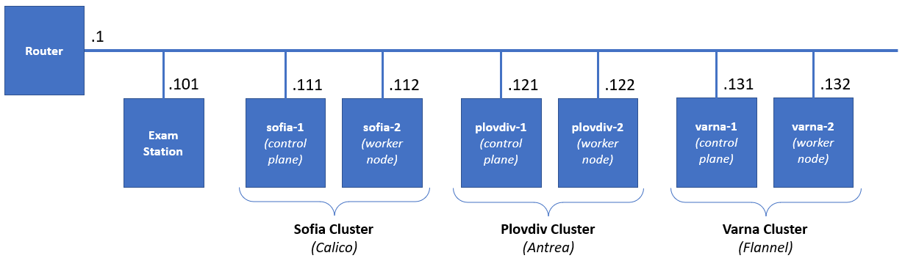


# **Exam: K8s 2024.10 (2024.11.30)**
## **Infrastructure**
You will have to accomplish a set of tasks in the following infrastructure

## **Exam Plot**
You have the following set of machines:

- **Exam station** is with **kubectl** + **helm** + **kustomize** installed
- **Sofia cluster** – two machines – working cluster with **Calico** as pod network plugin
- **Plovdiv cluster** – two machines – working cluster with **Antrea** as pod network plugin 
- **Varna cluster** – two machines – **not quite finished** cluster with **Flannel** as pod network plugin *(should be installed by you as part of the solution)*

All clusters are **Kubernetes 1.30.3** based, and all their nodes are with **2 vCPU / 2 GB RAM / 32 GB Disk / Debian 12**. The exam station is with **1 vCPU / 2 GB RAM**

You **should** use the **exam** user. It has **sudo** privileges on all machines and can authenticate to them via SSH
## **Rules**
Be sure to **follow strictly** the **naming** **conventions** *(files, folders, etc.)* specified in the checklist 

Tasks execution order should not be derived from the order in which they are listed below. Please note that there are tasks that depend on the successful completion of one or more other tasks

Usually, all steps could be achieved by following different paths and using different tools. In the end, not the means, but the **results** are being **measured**, **except stated otherwise**
## **Image Registry**
During the exam, we will be using the **hub.zahariev.pro** registry. It is a simple one and does not have an UI

You can see the list of images by visiting this URL in a browser on your personal computer:

[**https://hub.zahariev.pro/v2/_catalog](https://hub.zahariev.pro/v2/_catalog)** 

Or the tags for particular image like (change the ***k8s-environ*** string to the one you like*)*:

[**https://hub.zahariev.pro/v2/k8s-environ/tags/list](https://hub.zahariev.pro/v2/k8s-environ/tags/list)** 
## **Tasks checklist**
### **Sofia Cluster [19 pts]**
- (T101 / 6 pts) There is a simple manifest (**/files/sofia/t101a.yaml**) which we want to be able to easily deploy in production (**green**) and in test (**blue**). Using the **kustomize** application, you must prepare a set of folders and files in the **/files/sofia/t101** folder that allows 
  - Base (without any changes) deployment and deployment to both environments
  - The **green** deployment should increase the **replicas** to **3**, use the **green** tag, and runs on port **31101**
  - The **blue** deployment should use the **blue** image tag and runs on port **32101**
  - Make sure that **blue** and **green** are deployed (but not the base)
- (T102 / 2 pts) Explore the pod manifest in **/files/sofia/t102a.yaml** file and
  - Create a new one (**/files/sofia/t102b.yaml**) that wraps the pod template in a **CronJob** named **cjob**
  - Set it to run **every 10 minutes** and deploy it
- (T103 / 2 pts) Install **HAProxy** ingress controller. *You may need to adjust the manifest. For example, lower limit to 1536 and request to 1024*
- (T104 / 4 pts) There is the **animals** namespace. There are two pairs of pod and service. You are expected to create an ingress resource that
  - Will be in the same namespace and named **pets-ingress**
  - Will serve the **pets.lab** host
  - Path **/cat** to be redirected to **cat-svc** service and **/dog** to the **dog-svc**
  - Store it in **/files/sofia/t104b.yaml** and be sure to deploy it
- (T105 / 1 pts) Modify the configuration of the **Sofia** **Cluster** in such a way to allow workload to be placed on the **control plane** node as well
- (T106 / 4 pts) There is the **fortress** namespace. It is empty. Your mission is to
  - Create a **ServiceAccount** named **observer**
  - Create a **Role** named **looknotouch** that allows only **get** on **pods**
  - Create a **RoleBinding** named **looknotouch** that binds the role to the service account
  - Modify the pod manifest **/files/sofia/t106a.yaml** to run the pod with the **observer** service account, store the new version in **/files/sofia/t106b.yaml** and deploy it
### **Plovdiv Cluster [22 pts]**
- (T201 / 4 pts) There are three namespaces – **apple**, **orange**, and **apricot**. In all three, there is a pair of a pod and service. There aren’t any restrictions. You should correct this:
  - Add a network policy named **access-apple** that will limit the **ingress access** to the pods in the **apple** namespace to connections, coming only from pods in the **orange** namespace
  - Store the network policy in **/files/plovdiv/t201b.yaml** and deploy it
- (T202 / 5 pts) We all know that using **Helm** charts is both fun and easy. So, let’s spin up one chart
  - Use the **artifacthub.io** and find the **NGINX** chart provided by **Bitnami** and **add the repository**
  - Then **install** the chart as **exam-nginx** release in the **tomato** namespace (create it if not existing)
  - Make sure that using the chart’s parameters it is set to use a service of type **NodePort** 
  - Create a **ConfigMap** named **exam-nginx-cm** in the same namespace that contains an **index.html** file with the following text **Helm and Kubernetes Master** and attach it to the release
- (T203 / 2 pts) There is a pod in the **cucumber** namespace that is consuming a secret in the same namespace:
  - You are expected to find the unencoded value of the secret and save it as **/files/plovdiv/t203-secret.txt**
- (T204 / 4 pts) Explore the **banana** namespace. There should be a pair of a pod and service. They are created out of the **/files/plovdiv/t204a.yaml** manifest. The problem is that the pod (**banana-pod-1**) is not in running state and the service (**banana-svc**) does not have any endpoints. Your mission is to:
  - Correct these issues and save the changes as **/files/plovdiv/t204b.yaml** manifest
  - Make sure that the deployed objects are in a good shape (they reflect the corrections)
  - Add a second pod, in the new manifest file, of the same type but change the image tag to **green** and name it **banana-pod-2**
  - Make sure that the new pod is present in the service endpoints list
- (T205 / 1 pts) Modify the configuration of the **Plovdiv** **Cluster** in such a way to allow workload to be placed on the **control plane** node as well
- (T206 / 2 pts) Add a new label **speed** to both nodes (**plovdiv-1** and **plovdiv-2**) and set it to:
  - **slow** for **plovdiv-1** 
  - **fast** for **plovdiv-2**
- (T207 / 2 pts) Explore the manifest **/files/plovdiv/t207a.yaml**
  - Modify it in such a way that if deployed, the workload to go on the node with label **speed** set to **fast** and save the new manifest as **/files/plovdiv/t207b.yaml**
  - Deploy it to the cluster
- (T208 / 2 pts) Explore the manifest **/files/plovdiv/t208a.yaml**
  - Modify it in such a way that if deployed, the workload to go on the node named **plovdiv-1** and save the new manifest as **/files/plovdiv/t208b.yaml**
  - Deploy it to the cluster
### **Varna Cluster [19 pts]**
- (T301 / 5 pts) Install the missing system components (**kubeadm**, **kubelet**, and **kubectl**) on the **varna-2** node and make sure that their version is aligned with the version installed on the **varna-1** node
- (T302 / 3 pts) Join the **varna-2** node to the **Varna Cluster**
- (T303 / 2 pts) Deploy **Flannel** pod network plugin on the **Varna** **Cluster**
- (T304 / 4 pts) Explore the manifest **/files/varna/t304a.yaml** and 
  - Change it in such a way (save it under **/files/varna/t304b.yaml**) that the described pod is **deployed in three copies (replicas) on the cluster**
  - Deploy the resulting manifest
- (T305 / 4 pts) Explore the manifest **/files/varna/t305a.yaml** and 
  - Extend it to also include
    - A definition of a namespace named **cherry**
    - and a definition of a service named **cherry-svc** of type **NodePort** and port set to **32305**
    - and save it as **/files/varna/t305b.yaml**
  - Deploy the manifest
- (T306 / 1 pts) Modify the configuration of the **Varna** **Cluster** in such a way to allow workload to be placed on the **control plane** node as well

